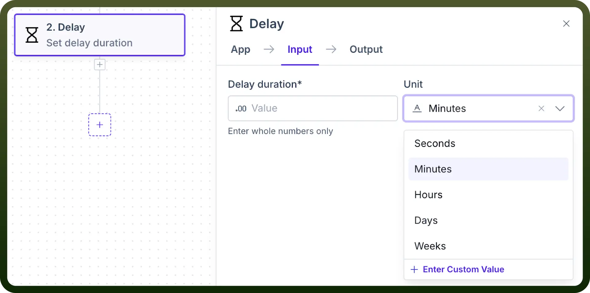
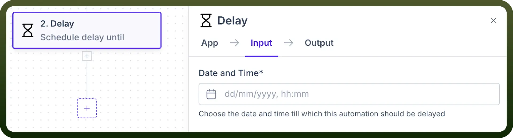
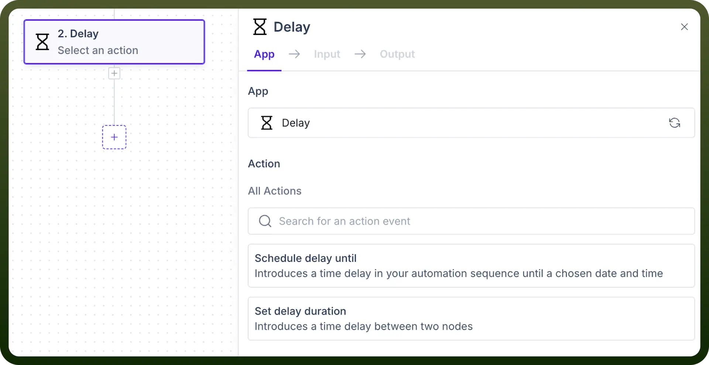

# Delay

Source: https://www.unifyapps.com/docs/unify-automations/delay
Section: automations

---

## Overview

The Delay Node in UnifyApps is designed to manage timing within automation workflows by introducing pauses at key steps. It provides precise control over scheduling with options to delay actions until a specific date and time or for a set duration between actions.

## Use Case Example

1. **Schedule Delay Until-** *Scheduled Customer Follow-Ups* When a lead reaches a certain stage in a sales pipeline, the automation can use Schedule Delay Until to follow up on a specific date, ensuring timely outreach and engagement.
2. **Set Delay Duration -** *Staggered Marketing Campaign Launch* For a marketing campaign, use Set Delay Duration in the automation to introduce timed gaps between campaign rollouts across channels, simultaneously optimising reach without overwhelming audiences.

## Actions in Delay

1. **Schedule Delay Until** The "`Schedule Delay Until`" action pauses an automation sequence until a specified date and time, enabling actions to occur precisely when needed. This is ideal for time-bound tasks that require specific future scheduling.

  

2. **Set Delay Duration** The "`Set Delay Duration`" action introduces a fixed interval between actions in automation, allowing for controlled pauses between sequential steps. This is beneficial when actions need gradual timing rather than instant execution.

  

## Notes

The Delay Node by UnifyApps provides essential actions for managing timing within automation workflows, enabling users to introduce precise delays between tasks. To make the most of these functionalities, keep in mind the following best practices:

1. Schedule delays thoughtfully to enhance user experience.
2. Utilise duration settings for optimal pacing in automation.
3. Implement error handling to maintain workflow integrity.
4. Monitor for potential timing conflicts in complex sequences.

By effectively leveraging the Delay Node, users can create more responsive and organised workflows tailored to their operational needs.
