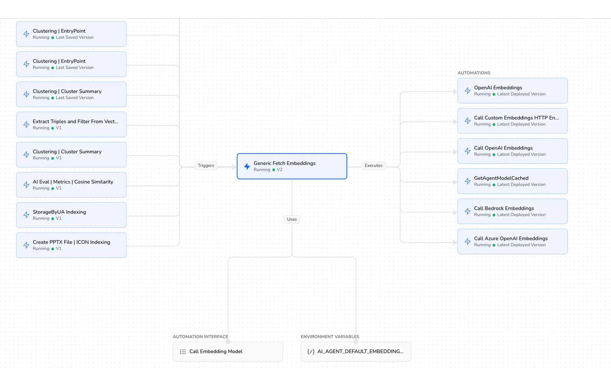

# Dependency Graph

Source: https://www.unifyapps.com/docs/unify-automations/dependency-graph
Section: automations

---

## Overview

A **dependency graph** is a visual or logical representation of tasks, components, or processes and the dependencies between them—basically, *what must happen before what*.

Think of it as a map of order and relationships that automation systems use to run things correctly, efficiently, and safely.

## Components of Dependency Graphs

- **Nodes** → tasks, jobs, steps, modules, or resources
- **Edges (arrows)** → dependencies (Task A must finish before Task B starts)

So if B depends on A, the graph shows:

A → B

Let’s know more about dependencies with the help of an example

1. **Nodes**
- **Left side**: different features and pipelines need embeddings
- **Centre:** one shared, versioned abstraction that fetches embeddings
- **Right side:** pluggable embedding providers (OpenAI, Azure OpenAI, Bedrock, custom HTTP, etc.)
- **Bottom:** configuration + interface that decides *which provider is actually used*
2. **Edges**
- A feature like clustering or indexing needs embeddings, so it calls *Generic Fetch Embeddings* (trigger) that:
- It executes the correct automation:
- Embeddings are returned in a standard format.
- The upstream workflow continues.

## Why Dependency Graphs matter in automations?

**1. Correct execution order**

Automation often involves multiple steps:

- Build → Test → Deploy
- Data extraction → Transformation → Loading

A dependency graph ensures:

- Tasks run only when prerequisites are complete
- No step runs too early or out of sequence

**2. Parallel execution**

Tasks without dependencies can run at the same time.

Dependency graphs help automation tools:

- Identify independent tasks
- Execute them in parallel
- Reduce total execution time

**3. Failure handling**

If a task fails:

- The graph shows which downstream tasks must be skipped
- Prevents cascading errors
- Makes retries and rollbacks easier

**4. Change impact analysis**

When you modify a task:

- The graph shows everything affected by that change
- Helps avoid breaking the automation pipeline

## Common use cases

1. **CI/CD pipelines**
- Code compile → unit tests → integration tests → deployment
- Tools use dependency graphs to decide execution order
2. **Test automation**
- Environment setup → test execution → cleanup
- Some tests depend on others or shared data
3. **Data pipelines**
- Source availability → processing jobs → analytics/reporting
