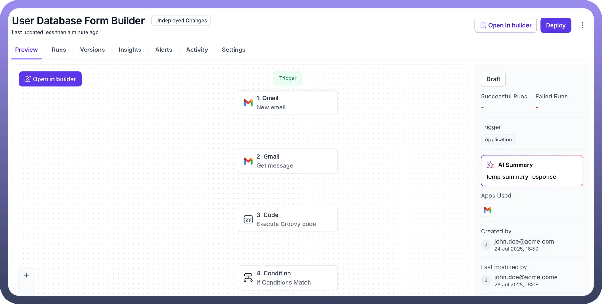
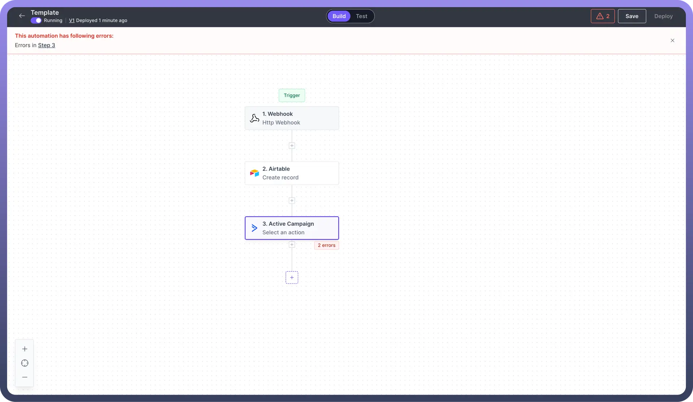
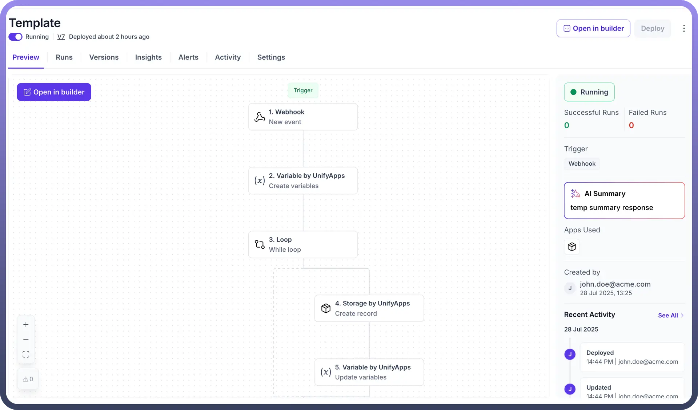

# Deploy your automation

Source: https://www.unifyapps.com/docs/unify-automations/deploy-your-automation
Section: automations

---

## Overview

Deploy Button allows users to execute their automation in real-time.

This means the automation will run when it meets the trigger criteria, such as a new Gmail received, a new ticket on Zendesk or an API request on the callable endpoint.

## Deploy your automation

- After building your automation and running your tests, you can `save` it and `deploy` it to utilise its features in real-time.
- If there is any error in your automation an alert box appears when you attempt to save your automation. It redirects you to the exact node that needs your attention. In such cases, deploying your automation won't be possible until the errors are fixed.

  

- After fixing the errors, you can save and deploy your automation.
- Each time you update your automation, you'll have to save and then redeploy it to see the changes in action. Every redeploy takes the automation to newer versions such as V2, V3, and so on.

  
