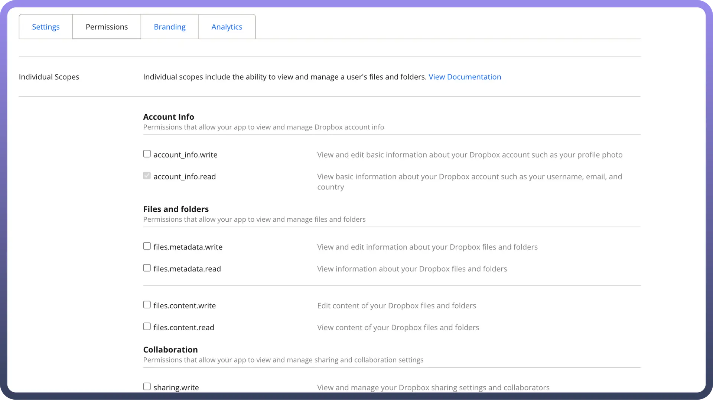
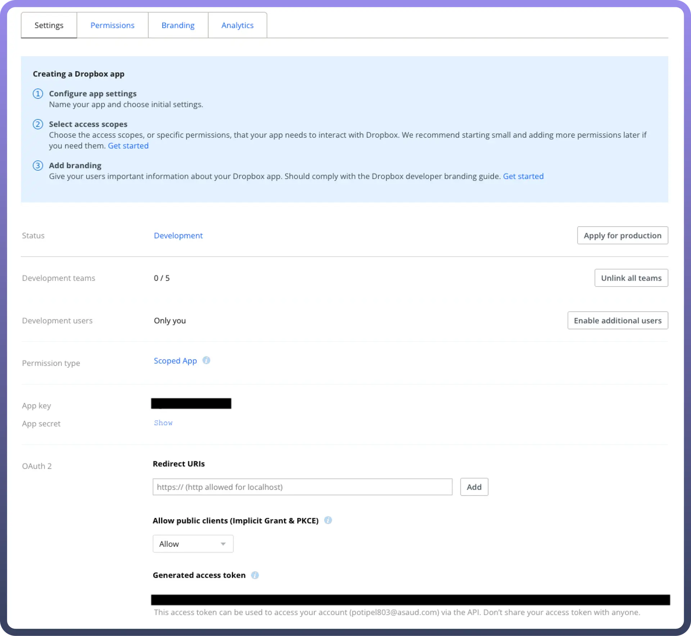
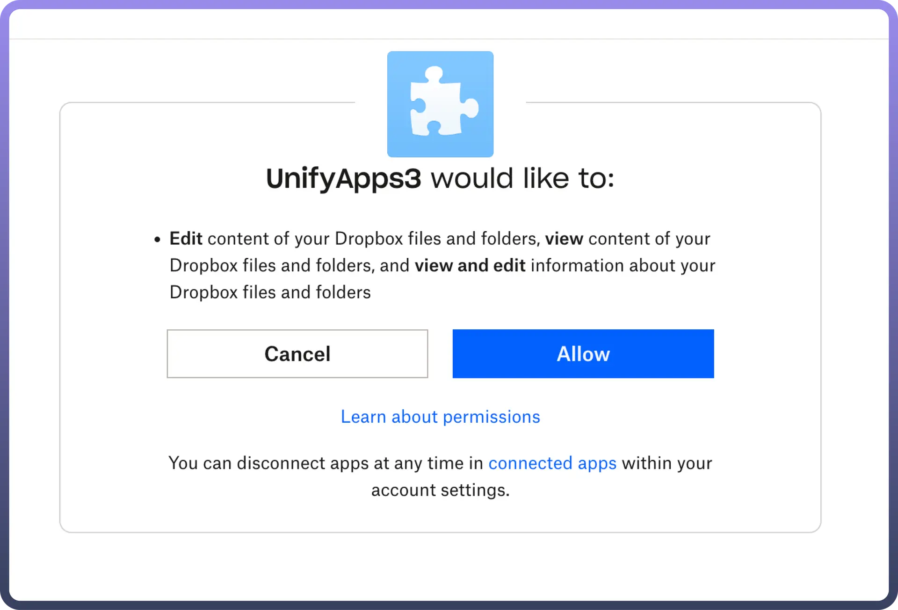

# Dropbox

Source: https://www.unifyapps.com/docs/unify-automations/dropbox
Section: automations

---

Dropbox provides cloud storage and collaboration tools for individuals and teams, supporting file syncing, sharing, and real-time updates. With integrations for popular apps and secure data protection, it enables seamless remote work and data accessibility.

Integrating Dropbox with your application allows for effortless file sharing, streamlined collaboration, and enhanced data management, ensuring a more efficient workflow.

## Authentication

Before you begin, ensure you have the following information:

- `Connection Name`: Choose a meaningful name for your connection. This name helps you identify the connection within your application or integration settings. It could be something descriptive like "MyAppDropboxIntegration".
- `Authentication Type`: Dropbox supports Oauth for authentication. This method ensures secure access to Dropbox's functionalities and data.

## OAuth based Authentication

- **Client ID and Client Secret**:
  - Go on to the [www.dropbox.com/developers](http://www.dropbox.com/developers) and navigate to the App console section.
  - Within app console section, select “`create apps`” to Create a new app on the DBX Platform
  - Choose the type of access you need:
    - `Full Dropbox` : You get full access to all the files and folders in the user's Dropbox.
    - `App folder` : A dedicated folder named after your app is created within the Apps folder of a user's Dropbox. Your app gets read and write access to this folder only.
  - Within the created app, navigate to the permission section and provide the required scopes for your app. Choose the following as the basic scopes (files.metadata.write, files.content.write,files.content.read), choose the remaining ones based on your needs

    

  - In the settings section, under OAuth 2, click on “`Generate Access token`” to generate the token.
  - For OAuth, App key and App secret represent Client ID and Client Secret respectively. **Note:** Use the following callback URL to complete the OAuth flow with UnifyApps. For example if you are accessing through qa.unifyapps.com the callback URL would be this: http://webhooks-golbal.ext-alb.qa.unifyapps.com/api/connector-auth-callback/oauth
  - Click on “`show`” to generate the Client Secret.

    

  - Click Generate to Generate an Access Token.
  - Now Add the Client ID and Client Secret to the Authorization page on UnifyApps, and click on `Authorize`.

    

  - Click on `Allow`, and your connection will be created successfully.

## Actions

| Action | Description |
|---|---|
| `Copy file/folder` | Duplicate a file or folder within Dropbox |
| `Create folder` | Create a new folder in your Dropbox account |
| `Delete file/folder` | Remove a file or folder from Dropbox |
| `Download file` | Download the contents of a file from Dropbox |
| `File content search` | Searches for files whose content matches the search term in Dropbox |
| `Get metadata for file/folder` | Access detailed information about a file or folder in Dropbox |
| `Move/rename a file/folder` | Move or rename a file/folder within Dropbox |
| `Read CSV file lines` | Read and extract data from CSV files stored in Dropbox |
| `Search files` | Search through your Dropbox files |
| `Search folders` | Search for folders within Dropbox |
| `Update CSV file` | Modify and update the contents of a CSV file stored in Dropbox |
| `Upload a file from a public URL` | Upload a file to Dropbox by providing its public URL or by providing contents directly |

## Triggers

| Trigger | Description |
|---|---|
| `On new file event` | Triggers when a new file is created in Dropbox |
