# Excel by UnifyApps

Source: https://www.unifyapps.com/docs/unify-automations/excel-by-unifyapps
Section: automations

---

## Overview

The Excel by UnifyApps node enables powerful Excel file operations within automation flows. Whether you're generating reports, transforming file formats, extracting data, or updating spreadsheets, these actions provide a seamless way to work with Excel files of various formats (XLSX, XLS, XLSB). This guide covers each available action, along with their inputs, usage steps, and outputs to help you integrate Excel capabilities smoothly into your workflows.

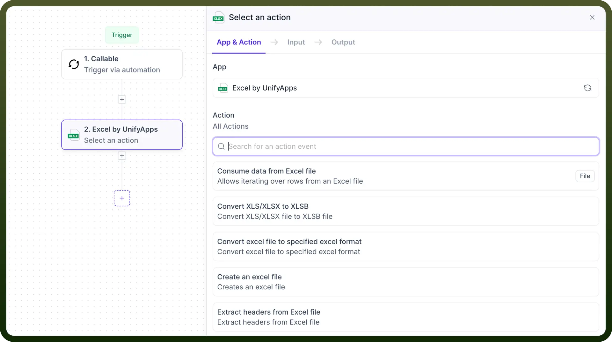

## Actions

### Consume data from an Excel file

This action lets users read data from a specified Excel file and perform designated operations on each row.

1. We will add the `Excel by UnifyApps` node, select `Consume Data from an Excel File`, and provide input for the following fields.
  - `File`**:** Provide the URL or file object from the data pill of the excel file here.
  - `File Type`**:** Select your file format from **.xlsx** or **.xls**.
  - `Sheet Name`**:** Specify the sheet to be processed.
  - `Header Row`**:** Determine if the first row contains headers, impacting data parsing.
  - `Columns`**:** Define specific fields to extract from each row.
  - `Batch`**:** Enable the processing of rows in defined batch sizes for better efficiency.

    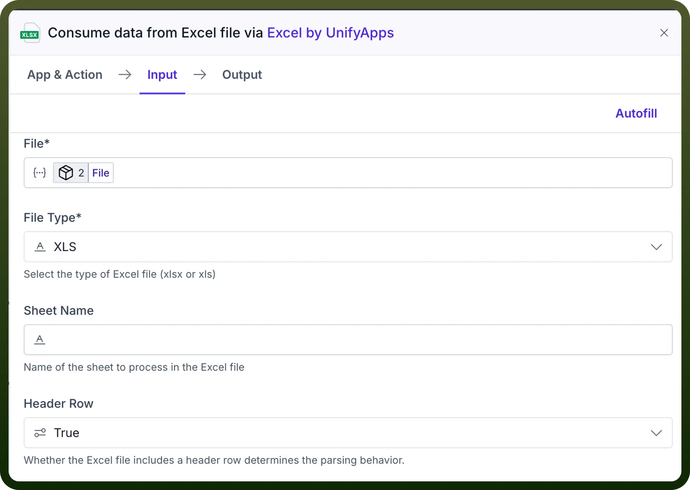

    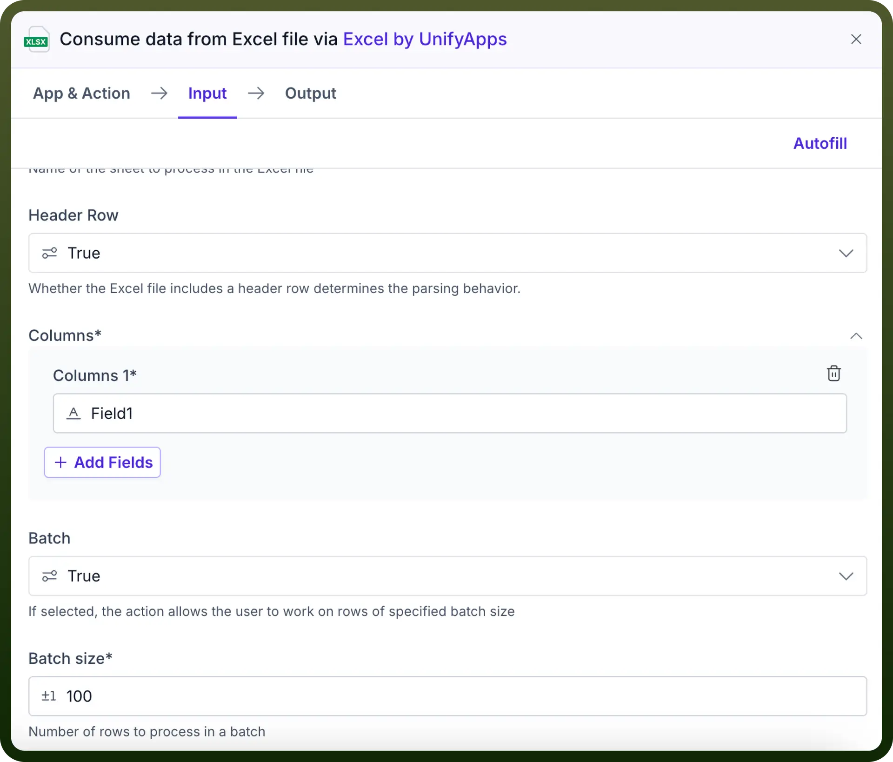

2. After setting the input parameters, add an app and action inside the node's iteration. As an example, here we are using Variables by UnifyApps to add items to the list created earlier, one by one.

  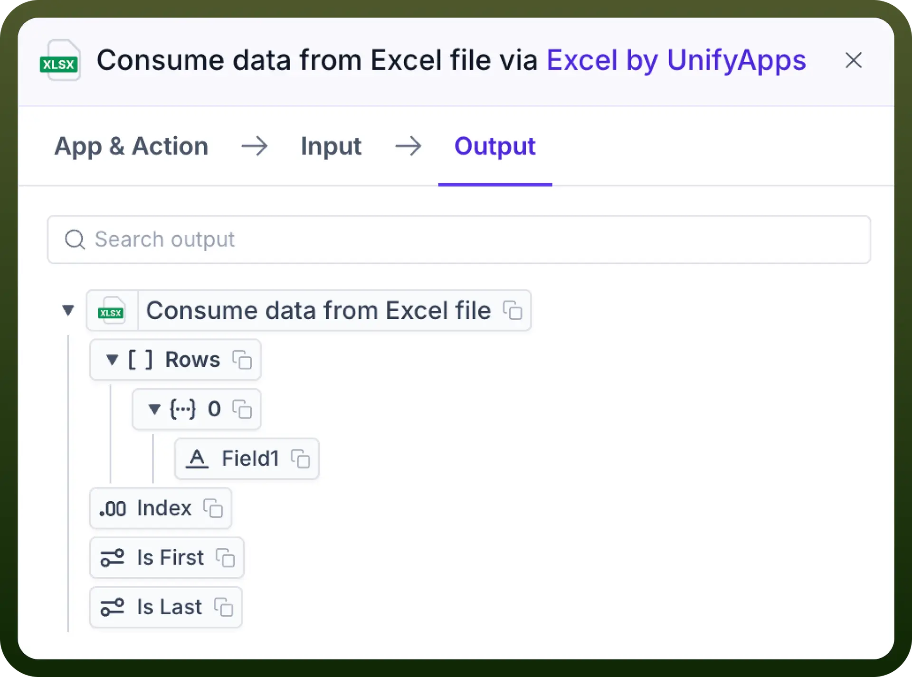

3. You can now extract the data from the Excel file using the output data pills, which consist of:
  - **Rows:** Array of row objects from your Excel file consisting of fields corresponding to the defined columns.
  - **Index:** Index of the currently processing row in the Excel file.
  - **is First / is Last**: If the current processing row is a first or last row.

### Convert XLS/XLSX to XLSB

This action allows users to convert Excel files from .xls or .xlsx format to .xlsb (Excel Binary Workbook) format within an automation flow.

**Steps to Use**

1. Add the node, select the `Convert XLS/XLSX to XLSB` action and provide the necessary inputs:

  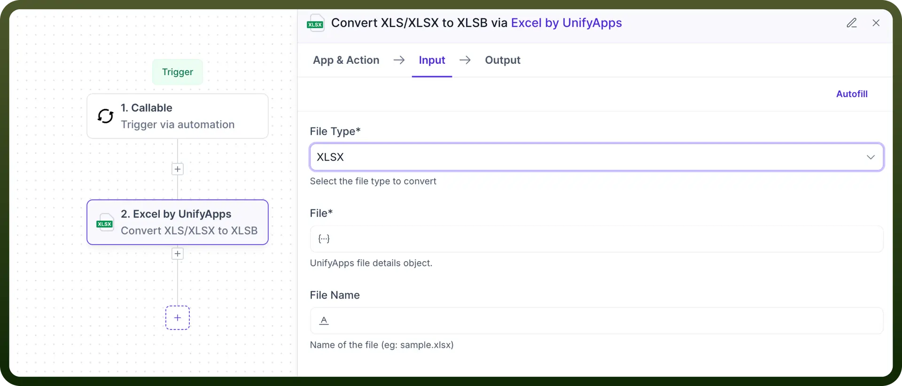

  - `File Type`: Choose the file format you are converting from — either XLS or XLSX.
  - `File`: Provide the file object (from UnifyApps file picker or data pill) for the Excel file to be converted.
  - `File Name`: Specify the name of the input file, including its extension (e.g., report.xlsx).
2. Once configured, this action will convert the given Excel file into a .xlsb file format, which is more efficient in terms of storage and performance for large datasets. **Output** After successful conversion, the output data pills include:

  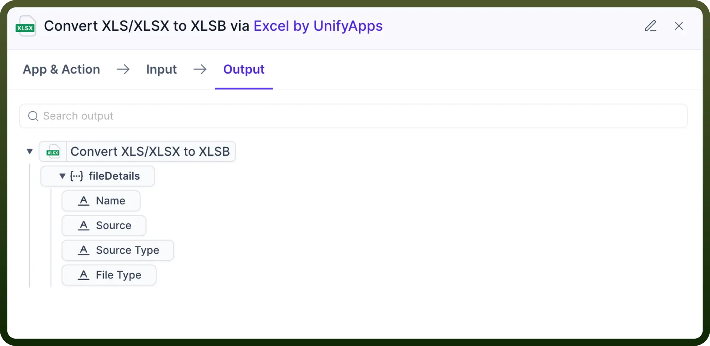

- **Converted File**: A file object representing the new .xlsb file, which can be used in subsequent automation steps (e.g., upload, email, or store).

### Convert Excel File to Specified Excel Format

This action allows users to convert Excel files from .xlsx, .xls, or .xlsb format into a different Excel format of their choice within an automation flow.

**Steps to Use**

1. Add the node, select the `Convert Excel File to Specified Excel Format` action and provide the necessary inputs:

  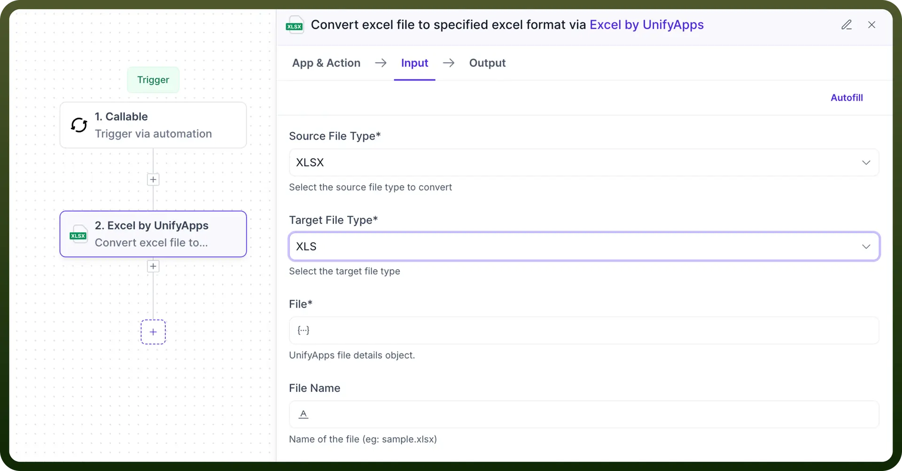

  - `Source File Type`: Choose the format of the Excel file you are uploading — either XLSX, XLS, or XLSB.
  - `Target File Type`: Choose the desired format you want to convert the uploaded file into — XLSX, XLS, or XLSB.
  - `File`: Provide the file object (from UnifyApps file picker or data pill) for the Excel file to be converted.
  - `File Name`: Specify the name of the output file, including its extension (e.g., converted_report.xlsb).
2. Once configured, this action will convert the Excel file to the specified format, useful for compatibility, compression, or performance considerations. **Output** After successful conversion, the output data pills include:

  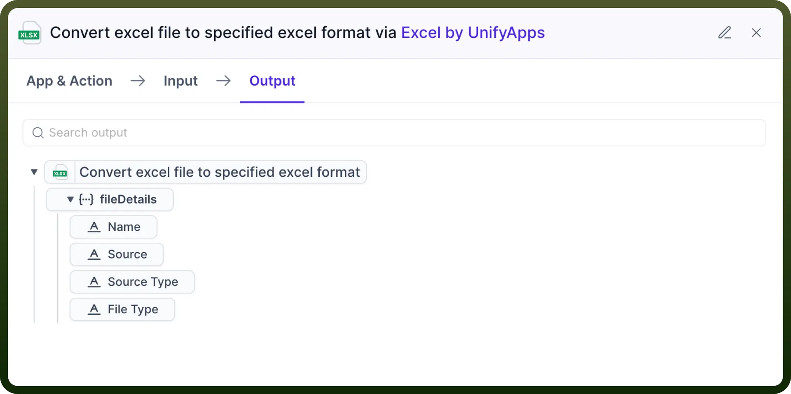

- **Converted File**: A file object representing the converted Excel file in the selected format, which can be used in subsequent steps in the automation.

### Create an Excel File

This action allows users to create a new Excel file in the format of their choice (XLSX, XLS, or XLSB) within an automation flow. It is useful for dynamically generating reports, logs, or other data outputs.

**Steps to Use**

1. Add the node, select the `Create an Excel File` action and provide the necessary inputs:

  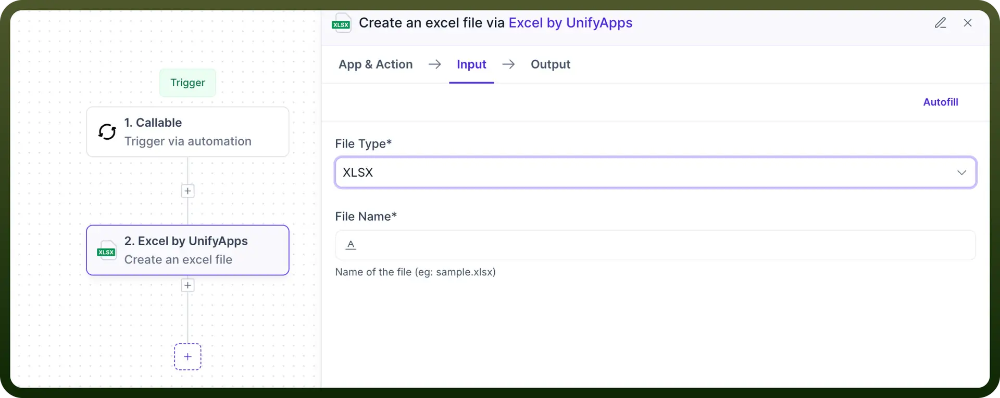

  - `File Type`: Choose the desired format for the new Excel file — XLSX, XLS, or XLSB.
  - `File Name`: Specify the name of the new Excel file, including its extension (e.g., generated_report.xlsx).
2. Once configured, this action will create an empty Excel file with the specified format and name. **Output**After successful execution, the output data pill includes:

  

- **Created File**: A file object representing the newly created Excel file, which can be used in subsequent steps in the automation.

### Extract Headers from Excel

This action allows users to extract the headers (column names) from an existing Excel file. It is useful for identifying the structure of an Excel file, especially when working with dynamic or unknown datasets.

**Steps to Use**

1. Add the node, select the **Extract Headers from Excel** action and provide the necessary inputs:

  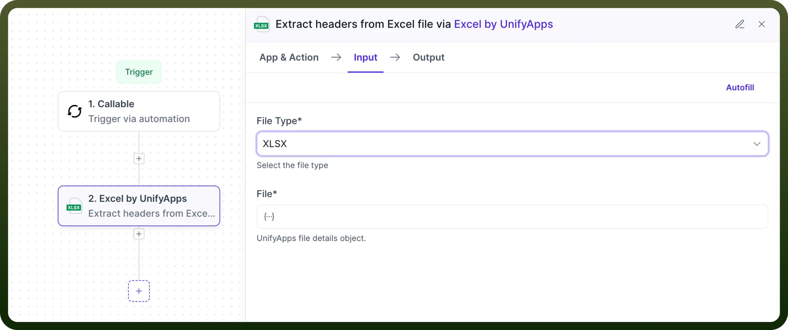

  - `File Type`: Choose the format of the Excel file — XLSX, XLS, or XLSB.
  - `File Name`: Specify the name of the Excel file from which you want to extract the headers.
2. Once configured, this action will extract the headers (column names) from the specified Excel file. **Output** After successful execution, the output data pill includes:

  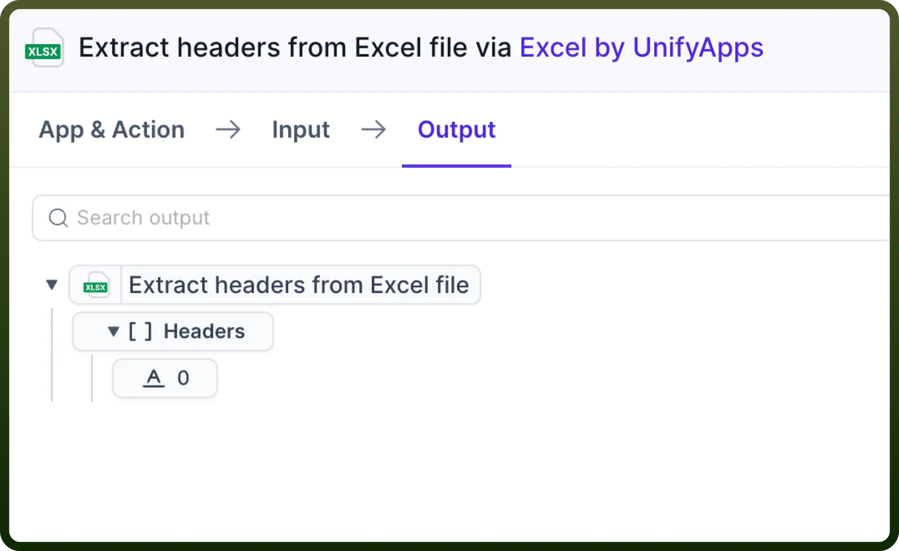

- **Headers**: A list of column headers extracted from the specified Excel file, which can be used in subsequent steps in the automation.

### List Sheet Names in an Excel File

This action allows users to retrieve a list of sheet names from an existing Excel file. It is useful for working with multi-sheet Excel files, where you may need to know the sheet names before performing operations on specific sheets.

**Steps to Use**

1. Add the node, select the `List Sheet Names in an Excel File` action and provide the necessary inputs:

  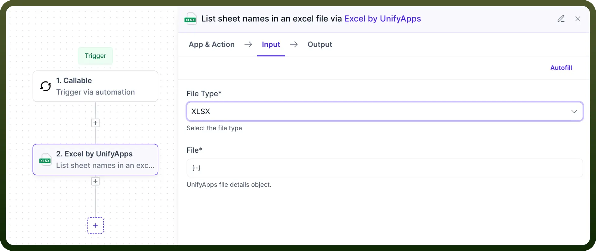

  - `File Type`: Choose the format of the Excel file — XLSX, XLS, or XLSB.
  - `File Name`: Specify the name of the Excel file from which you want to retrieve the sheet names.
2. Once configured, this action will list all the sheet names present in the specified Excel file. **Output** After successful execution, the output data pill includes:

  

- **Sheet Names**: A list of sheet names within the specified Excel file, which can be used in subsequent steps in the automation.

### Merge Multiple Excel Files into One File

This action allows users to merge data from multiple Excel files into a single Excel file. It’s useful when consolidating reports, logs, or datasets that are split across different files.

**Steps to Use**

1. Add the node, select the `Merge Multiple Excel Files into One File` action and provide the necessary inputs:

  

  - `List of Files`: Provide the file objects (via UnifyApps file picker or data pills) representing the Excel files to be merged.
  - `File Type`: Choose the format for the output Excel file — XLSX, XLS, or XLSB.
  - `File Name`: Specify the name of the merged Excel file, including its extension (e.g., merged_data.xlsx).
2. Once configured, this action will combine the contents of all input Excel files into a single file, maintaining consistent structure across sheets. **Output** After successful execution, the output data pill includes:

  

- **Merged File**: A file object representing the newly created Excel file that combines data from all input files. This file can be used in subsequent automation steps.

### Write Data to Excel File

This action allows users to write structured data into an Excel file within an automation flow. It supports both static and dynamic headers, making it suitable for a variety of data writing use cases like exporting API responses, log entries, or report generation.

**Steps to Use**

1. Add the node and select the `Write Data to Excel File` action and provide the necessary inputs:

  

  - `File Name`: Specify the name of the Excel file to which data will be written.
  - `File Type`: Choose the format of the Excel file — XLSX, XLS, or XLSB.
  - `Data Source`: Provide the data to be written into the Excel file. This can be a list of objects or records obtained from a previous step in the automation.
  - `Sheet Name`: Enter the name of the sheet where the data should be written.
  - `Header Type`: Choose how headers should be handled — Static (manually defined headers) or Dynamic (headers inferred from the data source).
  - `Define Headers` (required if Header Type is Static): Specify the column headers to be used while writing data.
2. Once configured, the action will write the provided data into the specified sheet of the Excel file, either using custom headers or inferring them from the data. **Output** After successful execution, the output data pill includes:

  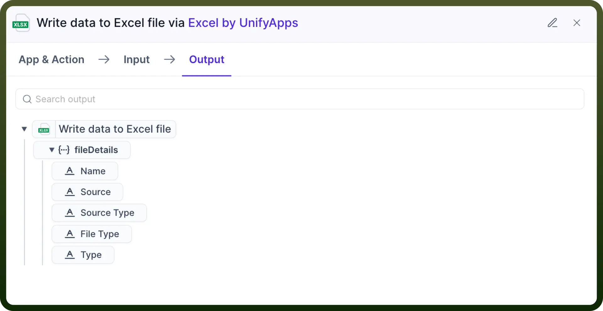

- **Updated File**: A file object representing the Excel file with the newly written data, ready for use in the next steps of the automation.

### Write Data to Sheet of Excel File

This action allows users to write data into a specific sheet of an existing Excel file. It supports row and column offsets, custom headers, and styling options like cell borders and color formatting. Ideal for updating Excel reports or inserting data into pre-defined templates.

**Steps to Use**

1. Add the node, select the `Write Data to Sheet of Excel File` action and provide the necessary inputs:

  

  

  

  - `File` *(Required)*: Provide the UnifyApps File Object representing the Excel file to which data will be appended.
  - `File Type` *(Required)*: Specify the format of the Excel file — XLSX, XLS, or XLSB.
  - `Data Source` *(Required)*: The data to be written into the Excel sheet. This can be dynamic data from previous steps.
  - `Sheet Name`: Enter the name of the sheet where the data should be written. If the sheet doesn’t exist, it may be created (depending on system behavior).
  - `Header Type` *(Required)*: Choose the type of headers — Static (user-defined) or Dynamic (inferred from the data source).
  - `Define Headers` *(Required if Header Type is Static)*: Specify the column headers to use.
  - `Row Offset`: Define the row number from which data writing should begin. Default is 0 (top of the sheet).
  - `Column Offset`: Define the column number from which data writing should begin. Default is 0 (leftmost column).
  - `Add Border`: Enable this option to apply borders to the cells being written.
  - `Color Details`:
    - `Header Row Color`: Specify a color for the header row (e.g., light gray, #D3D3D3).
    - `Data Rows Color`: Apply a uniform background color to all data rows.
2. Once configured, this action will write the data into the specified sheet at the defined position, applying any requested formatting and styling. **Output** After successful execution, the output data pill includes:

  

- **Updated File**: A file object representing the modified Excel file, ready for use in subsequent automation steps.
