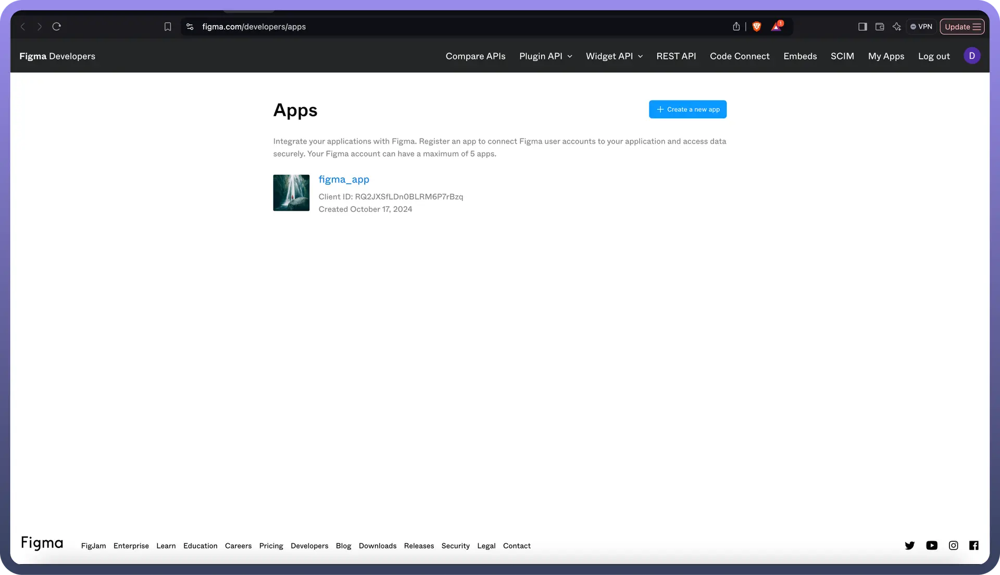
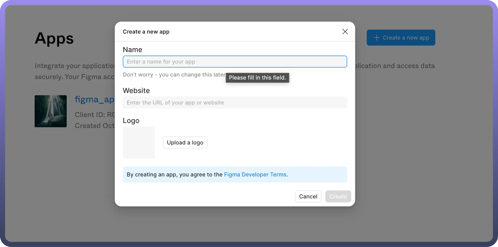
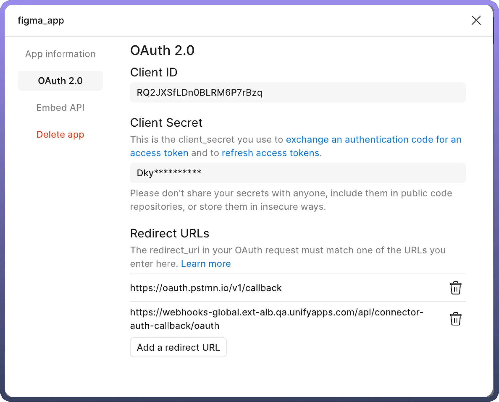
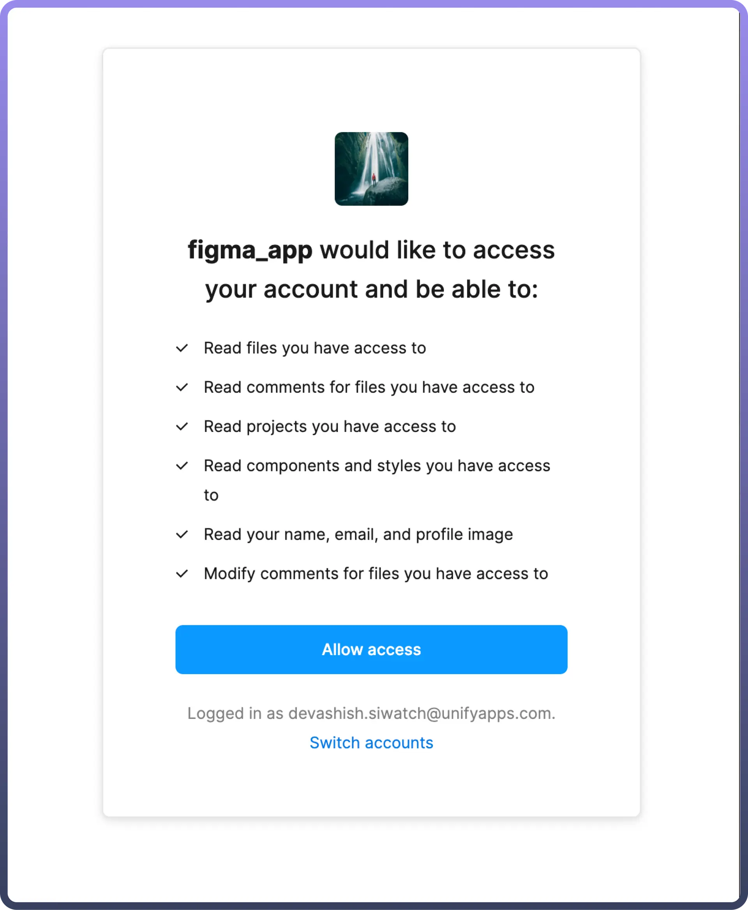
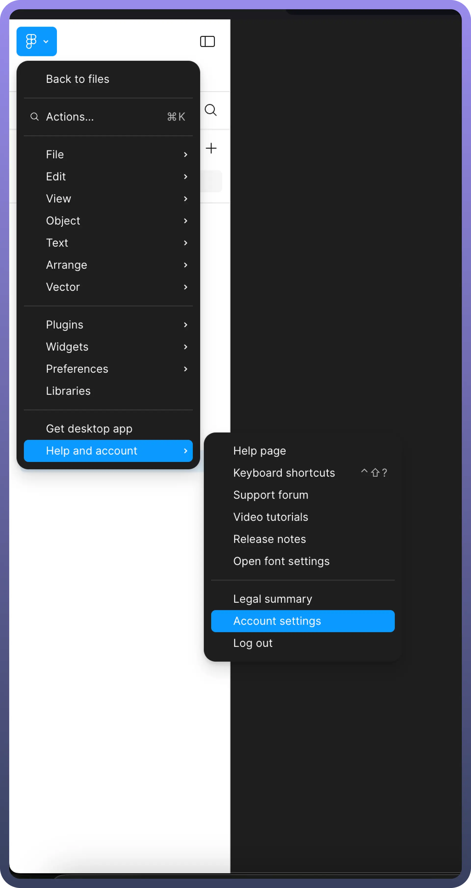
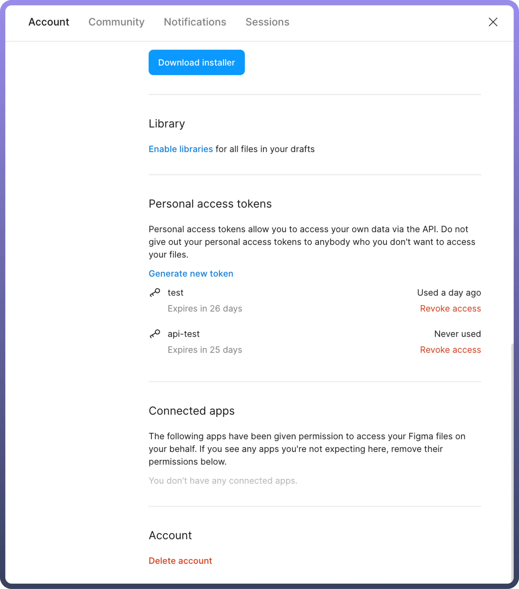

# Figma

Source: https://www.unifyapps.com/docs/unify-automations/figma
Section: automations

---

Figma is a collaborative web application for interface design, with additional offline features enabled by desktop applications for macOS and Windows. The feature set of Figma focuses on user interface and user experience design, with an emphasis on real-time collaboration, utilising a variety of vector graphics editor and prototyping tools.

Connecting your application to a Figma account enables integration for various Figma workspace functionalities.

## Authentication

Before you begin, make sure you have the following information:

- `Connection Name`: Choose a meaningful name for your connection. This name helps you identify the connection within your application or integration settings. It could be something descriptive like "MyAppFigmaIntegration".
- `Authentication Type`**:** Select the type of authentication for connecting to your Figma account:
  - OAuth based
  - Token-based

### OAuth based

First create an app in [https://www.figma.com/developers/apps](https://www.figma.com/developers/apps)

Then copy the `clientId` and `clientSecret` from the app. 
Then go to the UnifyApps platform. Select `OAuth` as the authentication type with the clientId and clientSecret that you copied previously and click on authorise. A pop-up screen opens with the necessary permissions required to set up the UnifyApps application.

### Token-based

You can opt for a token-based authentication method, where you can create a personal access token within their Figma Help and account > Account settings with relevant scope and expiration time in the Personal access tokens section.

## Granular Permissions

**Token and OAuth Scope**

| **OAuth Scope** | **Description** |
|---|---|
| `files:read` | Read files, projects, users, versions, comments, components & styles, and webhooks. |
| `file_variables:read, file_variables:write` | Read and write to variables in Figma file. Note: this is only available to members in Enterprise organizations. |
| `file_comments:write` | View basic information about public channels in a workspace |
| `file_dev_resources:read, file_dev_resources:write` | Read and write to dev resources in files. |
| `library_analytics:read` | Read your design system analytics. |
| `webhooks:write` | Create and manage webhooks. |

## Actions

| **Name** | **Description** |
|---|---|
| `Get file` | Get file information by its id |
| `Get file nodes` | Get information of specific nodes within a file |
