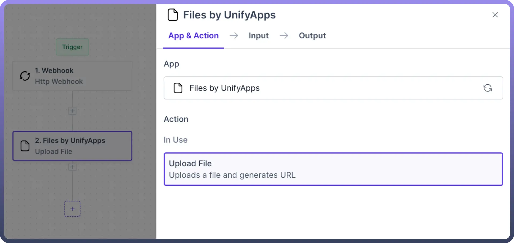
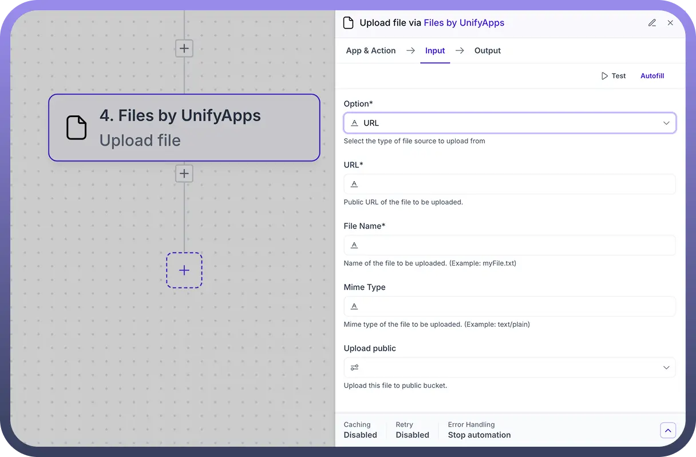
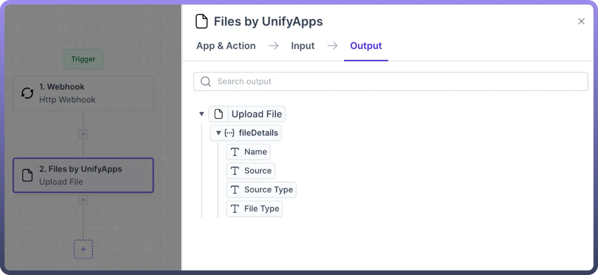

# Files by UnifyApps

Source: https://www.unifyapps.com/docs/unify-automations/files-by-unifyapps
Section: automations

---

## Overview

Files by UnifyApps is used to **create a file object** out of a given **URL** or **base-64 content**. This enables us to pass this file object further down the automation and into other apps as and when required.

## Use Case

We have a public **URL** for a **PDF** file which we wish to upload to our **Amazon S3 server**. To do so, we pass the URL into Files by UnifyApps, enabling us to create a file object out of it, which can then be passed into the Amazon S3 node to be uploaded.

## How to use Files by UnifyApps?

1. Add the `Files by UnfiyApps` node and select `Upload file` as the action.
2. Next, fill in the following input parameters:
  - `Option`**:** Select either **URL** or **Base64 Content** based on your requirement.
  - `File Name`**:** Input your file name.
  - `MIME Type`: Multipurpose Internet Mail Extension or MIME type will represent the format of your file. E.g.: text/csv, image/png, audio/mp3, etc. Please refer to this [link](https://developer.mozilla.org/en-US/docs/Web/HTTP/Basics_of_HTTP/MIME_types/Common_types) for a list of MIME types.
  - `URL/ Base64 Content`: Provide the URL or the Base64 Content in the input box.
3. Finally, we obtain the output with the following information pieces: `Name`, `Source`, `Source Type`, and `File Type`.

