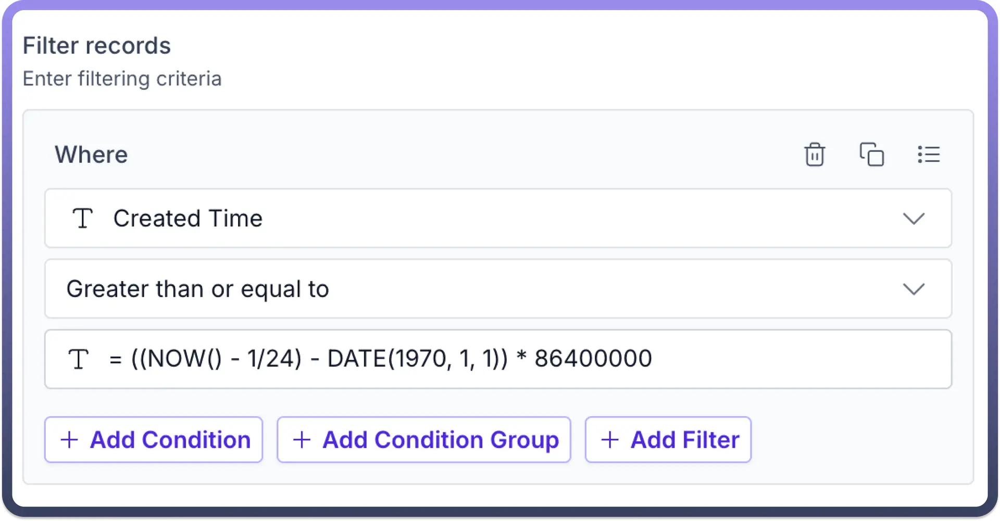
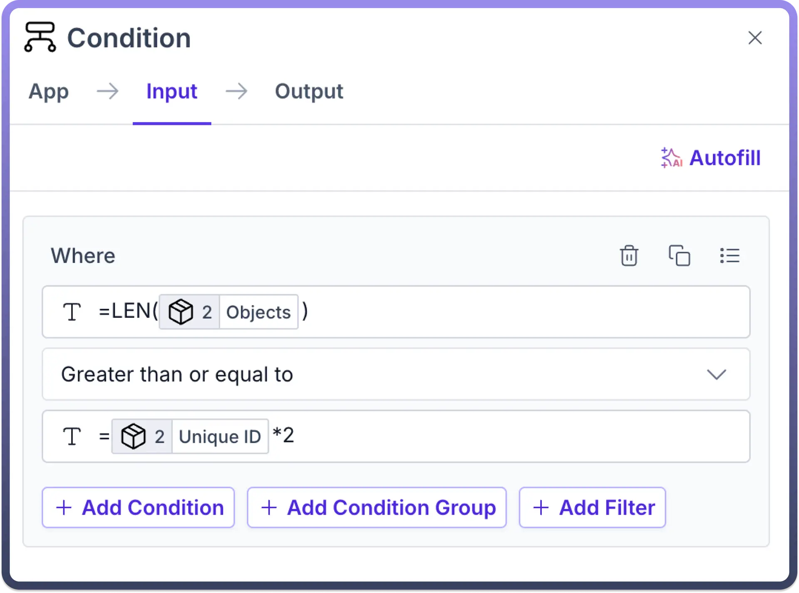

# Formula Suggestions

Source: https://www.unifyapps.com/docs/unify-automations/formula-suggestions
Section: automations

---

## Overview

Formulas by UnifyApps are expressions used to perform calculations, manipulate data, and automate tasks. They enable users to process numerical data, text, dates, and logical conditions to derive results efficiently.

**Why Do We Need Formulas?**

**- Automation**: Repeated manual calculations are tedious and error-prone. Formulas help automate these tasks, ensuring accuracy and consistency.

**- Data Analysis**: Formulas allow users to analyze large datasets by calculating averages, sums, percentages, and more to derive insights.

**- Efficiency**: Formulas offer speed for complex calculations, accuracy by reducing human error, scalability to handle large datasets, and flexibility with a wide range of mathematical, statistical, and logical functions.

**- Logical Operations**: Excel formulas allow for conditional evaluations, such as checking if values meet certain criteria (`IF()`, `AND()`, `OR()`).

## How to use formulas in automation ?

A formula can be invoked by using an **equals sign (=)** and may contain:

- **Operators** like `+`, `-`, `*`, `/` for mathematical operations.
- **Node field references** to work with values from specific automation nodes.
- **Functions** like `SUM()`, `LEN()`, `NOW()` to perform predefined calculations.

## Example

In this use case, we are sending messages to our internal Slack channel for all Zendesk support tickets that have not yet been acknowledged.

**Workflow Overview:**

1. **Hourly Scheduler**: A scheduler runs every hour, fetching all ticket IDs from the object that were created in the last hour.
2. **Comment Check**: For each ticket, the system checks whether any comments are present.
3. **Slack Notification**: If a ticket has no comments, a message is posted to our internal Slack channel.

**Formulas Used**:

- `NOW()`: Retrieves the current date and time to identify tickets created in the last hour.

  

- `INT()`: Converts numeric values into integers as ticket id is stored in string format in object.

  

- `LEN()`: Checks the length of comments to verify if any comment is posted on ticket or not

  

- `CONCAT()`: Combines different text elements, such as ticket details, to form the message for Slack.

## Supported Formulae

| **Formula** | **Description** | **Supported data types** | **Syntax** |
|---|---|---|---|
| `LEN` | Returns the length of the string, array | text/array | LEN( 📦 Order ID ) |
| `ABS` | Returns the absolute value of a number | number | ABS( 💰 Amount ) |
| `ACOS` | Returns the arccosine of a number | number | ACOS( 📊 Cosine Value ) |
| `ACOSH` | Returns the inverse hyperbolic cosine of a number | number | ACOSH( 📈 Hyperbolic Cosine ) |
| `ADDRESS` | Returns a cell reference as text | row column | ADDRESS( 🔢 Row 🔠 Column ) |
| `AND` | Returns TRUE if all arguments are TRUE | logical1, [logical2, ...] | AND( ✅ Condition 1, ✅ Condition 2 ) |
| `AREAS` | Returns the number of areas in a reference | reference | AREAS( 📍 Cell Range ) |
| `ASIN` | Returns the arcsine of a number | number | ASIN( 📊 Sine Value ) |
| `ASINH` | Returns the inverse hyperbolic sine of a number | number | ASINH( 📈 Hyperbolic Sine ) |
| `ATAN` | Returns the arctangent of a number | number | ATAN( 📊 Tangent Value ) |
| `ATAN2` | Returns the arctangent from x- and y-coordinates | list of numbers | ATAN2( 📏 X-Coordinate 📐 Y-Coordinate ) |
| `ATANH` | Returns the inverse hyperbolic tangent of a number | number | ATANH( 📈 Hyperbolic Tangent ) |
| `AVEDEV` | Returns the average of the absolute deviations of data points from their mean | number1, [number2, ...] | AVEDEV( 🔢 Number 1 🔢 Number 2 🔢 Number 3 ) |
| `AVERAGE` | Returns the average of its arguments | number1, [number2, ...] | AVERAGE( 💯 Score 1 💯 Score 2 💯 Score 3 ) |
| `AVERAGEA` | Returns the average of its arguments including numbers text and logical values | value1, [value2, ...] | AVERAGEA( 📊 Value 1 📊 Value 2 📊 Value 3 ) |
| `CEILING` | Rounds a number up to the nearest integer or multiple of significance | number | CEILING( 🔢 Number ) |
| `CHAR` | Returns the character specified by a number | number | CHAR( 🔢 ASCII Code ) |
| `CHOOSE` | Chooses a value from a list of values | index_num, value1, [value2, ...] | CHOOSE( 🔢 Index 📊 Value 1 📊 Value 2 📊 Value 3 ) |
| `CLEAN` | Removes all non-printable characters from text | text | CLEAN( 📝 Text ) |
| `CODE` | Returns a numeric code for the first character in a text string | text | CODE( 🔤 Character ) |
| `COLUMN` | Returns the column number of a reference | [reference] | COLUMN( 📍 Cell Reference ) |
| `COLUMNS` | Returns the number of columns in a reference | array | COLUMNS( 📊 Array ) |
| `COMBIN` | Returns the number of combinations for a given number of objects | number, number_chosen | COMBIN( 🔢 Total 🔢 Chosen ) |
| `CONCATENATE` | Joins several text items into one text item | text1, [text2, ...] | CONCATENATE( 📝 Text 1 📝 Text 2 ) |
| `CORREL` | Returns the correlation coefficient between two data sets | array1, array2 | CORREL( 📊 Array 1 📊 Array 2 ) |
| `COS` | Returns the cosine of a number | number | COS( 📐 Angle ) |
| `COSH` | Returns the hyperbolic cosine of a number | number | COSH( 🔢 Number ) |
| `COUNT` | Counts how many numbers are in the list of arguments | value1, [value2, ...] | COUNT( 🔢 Value 1 🔢 Value 2 🔢 Value 3 ) |
| `COUNTA` | Counts how many values are in the list of arguments | value1, [value2, ...] | COUNTA( 📊 Value 1 📊 Value 2 📊 Value 3 ) |
| `COUNTBLANK` | Counts the number of blank cells within a range | range | COUNTBLANK( 📍 Range ) |
| `COUNTIF` | Counts the number of cells within a range that meet the given criteria | range, criteria | COUNTIF( 📍 Range 📌 Criteria ) |
| `COVAR` | Returns covariance the average of the products of paired deviations | array1, array2 | COVAR( 📊 Array 1 📊 Array 2 ) |
| `DATE` | Returns the serial number of a particular date | year, month, day | DATE( 📅 Year 📅 Month 📅 Day ) |
| `DATEVALUE` | Converts a date in the form of text to a serial number | date_text | DATEVALUE( 📝 Date Text ) |
| `DAVERAGE` | Averages the values in a column of a list or database that match conditions you specify | database, field, criteria | DAVERAGE( 📊 Database 🏷️ Field 📌 Criteria ) |
| `DAY` | Converts a serial number to a day of the month | serial_number | DAY( 📅 Date ) |
| `DAYS360` | Calculates the number of days between two dates based on a 360-day year | start_date, end_date, [method] | DAYS360( 📅 Start Date 📅 End Date ) |
| `DCOUNT` | Counts the cells containing numbers in a column of a list or database that match conditions that you specify | database, field, criteria | DCOUNT( 📊 Database 🏷️ Field 📌 Criteria ) |
| `DCOUNTA` | Counts nonblank cells in a column of a list or database that match conditions that you specify | database, field, criteria | DCOUNTA( 📊 Database 🏷️ Field 📌 Criteria ) |
| `DEGREES` | Converts radians to degrees | angle | DEGREES( 📐 Angle ) |
| `DEVSQ` | Returns the sum of squares of deviations | number1, [number2, ...] | DEVSQ( 🔢 Number 1 🔢 Number 2 🔢 Number 3 ) |
| `DGET` | Extracts from a database a single record that matches the specified criteria | database, field, criteria | DGET( 📊 Database 🏷️ Field 📌 Criteria ) |
| `DMAX` | Returns the maximum value from selected database entries | database, field, criteria | DMAX( 📊 Database 🏷️ Field 📌 Criteria ) |
| `DMIN` | Returns the minimum value from selected database entries | database, field, criteria | DMIN( 📊 Database 🏷️ Field 📌 Criteria ) |
| `DOLLAR` | Converts a number to text using currency format | number, [decimals] | DOLLAR( 💰 Amount 🔢 Decimals ) |
| `DPRODUCT` | Multiplies the values in a column of a list or database that match conditions that you specify | database, field, criteria | DPRODUCT( 📊 Database 🏷️ Field 📌 Criteria ) |
| `DSTDEV` | Estimates the standard deviation based on a sample from selected database entries | database, field, criteria | DSTDEV( 📊 Database 🏷️ Field 📌 Criteria ) |
| `DSTDEVP` | Calculates the standard deviation based on the entire population of selected database entries | database, field, criteria | DSTDEVP( 📊 Database 🏷️ Field 📌 Criteria ) |
| `DSUM` | Adds the numbers in a column of a list or database that match conditions that you specify | database, field, criteria | DSUM( 📊 Database 🏷️ Field 📌 Criteria ) |
| `DVAR` | Estimates variance based on a sample from selected database entries | database, field, criteria | DVAR( 📊 Database 🏷️ Field 📌 Criteria ) |
| `DVARP` | Calculates variance based on the entire population of selected database entries | database, field, criteria | DVARP( 📊 Database 🏷️ Field 📌 Criteria ) |
| `ERROR.TYPE` | Returns a number corresponding to an error type | error_val | ERROR.TYPE( ❌ Error Value ) |
| `EVEN` | Rounds a number up to the nearest even integer | number | EVEN( 🔢 Number ) |
| `EXACT` | Checks to see if two text values are identical | text1, text2 | EXACT( 📝 Text 1 📝 Text 2 ) |
| `EXP` | Returns e raised to the power of a given number | number | EXP( 🔢 Power ) |
| `FACT` | Returns the factorial of a number | number | FACT( 🔢 Number ) |
| `FALSE` | Returns the logical value FALSE |  | FALSE() |
| `FIND` | Finds one text value within another (case-sensitive) | find_text, within_text, [start_num] | FIND( 🔍 Find Text 📝 Within Text 🔢 Start Position ) |
| `FIXED` | Formats a number as text with a fixed number of decimals | number, [decimals], [no_commas] | FIXED( 🔢 Number 🔢 Decimals ) |
| `FLOOR` | Rounds a number down to the nearest multiple of significance | number, significance | FLOOR( 🔢 Number 🔢 Significance ) |
| `FORECAST` | Calculates a future value using existing values | x, known_y's, known_x's | FORECAST( 🔢 X Value 📊 Known Y's 📊 Known X's ) |
| `FREQUENCY` | Calculates how often values occur within a range of values | data_array, bins_array | FREQUENCY( 📊 Data Array 📊 Bins Array ) |
| `FV` | Returns the future value of an investment | rate, nper, pmt, [pv], [type] | FV( 📊 Rate 🔢 Periods 💰 Payment 💰 Present Value ) |
| `GEOMEAN` | Returns the geometric mean | number1, [number2, ...] | GEOMEAN( 🔢 Number 1 🔢 Number 2 🔢 Number 3 ) |
| `HLOOKUP` | Looks for a value in the top row of a table or an array and returns the value in the same column from a row you specify | lookup_value, table_array, row_index_num, [range_lookup] | HLOOKUP( 🔍 Lookup Value 📊 Table Array 🔢 Row Index ) |
| `HOUR` | Converts a serial number to an hour | serial_number | HOUR( 🕒 Time ) |
| `HYPERLINK` | Creates a shortcut or jump that opens a document stored on your hard drive network server or on the Internet | link_location, [friendly_name] | HYPERLINK( 🔗 URL 📝 Display Text ) |
| `IF` | Specifies a logical test to perform | logical_test, [value_if_true], [value_if_false] | IF( ❓ Condition 📊 True Result 📊 False Result ) |
| `INDEX` | Returns a value or the reference to a value from within a table or range | array, row_num, [column_num] | INDEX( 📊 Array 🔢 Row 🔢 Column ) |
| `INDIRECT` | Returns a reference specified by a text string | ref_text | INDIRECT( 📝 Reference Text ) |
| `INT` | Rounds a number down to the nearest integer | number | INT( 🔢 Number ) |
| `INTERCEPT` | Returns the intercept of the linear regression line | known_x's, known_y's | INTERCEPT( 📊 Known X's 📊 Known Y's ) |
| `IPMT` | Returns the interest payment for an investment for a given period | rate, per, nper, pv, [fv], [type] | IPMT( 📊 Rate 🔢 Period 🔢 Num Periods 💰 Present Value ) |
| `IRR` | Returns the internal rate of return for a series of cash flows | values, [guess] | IRR( 💰 Cash Flows 🔢 Guess ) |
| `ISBLANK` | Returns TRUE if the value is blank | value | ISBLANK( 📊 Value ) |
| `ISERR` | Returns TRUE if the value is any error value except #N/A | value | ISERR( 📊 Value ) |
| `ISERROR` | Returns TRUE if the value is any error value | value | ISERROR( 📊 Value ) |
| `ISLOGICAL` | Returns TRUE if the value is a logical value | value | ISLOGICAL( 📊 Value ) |
| `ISNA` | Returns TRUE if the value is the #N/A error value | value | ISNA( 📊 Value ) |
| `ISNONTEXT` | Returns TRUE if the value is not text | value | ISNONTEXT( 📊 Value ) |
| `ISNUMBER` | Returns TRUE if the value is a number | value | ISNUMBER( 📊 Value ) |
| `ISREF` | Returns TRUE if the value is a reference | value | ISREF( 📊 Value ) |
| `ISTEXT` | Returns TRUE if the value is text | value | ISTEXT( 📊 Value ) |
| `LARGE` | Returns the k-th largest value in a data set | array, k | LARGE( 📊 Array 🔢 K ) |
| `LEFT` | Returns the leftmost characters from a text value | text, [num_chars] | LEFT( 📝 Text 🔢 Num Chars ) |
| `LN` | Returns the natural logarithm of a number | number | LN( 🔢 Number ) |
| `LOG` | Returns the logarithm of a number to a specified base | number, [base] | LOG( 🔢 Number 🔢 Base ) |
| `LOG10` | Returns the base-10 logarithm of a number | number | LOG10( 🔢 Number ) |
| `LOOKUP` | Looks up values in a vector or array | lookup_value, lookup_vector, [result_vector] | LOOKUP( 🔍 Lookup Value 📊 Lookup Vector 📊 Result Vector ) |
| `LOWER` | Converts text to lowercase | text | LOWER( 📝 Text ) |
| `MATCH` | Looks up values in a reference or array | lookup_value, lookup_array, [match_type] | MATCH( 🔍 Lookup Value 📊 Lookup Array 🔢 Match Type ) |
| `MAX` | Returns the maximum value in a list of arguments | number1, [number2, ...] | MAX( 🔢 Number 1 🔢 Number 2 🔢 Number 3 ) |
| `MAXA` | Returns the maximum value in a list of arguments including numbers text and logical values | value1, [value2, ...] | MAXA( 📊 Value 1 📊 Value 2 📊 Value 3 ) |
| `MDETERM` | Returns the matrix determinant of an array | array | MDETERM( 📊 Array ) |
| `MEDIAN` | Returns the median of the given numbers | number1, [number2, ...] | MEDIAN( 🔢 Number 1 🔢 Number 2 🔢 Number 3 ) |
| `MID` | Returns a specific number of characters from a text string starting at the position you specify | text, start_num, num_chars | MID( 📝 Text 🔢 Start 🔢 Num Chars ) |
| `MIN` | Returns the minimum value in a list of arguments | number1, [number2, ...] | MIN( 🔢 Number 1 🔢 Number 2 🔢 Number 3 ) |
| `MINA` | Returns the smallest value in a list of arguments including numbers text and logical values | value1, [value2, ...] | MINA( 📊 Value 1 📊 Value 2 📊 Value 3 ) |
| `MINUTE` | Converts a serial number to a minute | serial_number | MINUTE( 🕒 Time ) |
| `MINVERSE` | Returns the matrix inverse of an array | array | MINVERSE( 📊 Array ) |
| `MIRR` | Returns the modified internal rate of return for a series of periodic cash flows | values, finance_rate, reinvest_rate | MIRR( 💰 Cash Flows 📊 Finance Rate 📊 Reinvest Rate ) |
| `MMULT` | Returns the matrix product of two arrays | array1, array2 | MMULT( 📊 Array 1 📊 Array 2 ) |
| `MOD` | Returns the remainder from division | number, divisor | MOD( 🔢 Number 🔢 Divisor ) |
| `MODE` | Returns the most common value in a data set | number1, [number2, ...] | MODE( 🔢 Number 1 🔢 Number 2 🔢 Number 3 ) |
| `MONTH` | Converts a serial number to a month | serial_number | MONTH( 📅 Date ) |
| `NORMDIST` | Returns the normal distribution | x, mean, standard_dev, cumulative | NORMDIST( 🔢 X 📊 Mean 📊 Standard Dev 📊 Cumulative ) |
| `NORMINV` | Returns the inverse of the normal cumulative distribution | probability, mean, standard_dev | NORMINV( 📊 Probability 📊 Mean 📊 Standard Dev ) |
| `NORMSDIST` | Returns the standard normal cumulative distribution | number | NORMSDIST( 🔢 Z ) |
| `NORMSINV` | Returns the inverse of the standard normal cumulative distribution | probability | NORMSINV( 📊 Probability ) |
| `NOT` | Reverses the logic of its argument | logical | NOT( ❓ Logical ) |
| `NOW` | Returns the serial number of the current date and time | - | NOW() |
| `NPER` | Returns the number of periods for an investment | rate, pmt, pv, [fv], [type] | NPER( 📊 Rate 💰 Payment 💰 Present Value ) |
| `NPV` | Returns the net present value of an investment based on a series of periodic cash flows and a discount rate | rate, value1, [value2, ...] | NPV( 📊 Rate 💰 Value 1 💰 Value 2 ) |
| `ODD` | Rounds a number up to the nearest odd integer | number | ODD( 🔢 Number ) |
| `OFFSET` | Returns a reference offset from a given reference | reference, rows, cols, [height], [width] | OFFSET( 📍 Reference 🔢 Rows 🔢 Columns ) |
| `OR` | Returns TRUE if any argument is TRUE | logical1, [logical2, ...] | OR( ❓ Logical 1 ❓ Logical 2 ) |
| `PEARSON` | Returns the Pearson product moment correlation coefficient | array1, array2 | PEARSON( 📊 Array 1 📊 Array 2 ) |
| `PERCENTILE` | Returns the k-th percentile of values in a range | array, k | PERCENTILE( 📊 Array 🔢 K ) |
| `PERCENTRANK` | Returns the percentage rank of a value in a data set | array, x, [significance] | PERCENTRANK( 📊 Array 🔢 X ) |
| `PI` | Returns the value of pi |  | PI() |
| `PMT` | Returns the periodic payment for an annuity | rate, nper, pv, [fv], [type] | PMT( 📊 Rate 🔢 Num Periods 💰 Present Value ) |
| `POISSON` | Returns the Poisson distribution | x, mean, cumulative | POISSON( 🔢 X 📊 Mean ❓ Cumulative ) |
| `POWER` | Returns the result of a number raised to a power | number, power | POWER( 🔢 Base 🔢 Exponent ) |
| `PPMT` | Returns the payment on the principal for an investment for a given period | rate, per, nper, pv, [fv], [type] | PPMT( 📊 Rate 🔢 Period 🔢 Num Periods 💰 Present Value ) |
| `PRODUCT` | Multiplies its arguments | number1, [number2, ...] | PRODUCT( 🔢 Number 1 🔢 Number 2 🔢 Number 3 ) |
| `PROPER` | Capitalizes the first letter in each word of a text value | text | PROPER( 📝 Text ) |
| `PV` | Returns the present value of an investment | rate, nper, pmt, [fv], [type] | PV( 📊 Rate 🔢 Num Periods 💰 Payment ) |
| `RADIANS` | Converts degrees to radians | angle | RADIANS( 📐 Angle ) |
| `RAND` | Returns a random number between 0 and 1 |  | RAND() |
| `RANK` | Returns the rank of a number in a list of numbers | number, ref, [order] | RANK( 🔢 Number 📊 Reference ) |
| `RATE` | Returns the interest rate per period of an annuity | nper, pmt, pv, [fv], [type], [guess] | RATE( 🔢 Num Periods 💰 Payment 💰 Present Value ) |
| `REPLACE` | Replaces characters within text | old_text, start_num, num_chars, new_text | REPLACE( 📝 Old Text 🔢 Start 🔢 Num Chars 📝 New Text ) |
| `REPT` | Repeats text a given number of times | text, number_times | REPT( 📝 Text 🔢 Times ) |
| `RIGHT` | Returns the rightmost characters from a text value | text, [num_chars] | RIGHT( 📝 Text 🔢 Num Chars ) |
| `ROMAN` | Converts an arabic numeral to roman as text | number, [form] | ROMAN( 🔢 Number ) |
| `ROUND` | Rounds a number to a specified number of digits | number, num_digits | ROUND( 🔢 Number 🔢 Digits ) |
| `ROUNDDOWN` | Rounds a number down toward zero | number, num_digits | ROUNDDOWN( 🔢 Number 🔢 Digits ) |
| `ROUNDUP` | Rounds a number up away from zero | number, num_digits | ROUNDUP( 🔢 Number 🔢 Digits ) |
| `ROW` | Returns the row number of a reference | [reference] | ROW( 📍 Reference ) |
| `ROWS` | Returns the number of rows in a reference | array | ROWS( 📊 Array ) |
| `SEARCH` | Finds one text value within another (not case-sensitive) | find_text, within_text, [start_num] | SEARCH( 🔍 Find Text 📝 Within Text 🔢 Start ) |
| `SECOND` | Converts a serial number to a second | serial_number | SECOND( 🕒 Time ) |
| `SIGN` | Returns the sign of a number | number | SIGN( 🔢 Number ) |
| `SIN` | Returns the sine of the given angle | number | SIN( 📐 Angle ) |
| `SINH` | Returns the hyperbolic sine of a number | number | SINH( 🔢 Number ) |
| `SLOPE` | Returns the slope of the linear regression line | known_y's, known_x's | SLOPE( 📊 Known Y's 📊 Known X's ) |
| `SMALL` | Returns the k-th smallest value in a data set | array, k | SMALL( 📊 Array 🔢 K ) |
| `SQRT` | Returns a positive square root | number | SQRT( 🔢 Number ) |
| `STANDARDIZE` | Returns a normalized value | x, mean, standard_dev | STANDARDIZE( 🔢 X 📊 Mean 📊 Standard Dev ) |
| `STDEV` | Estimates standard deviation based on a sample | number1, [number2, ...] | STDEV( 🔢 Number 1 🔢 Number 2 🔢 Number 3 ) |
| `STDEVA` | Estimates standard deviation based on a sample including numbers text and logical values | value1, [value2, ...] | STDEVA( 📊 Value 1 📊 Value 2 📊 Value 3 ) |
| `STDEVP` | Calculates standard deviation based on the entire population | number1, [number2, ...] | STDEVP( 🔢 Number 1 🔢 Number 2 🔢 Number 3 ) |
| `STDEVPA` | Calculates standard deviation based on the entire population including numbers text and logical values | value1, [value2, ...] | STDEVPA( 📊 Value 1 📊 Value 2 📊 Value 3 ) |
| `SUBSTITUTE` | Substitutes new text for old text in a text string | text, old_text, new_text, [instance_num] | SUBSTITUTE( 📝 Text 📝 Old Text 📝 New Text ) |
| `SUBTOTAL` | Returns a subtotal in a list or database | function_num, ref1, [ref2, ...] | SUBTOTAL( 🔢 Function Num 📍 Ref 1 📍 Ref 2 ) |
| `SUM` | Adds its arguments | number1, [number2, ...] | SUM( 🔢 Number 1 🔢 Number 2 🔢 Number 3 ) |
| `SUMIF` | Adds the cells specified by a given criteria | range, criteria, [sum_range] | SUMIF( 📍 Range 📌 Criteria 📍 Sum Range ) |
| `SUMPRODUCT` | Returns the sum of the products of corresponding array components | array1, [array2, ...] | SUMPRODUCT( 📊 Array 1 📊 Array 2 ) |
| `SUMSQ` | Returns the sum of the squares of the arguments | number1, [number2, ...] | SUMSQ( 🔢 Number 1 🔢 Number 2 🔢 Number 3 ) |
| `SUMX2MY2` | Returns the sum of the difference of squares of corresponding values in two arrays | array_x, array_y | SUMX2MY2( 📊 Array X 📊 Array Y ) |
| `SUMX2PY2` | Returns the sum of the sum of squares of corresponding values in two arrays | array_x, array_y | SUMX2PY2( 📊 Array X 📊 Array Y ) |
| `SUMXMY2` | Returns the sum of squares of differences of corresponding values in two arrays | array_x, array_y | SUMXMY2( 📊 Array X 📊 Array Y ) |
| `T` | Converts its arguments to text | value | T( 📊 Value ) |
| `TAN` | Returns the tangent of a number | number | TAN( 📐 Angle ) |
| `TANH` | Returns the hyperbolic tangent of a number | number | TANH( 🔢 Number ) |
| `TDIST` | Returns the Student's t-distribution | x, deg_freedom, tails | TDIST( 🔢 X 🔢 Degrees of Freedom 🔢 Tails ) |
| `TEXT` | Formats a number and converts it to text | value, format_text | TEXT( 🔢 Value 📝 Format Text ) |
| `TIME` | Returns the serial number of a particular time | hour, minute, second | TIME( 🕒 Hour 🕒 Minute 🕒 Second ) |
| `TIMEVALUE` | Converts a text time to a serial number | time_text | TIMEVALUE( 📝 Time Text ) |
| `TODAY` | Returns the serial number of today's date |  | TODAY() |
| `TRANSPOSE` | Returns the transpose of an array | array | TRANSPOSE( 📊 Array ) |
| `TREND` | Returns values along a linear trend | known_y's, [known_x's], [new_x's], [const] | TREND( 📊 Known Y's 📊 Known X's 📊 New X's ) |
| `TRIM` | Removes spaces from text | text | TRIM( 📝 Text ) |
| `TRUE` | Returns the logical value TRUE |  | TRUE() |
| `TRUNC` | Truncates a number to an integer | number, [num_digits] | TRUNC( 🔢 Number 🔢 Digits ) |
| `UPPER` | Converts text to uppercase | text | UPPER( 📝 Text ) |
| `VALUE` | Converts a text argument to a number | text | VALUE( 📝 Text ) |
| `VAR` | Estimates variance based on a sample | number1, [number2, ...] | VAR( 🔢 Number 1 🔢 Number 2 🔢 Number 3 ) |
| `VARA` | Estimates variance based on a sample including numbers text and logical values | value1, [value2, ...] | VARA( 📊 Value 1 📊 Value 2 📊 Value 3 ) |
| `VARP` | Calculates variance based on the entire population | number1, [number2, ...] | VARP( 🔢 Number 1 🔢 Number 2 🔢 Number 3 ) |
| `VARPA` | Calculates variance based on the entire population including numbers text and logical values | value1, [value2, ...] | VARPA( 📊 Value 1 📊 Value 2 📊 Value 3 ) |
| `VLOOKUP` | Looks for a value in the leftmost column of a table and returns a value in the same row from a column you specify | lookup_value, table_array, col_index_num, [range_lookup] | VLOOKUP( 🔍 Lookup Value 📊 Table Array 🔢 Column Index ) |
| `WEEKDAY` | Converts a serial number to a day of the week | serial_number, [return_type] | WEEKDAY( 📅 Date ) |
| `YEAR` | Converts a serial number to a year | serial_number | YEAR( 📅 Date ) |
