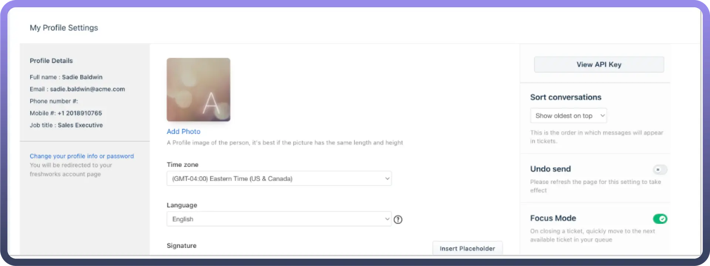

# Freshdesk

Source: https://www.unifyapps.com/docs/unify-automations/freshdesk
Section: automations

---

Freshdesk simplifies customer support management by centralizing tickets, team tasks, and communication for seamless issue resolution. Its automation and reporting tools enhance efficiency and security, making it an ideal platform for effective customer service.

Connecting your application to a Freshdesk account enables you to interact with Freshdesk’s project management and tracking capabilities directly from your application.

## Authentication

Before you begin, make sure you have the following information:

- `Connection Name`: The Connection Name is a unique identifier you choose for the connection between your application and your Freshdesk account.
- `Authentication Type`**:** Freshdesk supports the following type of authentication for connecting to your account:
  - API Key
  - Basic Authentication

### API Key based Authentication

To find your API Key

1. Log in to your Freshdesk account.
2. Navigate to the profile icon at the top right and go to profile settings.
3. In the right pane, select `View API key` and complete the captcha verification.

  

4. Copy the API key and treat it with high confidentiality as it allows access to your Freshdesk account.
5. You can reset the API Key if necessary, which will disconnect all connected applications. New keys must be shared with these applications to restore their access.

### Basic Authentication

1. Basic authentication requires your Freshdesk domain (formatted as *yourcompany.freshdesk.com*) and API key, acting as your password.
2. To authenticate API requests, combine your API key with a placeholder password and encode this in base64.
3. Include the encoded string in request headers under the Authorization field.
4. For security, always use HTTPS to safeguard your credentials.

## Actions

| **Action Name** | **Description** |
|---|---|
| `Create agent` | Creates an agent for Freshdesk |
| `Create company` | Creates a company in Freshdesk |
| `Create contact` | Creates a contact in Freshdesk |
| `Create message thread` | Creates a thread in Freshdesk |
| `Create thread` | Creates a thread in Freshdesk |
| `Create ticket` | Creates a ticket in Freshdesk |
| `Delete agent` | Deletes an agent by ID in Freshdesk |
| `Delete company` | Deletes a company by ID in Freshdesk |
| `Delete contact` | Deletes a contact by ID in Freshdesk |
| `Delete message thread` | Deletes a message thread by ID in Freshdesk |
| `Delete thread` | Deletes a thread by ID in Freshdesk |
| `Delete ticket` | Deletes a ticket by ID in Freshdesk |
| `Get agent` | Get agent details by ID in Freshdesk |
| `Get company` | Gets company details by ID in Freshdesk |
| `Get contact` | Gets contact details by ID in Freshdesk |
| `Get group` | Gets group details by ID in Freshdesk |
| `Get message thread` | Get message thread details by ID in Freshdesk |
| `Get thread` | Gets thread details by ID by Freshdesk |
| `Get ticket` | Get ticket details by ID in Freshdesk |
| `List agents` | Lists agents in Freshdesk |
| `List companies` | Lists companies in Freshdesk |
| `List contacts` | Lists contacts in Freshdesk |
| `List forum categories` | List forum categories in Freshdesk |
| `List forums` | List forums in Freshdesk |
| `List solution folders` | List solution folders in Freshdesk |
| `List solutions` | List solutions in Freshdesk |
| `List tickets` | Lists tickets in Freshdesk |
| `Search agents` | Searches for agents in Freshdesk |
| `Search companies` | Searches for a company in Freshdesk |
| `Search contacts` | Searches for a contact in Freshdesk |
| `Search forum topics` | Searches forum topics in Freshdesk |
| `Search solution` | Searches for a solution article in Freshdesk |
| `Search tickets` | Searches for a ticket in Freshdesk |
| `Update agent` | Updates agent by ID in Freshdesk |
| `Update company` | Updates a company by ID in Freshdesk |
| `Update contact` | Updates a contact by ID in Freshdesk |
| `Update message thread` | Updates a message thread by ID in Freshdesk |
| `Update ticket` | Updates a ticket by ID in Freshdesk |

## Triggers

| **Trigger Name** | **Description** |
|---|---|
| `New company` | Triggers when a new company is created in Freshdesk |
| `New contact` | Triggers when a new contact is created in Freshdesk |
| `New ticket` | Triggers when a new ticket is created in Freshdesk |
| `Updated company` | Triggers when a company gets updated in Freshdesk |
| `Updated contact` | Triggers when a contact gets updated in Freshdesk |
| `Updated ticket` | Triggers when a ticket gets updated in Freshdesk |
