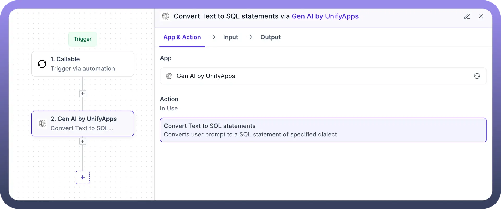
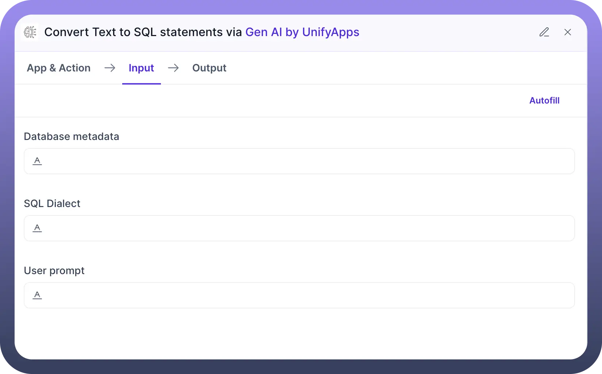
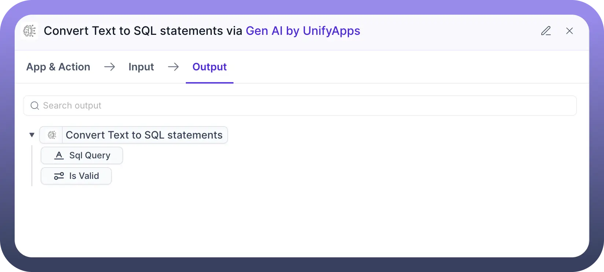

# Gen AI by UnifyApps

Source: https://www.unifyapps.com/docs/unify-automations/gen-ai-by-unifyapps
Section: automations

---

## Overview

**Gen AI by UnifyApps** brings the power of generative AI into automation workflows. It enables natural language understanding and intelligent task generation, starting with converting plain English prompts into SQL queries tailored to your database schema and dialect.

This is particularly useful for business users or analysts who want to interact with databases without writing SQL code, accelerating data access and enhancing productivity across teams.

## Use Case Example

**Natural Language to SQL Conversion for Business Dashboards**

A product analyst wants to create a dashboard that displays the total number of orders by region for the last 30 days. Instead of writing SQL manually, the analyst uses the **Convert Text to SQL Statements** action. By entering a prompt like “Show me total orders by region for the last 30 days” and specifying the SQL dialect and schema metadata, the system returns an accurate SQL query instantly.

## Action

**Convert Text to SQL Statements**

The **Convert Text to SQL Statements** action uses AI to translate user prompts into executable SQL queries based on your specified dialect and database schema. It simplifies the query-building process, making data more accessible to non-technical users.

**Input Fields:**

- `Database Metadata`: Provide the structure of your database, including table and column names. This helps the AI model understand what data is available and how to structure the query accurately.
- `SQL Dialect`: Choose the SQL dialect (e.g., MySQL, PostgreSQL, BigQuery, Snowflake, etc.) that the generated query should comply with.
- `User Prompt`: Enter a plain-language description of the query you want to run. Example: “Get the average revenue per customer for the last quarter.”

**Output:**

- A syntactically valid SQL query tailored to your database schema and dialect. This can be passed to a downstream SQL execution step or used for review.

### Benefits

- Accelerates query writing for analysts and product teams
- Reduces reliance on technical SQL knowledge
- Increases efficiency in building data-driven workflows
- Supports multiple SQL dialects and structured schemas
