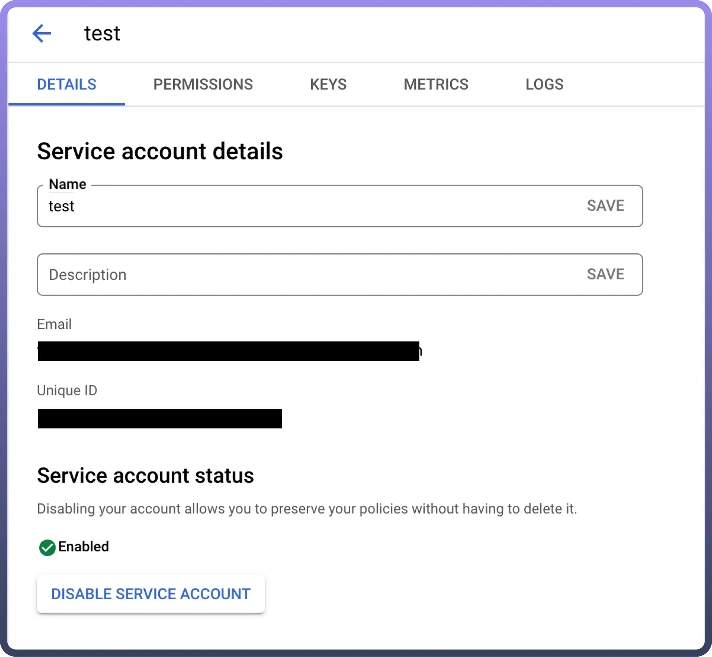
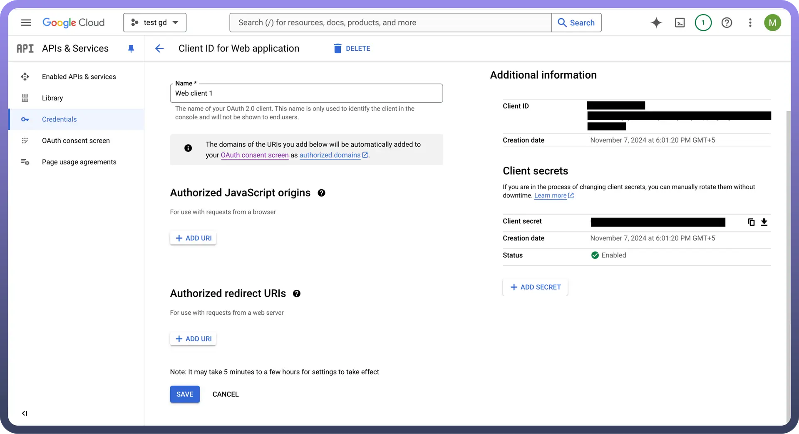
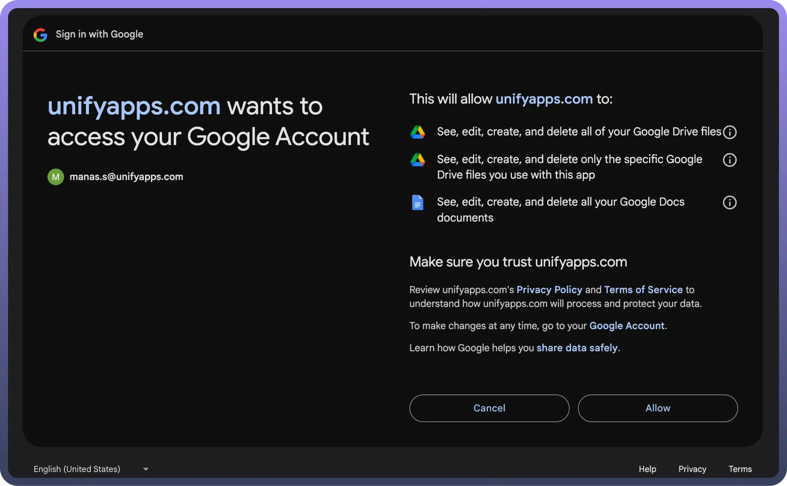

# Google Docs

Source: https://www.unifyapps.com/docs/unify-automations/google-docs
Section: automations

---

Google Docs is a cloud-based word processing tool that allows for real-time collaboration and seamless document sharing. It provides automatic saving and easy access from any device, making it ideal for both personal and professional use.

Integrating your application with Google Docs revolutionizes document collaboration, offering real-time editing, version control, and seamless sharing, enhancing productivity and teamwork.

## Authentication

Before you begin, ensure you have the following information:

- `Connection Name`: Choose a descriptive name for your Google docs connection to help you identify it within your application or integration settings. A meaningful name, like "MyAppGoogledocsIntegration," helps maintain organization, especially when managing multiple integrations.
- `Authentication Type`: Select the type of authentication to connect to your Google docs account securely:
  - Service Account Authentication
  - OAuth

### Service Account Based Authentication

- Create a service account by following these [steps](https://apps.google.com/supportwidget/articlehome?hl=en&article_url=https%3A%2F%2Fsupport.google.com%2Fa%2Fanswer%2F7378726%3Fhl%3Den&assistant_id=generic-unu&product_context=7378726&product_name=UnuFlow&trigger_context=a).
- Add domain-level access to the service account (based on client ID) by following these [steps](https://developers.google.com/cloud-search/docs/guides/delegation#delegate_domain-wide_authority_to_your_service_account).
- Ensure that the following scopes are added to your service account and domain-level access: [https://www.googleapis.com/auth/documents](https://www.googleapis.com/auth/documents) [https://www.googleapis.com/auth/documents.readonly](https://www.googleapis.com/auth/documents.readonly) [https://www.googleapis.com/auth/drive.file](https://www.googleapis.com/auth/drive.file) [https://www.googleapis.com/auth/drive](https://www.googleapis.com/auth/drive) [https://www.googleapis.com/auth/drive.readonly](https://www.googleapis.com/auth/drive.readonly)
- Use the service account email, private key, and a sample user email to authenticate the connection

  

### OAuth Based Authentication (With Credentials)

The OAuth  method involves signing in with your Google account credentials on Google's Single Sign-On page, and granting the necessary permissions to UnifyWorkflows, For `OAuth`-based authentication, you'll need to perform the following steps to generate access credentials:

- Turn on the API services for Google Docs API and Google Drive API from `APIs & Services` -> `Enable APIs and services`**.**
- Create an OAuth Client Credentials by following these [steps](https://support.google.com/cloud/answer/6158849?hl=en#).
- Set up an OAuth consent screen to configure OAuth consent for your application by the following [steps](https://support.google.com/cloud/answer/10311615?hl=en&ref_topic=3473162&sjid=10952494557109160158-AP) **.**
- After adding new secret, console displays the `Client Identifier` as “`Client ID`” and `Client Secret` as **“**`Client secret`**”**. Copy this and treat it with high confidentiality, as it allows access to your Google Docs account.

  

- Use the `Client ID` and `Client secret`, press the Authorise button. You’ll be redirected to a Google sign-in page.
- If you're not already logged into Google, enter your Google account credentials and Sign in.
- Google will display a permissions request screen, showing the app name and the specific Google services we are requesting access to (e.g., Google Docs and Google Drive).
- Carefully review the permissions being requested. If you’re comfortable with them, click the "`Allow`" or "`Grant Access`" button.
- After granting access, you will be automatically redirected back to our platform, where you should see a confirmation message indicating that your Google account is now connected and authorized.
- Ensure that the following permissions are granted for `OAuth authentication` and provide public access to your documents in Google drive. [https://www.googleapis.com/auth/documents](https://www.googleapis.com/auth/documents) [https://www.googleapis.com/auth/documents.readonly](https://www.googleapis.com/auth/documents.readonly) [https://www.googleapis.com/auth/drive.file](https://www.googleapis.com/auth/drive.file) [https://www.googleapis.com/auth/drive](https://www.googleapis.com/auth/drive) [https://www.googleapis.com/auth/drive.readonly](https://www.googleapis.com/auth/drive.readonly)

### OAuth

- Press the `Authorize` button. You'll be redirected to a Google sign-in page.
- If you're not already logged into Google, enter your Google account credentials.
- Google will display a permissions request screen. You'll see our app name and the specific Google services we request access to.
- Carefully review the permissions we're asking for. If you're comfortable with the permissions, click the "`Allow`" or "`Grant Access`" button.
- After granting access, you'll be automatically redirected back to our platform. You should see a confirmation message that your Google account is now connected.

  

## Actions

| **Action Name** | **Description** |
|---|---|
| `Create Document` | Creates a document in Google Docs |
| `Append text to document` | Appends a text to an existing document in Google Docs |
| `Find a document` | Searches for a specific document by name in Google Docs |
| `Create document from template` | Creates document using data and existing template in Google Docs |
| `Update document` | Updates the text in existing document in Google Doc |
| `Upload a document in Google Docs` | Uploads a document in Google Docs |

## Triggers

| **Action Name** | **Description** |
|---|---|
| `New document (inside any folder)` | Triggers when an document is created in Google docs |
| `New document in specific folder` | Triggers when an document is created in specific folder |
