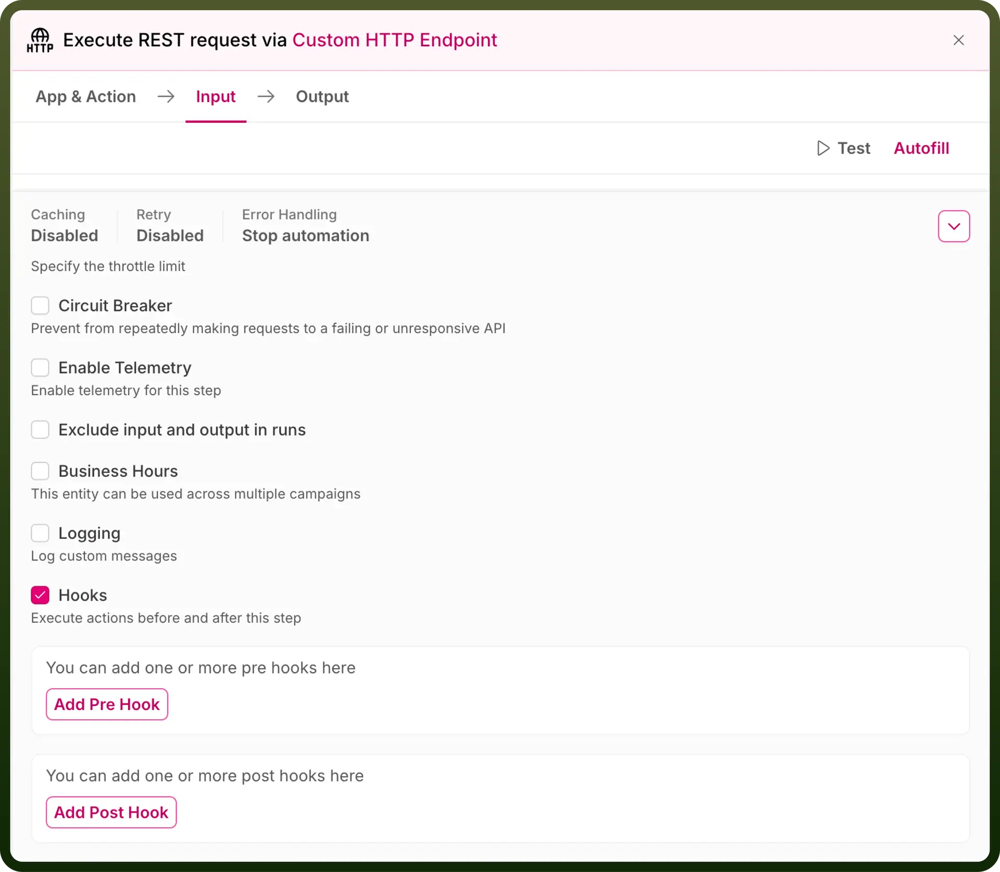
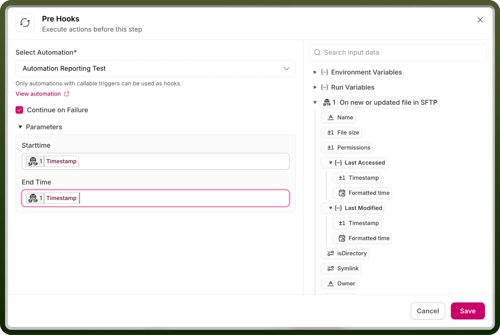
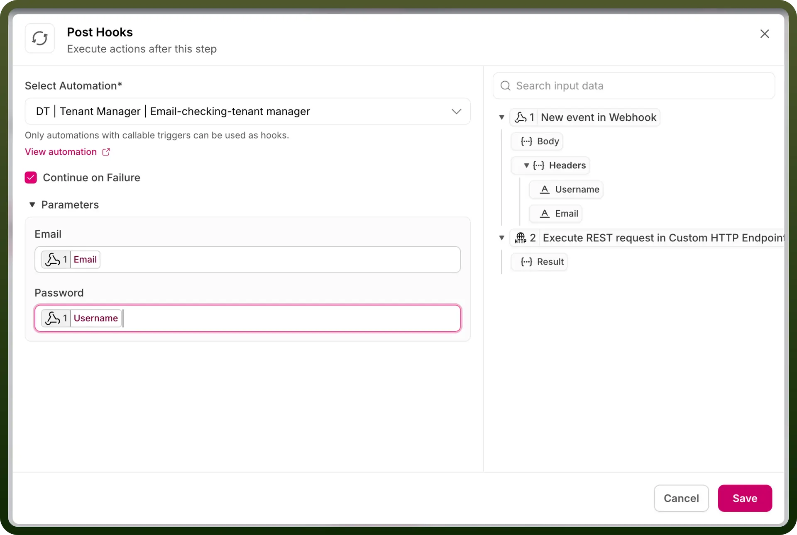

# Hooks

Source: https://www.unifyapps.com/docs/unify-automations/hooks
Section: automations

---

## Overview

Hooks in UnifyApps allow users to trigger child automations directly from an existing node without needing to add a separate node for this purpose. This feature streamlines the design of workflows by reducing redundancy, keeping them clear and efficient while enhancing overall automation flexibility and functionality.

Hooks can be used to trigger any automation that has a trigger type of **Callable via automation.**

Hooks can be defined at the node level by enabling the hooks toggle in the extended menu of the node.

## Understanding Hooks in Nodes

The platform allows you to configure hooks on a node to trigger automations at specific stages of the node's execution. Hooks can be set up in two ways:

1. `Pre-Hook`:
  - This triggers the specified automation **before** the node's execution begins.
2. `Post-Hook`:
  - This triggers the specified automation **after** the node's execution is complete.

Both types of hooks operate in a synchronized manner. This means that subsequent events in the workflow will only proceed once the referred automation triggered by the hook has completed its execution.

## Failure Handling

The referenced automation triggered by a hook can be configured to ensure that the node executes without barriers, even if the automation fails. This behavior can be enabled for both pre-hooks and post-hooks via a **checkbox** in the hook configuration modal.

## Setup Process

- Select the automation to be triggered from a dropdown menu.
- The input fields from the selected automation will appear below, allowing you to map `data pills` from the current automation into the referenced automation.
- Use the checkbox to determine whether the node should continue execution regardless of the referenced automation’s success or failure.

This flexibility ensures robust workflow execution while maintaining seamless integration between automations.
