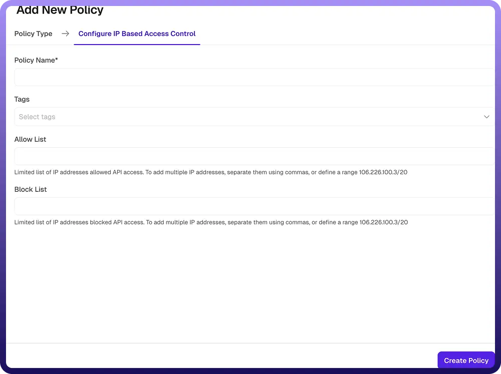

# IP Based Access Control Policy

Source: https://www.unifyapps.com/docs/unify-automations/ip-based-access-control-policy
Section: automations

---

## Overview

An IP Based Access Control Policy restricts or allows access to APIs based on the client’s IP address. It helps enhance security by ensuring that only trusted IP addresses or networks can access your APIs, while blocking unauthorized or suspicious sources.

You can define both allow lists and block lists to control access. Requests are evaluated against these lists before being forwarded to the backend.

## Field Reference

The following fields are available when creating or editing an IP Based Access Control policy:

| **Field Reference** | **Description** |
|---|---|
| `Policy Name` | A unique identifier for the policy, used across logs, dashboards, and API group configurations. Required |
| `Tags` | Custom labels to organize and filter the policy by environment, team, or functionality. Optional |
| `Allow List` | Specifies the list of IP addresses or IP ranges that are permitted to access the API.  Multiple IPs can be added by separating them with commas. **Optional** |
| `Block List` | Specifies the list of IP addresses or IP ranges that are denied access to the API.Multiple IPs can be added by separating them with commas. **Optional** |

## How It Works

1. `Request received`**:** The gateway receives the API request and identifies the client’s IP address.
2. `Block list check`**:** The IP address is checked against the **block list.**
3. `Allow list check`**:** If an allow list is configured, the IP is validated against it.
4. `Request forwarding`**:** If the IP passes all checks, the request is forwarded to the backend service.
5. `Access enforcement`**:** Rejected requests receive an appropriate error response indicating that access is denied.

## Attaching a Policy to an API Group

Once an IP Based Access Control Policy is created, it can be attached to one or more API Groups. 
 Multiple policies can be applied to an API Group, and their execution order can be configured by arranging them in the desired sequence.
