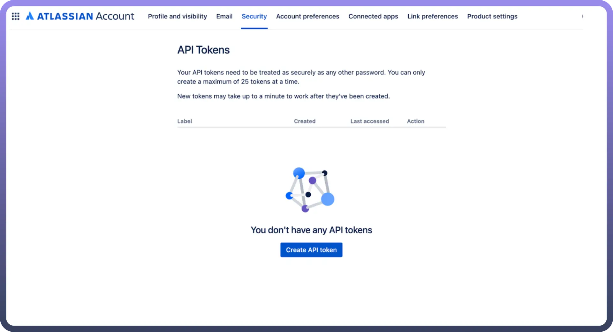

# Jira

Source: https://www.unifyapps.com/docs/unify-automations/jira
Section: automations

---

Jira provides a simple way to **organize** and **plan** the release of any software. It is designed to assist teams in **planning**, **tracking**, **releasing**, and **supporting** software development projects efficiently. It supports a wide range of project types, from simple initiatives to complex DevOps practices, allowing effective communication among team members.

Integrating your application with Jira revolutionizes project management, facilitating streamlined issue tracking, team collaboration, and automation.

## Authentication

Ensure you have the following information ready for a seamless integration process:

- `Connection Name`: Select a descriptive name for your connection, like "MyAppJiraIntegration". This helps in easily identifying the connection within your application or integration settings.
- `Authentication Type`**:** Jira supports the following types of authentication.
  - Access Token
  - OAuth 2.0

### Access Token

- Create the API token by going to [https://id.atlassian.com/manage/api-tokens](https://id.atlassian.com/manage/api-tokens)
- In the API token section, click on Create API token. Ensure to keep this key secure as it grants access to Jira's services and is billed based on usage.

  

### OAuth 2.0

- Follow these steps to configure OAuth 2.0:
  - Visit [developer.atlassian.com](https://developer.atlassian.com/) and click your profile icon in the top-right corner
  - Select [Developer Console](https://developer.atlassian.com/console/myapps/) from the dropdown menu
  - Choose your application or create a new one
  - Navigate to "`Authorization`" in the left menu
  - Click "`Configure`" next to OAuth 2.0 (3LO)
  - Enter your application's Callback URL
  - Save your changes
- Adding API Permissions:
  - Select "`Permissions`" from the left menu
  - Find the desired API and click "`Add`"
  - Configure the necessary scopes for your integration

## Triggers

| **Triggers** | **Description** |
|---|---|
| `New issue` | Use this trigger to start the automation when an issue is created in Jira. |
| `New/updated comment` | Use this trigger to start the automation when a comment is added or updated in Jira. |
| `New/updated issue` | Use this trigger to start the automation when an issue is added or updated in Jira. |
| `New/updated worklog` | Use this trigger to start the automation when a worklog is created or updated in Jira. |
| `New project` | Use this trigger to start the automation when a new project is created in Jira. |
| `Updated issue` | Use this trigger to start the automation when an issue is updated in Jira. |

## Actions

| **Actions** | **Description** |
|---|---|
| `Assign user to issue` | Use this action to Assign user to issue in Jira. |
| `Create comment` | Use this action to create comment for issue in Jira. |
| `Create issue` | Use this action to create an issue in Jira. |
| `Create user` | Use this action to create a user in Jira. |
| `Find users assignable to projects` | Use this action to find users assignable to projects in Jira. |
| `Get changelogs` | Use this action to get changelogs for an issue from Jira. |
| `Get comments` | Use this action to get comments for an issue from Jira. |
| `Get issue details` | Use this action to get issue details from Jira. |
| `Get issue type schemas` | Use this action to get all issue type schemes from Jira. |
| `Get projects` | Use this action to get projects from Jira. |
| `Get user` | Use this action to get user details from Jira. |
| `Get user details by email` | Use this action to get user details by email from Jira. |
| `Get user details by ID` | Use this action to get user details by ID from Jira. |
| `Update comment` | Use this action to update comment for an issue in Jira. |
| `Update issue` | Use this action to update issue in Jira. |
| `Update attachment` | Use this action to upload attachment to an issue in Jira. |
