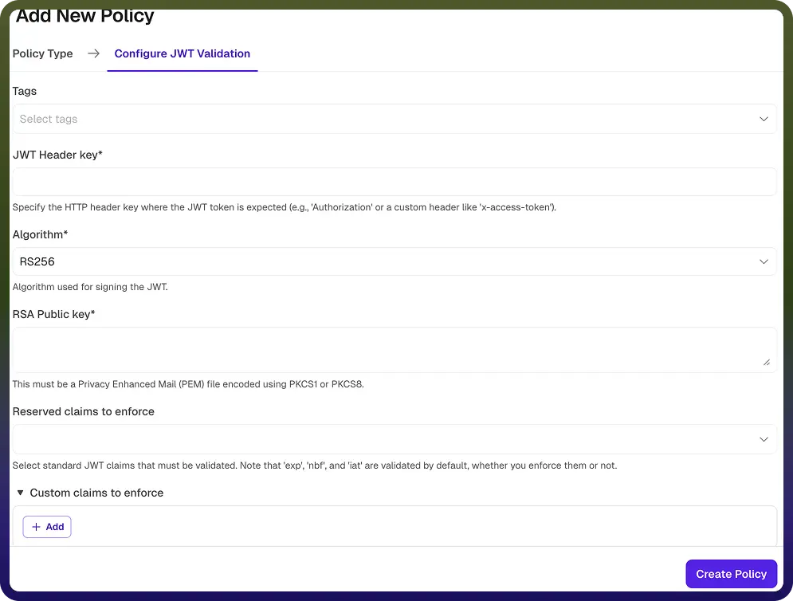

# JWT Validation Policy

Source: https://www.unifyapps.com/docs/unify-automations/jwt-validation-policy
Section: automations

---

## Overview

A JWT Validation Policy verifies the authenticity and integrity of JSON Web Tokens (JWTs) included in API requests. It ensures that only requests with valid, trusted tokens are allowed to access backend services.

The policy validates the token signature, algorithm, and claims to enforce authentication and authorization requirements.

| **Field Reference** | **Description** |
|---|---|
| `Policy Name` | A unique identifier for the policy, used across logs, dashboards, and API group configurations. **Required** |
| `Tags` | Custom labels to organize and filter the policy by environment, team, or functionality. **Optional** |
| `JWT Header Key` | Specifies the HTTP header where the JWT token is expected. Examples: Authorization , x-access-token **Required** |
| `Algorithm` | Defines the cryptographic algorithm used to verify the JWT signature. **Required**
 Supported algorithms include: 
 → **RS256, RS384, RS512** (RSA-based) 
 → **HS256, HS384, HS512** (HMAC-based) |
| `RSA Public key` | Specifies the public key used to verify JWT signatures (for RSA algorithms). 
 → Must be in PEM format (PKCS1 or PKCS8) 
 → Used to validate tokens signed with the corresponding private key 
**Required (for RSA algorithms)** |
| `Reserved Claims to Enforce` | Specifies standard JWT claims that must be validated. Examples include: 
 → iss (issuer) 
 → aud (audience) 
 → sub (subject) 
 Note: Claims such as exp (expiration), nbf (not before), and iat (issued at) are validated by default. **Optional** |
| `Custom Claims to Enforce` | Defines additional custom claims that must be present and match expected values. 
 Each custom claim includes: 
**a. Claim Name:** The name of the claim to validate. **Required**
**b. Expected Value:** The expected value for the claim. 
 The request will be rejected if the value does not match. **Required** |

## How It Works

1. `Request received`**:** The gateway receives an API request containing a JWT.
2. `Token extraction`**:** The JWT is extracted from the configured HTTP header.
3. `Signature validation`**:**The token’s signature is verified using the selected algorithm and key.
4. `Claims validation`**:**
5. `Validation outcome`**:** If the token is valid, the request is forwarded to the backend, else validation fails, the request is rejected
6. `Error response`**:** Rejected requests receive an error indicating authentication or token validation failure.

## Attaching a Policy to an API Group

Once a JWT Validation Policy is created, it can be attached to one or more API Groups. Multiple policies can be applied to an API Group, and their execution order can be configured by arranging them in the desired sequence.
