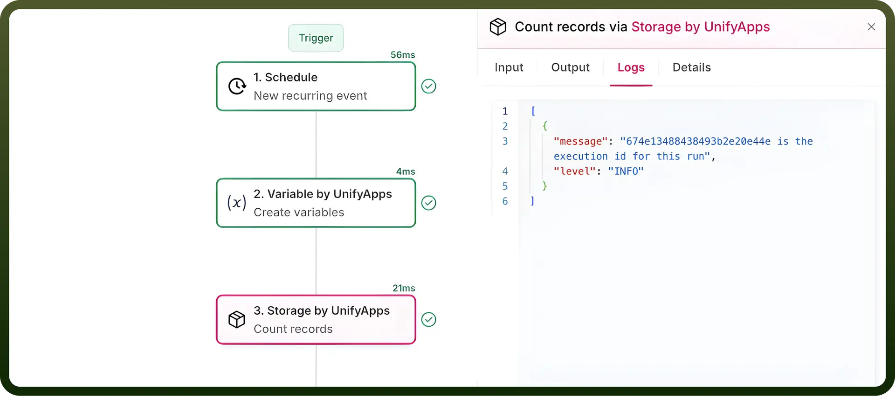
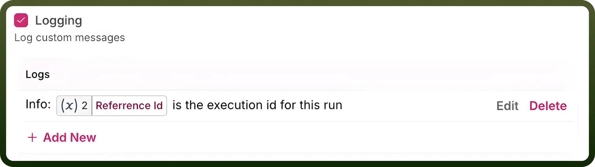
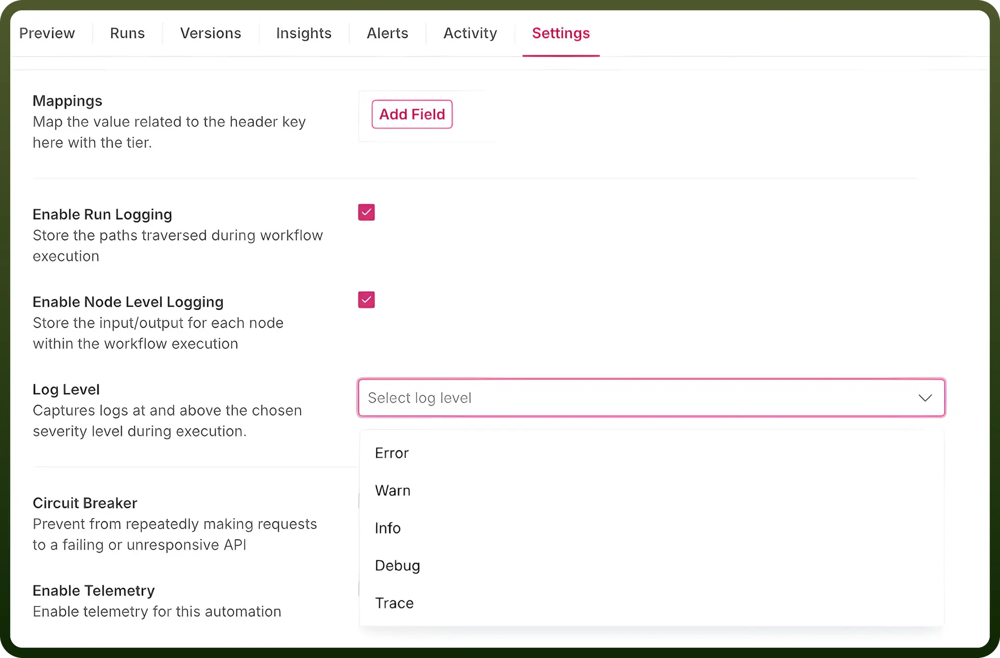
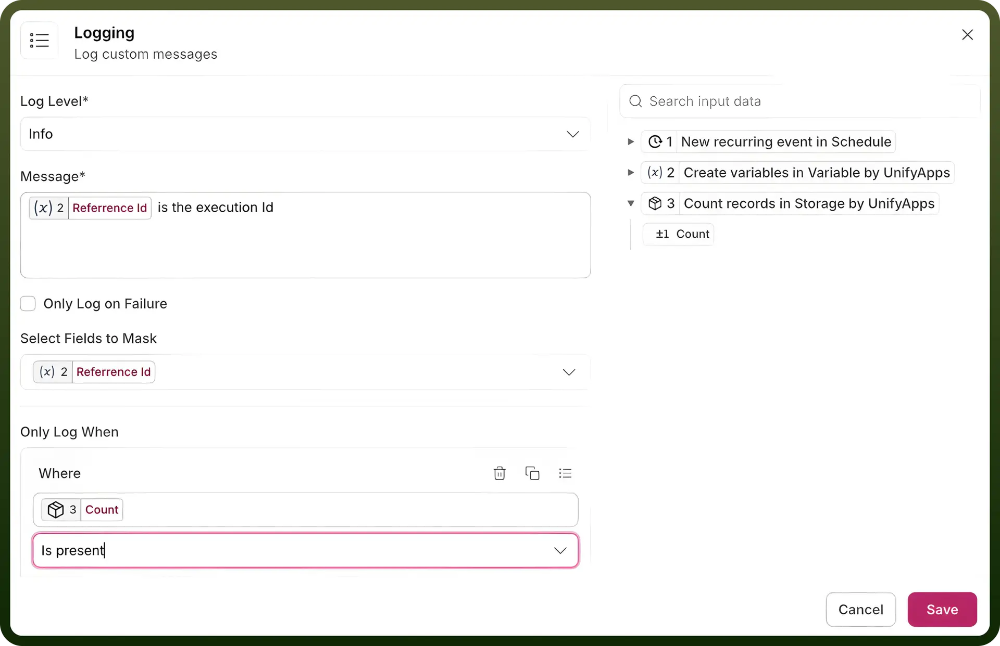

# Logging

Source: https://www.unifyapps.com/docs/unify-automations/logging
Section: automations

---

## Overview

Logging in UnifyApps enables users to track the functionality of a node in an automation. This feature allows the creation of logs that can capture details of a node execution, in the form of **messages** and provide insights into their execution history.

These recorded messages could be accessed in the runs of the automation, at the node level details, under the tab of **Logs**, along with the input and output tabs for the node.

Node level logs can be enabled through the extended configuration menu by checking the logging option. Users can set up multiple configurations to capture a range of messages across the same node.

To enable logging at the node level, users must configure the logging level in the **automation settings**. The logging levels available for configuration are as follows:

1. **Error**
2. **Warn**
3. **Info**
4. **Debug**
5. **Trace**

## How Logging Levels Work?

- The logging level defined in the automation settings determines the **maximum extent** of logging detail available for the nodes.
- Node-level logging can only be set to the level chosen in the automation settings or levels **above it** in the hierarchy.

## Steps to Configure a Log Message

1. **Define the Log Type** Select the type of log you want to register from the `Log Level` dropdown. Options include:
  - `Error`: Logs critical issues preventing the node from functioning.
  - `Warn`: Logs potential issues that might lead to errors.
  - `Info`: Logs general information about the node's execution.
  - `Debug`: Logs detailed information useful for debugging.
  - `Trace`: Logs granular details such as execution flow and variable states.
2. **Configure the Log Message**
  - Enter a custom message in the `Message` text field to describe what is being logged.
  - Add dynamic data-pills from the **right panel** to include input data from preceding nodes in your message.
3. **Set Conditions for Logging (Optional)** If you want to register logs only under certain conditions:
  - Use the `Only Log When` section.
  - Define the field, the condition (e.g., equals to), and the value to ensure the log triggers only when the specified condition is met.
4. **Mask Sensitive Fields in Logs (Optional)** If your log message contains sensitive information:
  - Use the `Select Fields to Mask` dropdown to choose the fields to obfuscate.
  - Masked fields will appear as hidden in the logs to protect data privacy.
5. **Enable Logging on Failure Only (Optional)** If you only want to log messages when the node fails:
  - Check the `Only Log on Failure` box to ensure logs are created only for failed executions.
6. **Save the Configuration** After defining the log type, message, and any optional settings, click `Save` to apply your logging configuration.

