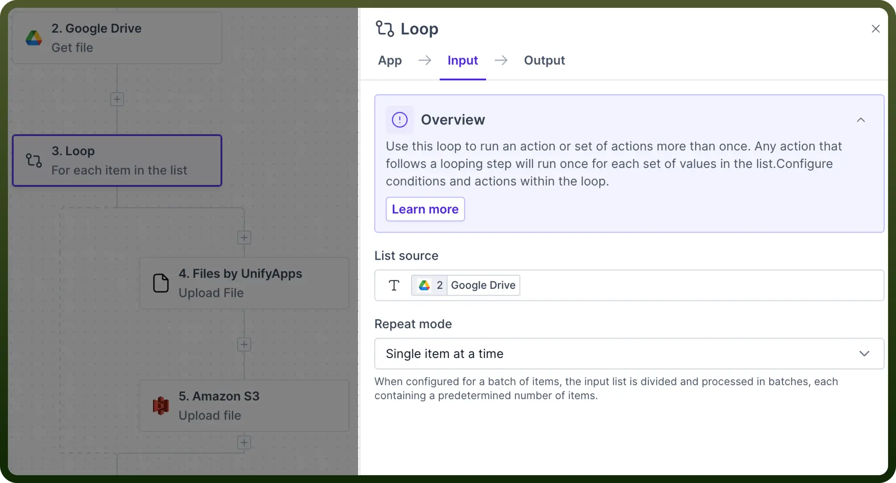
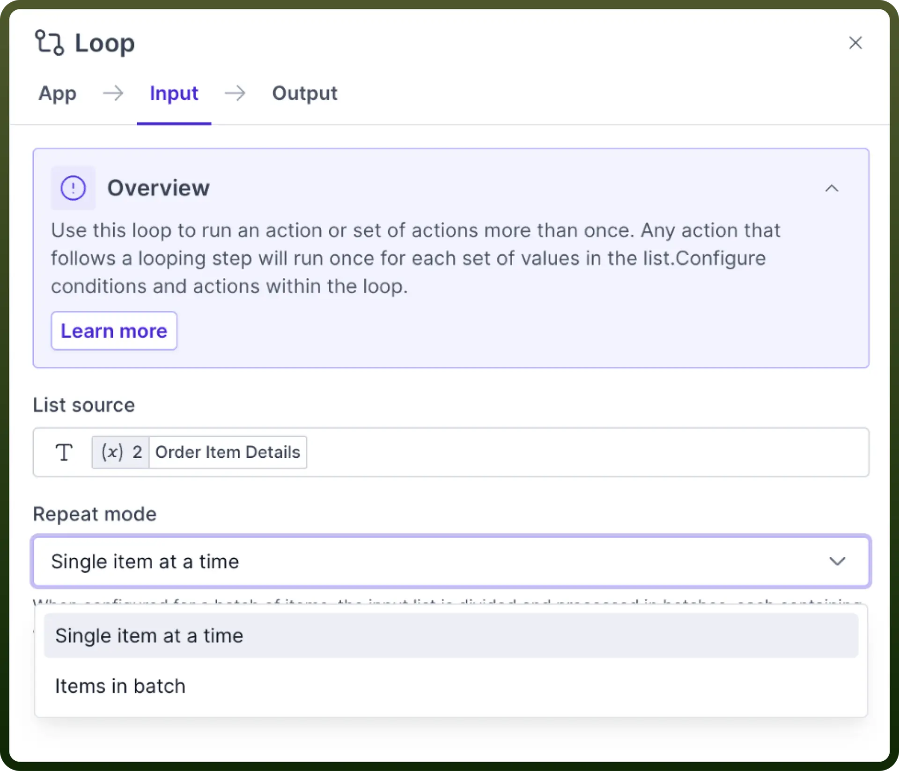
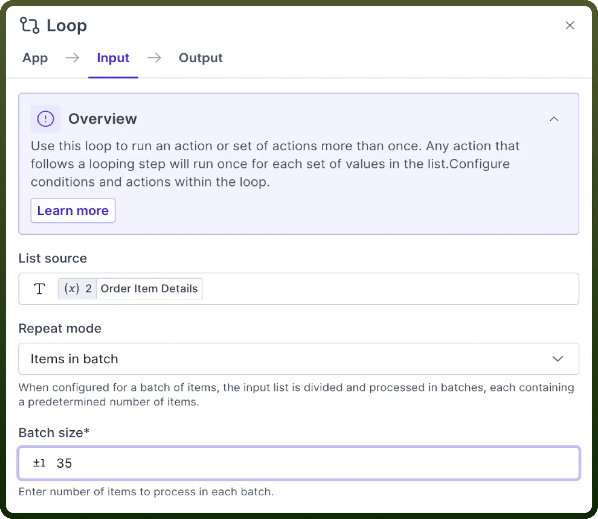
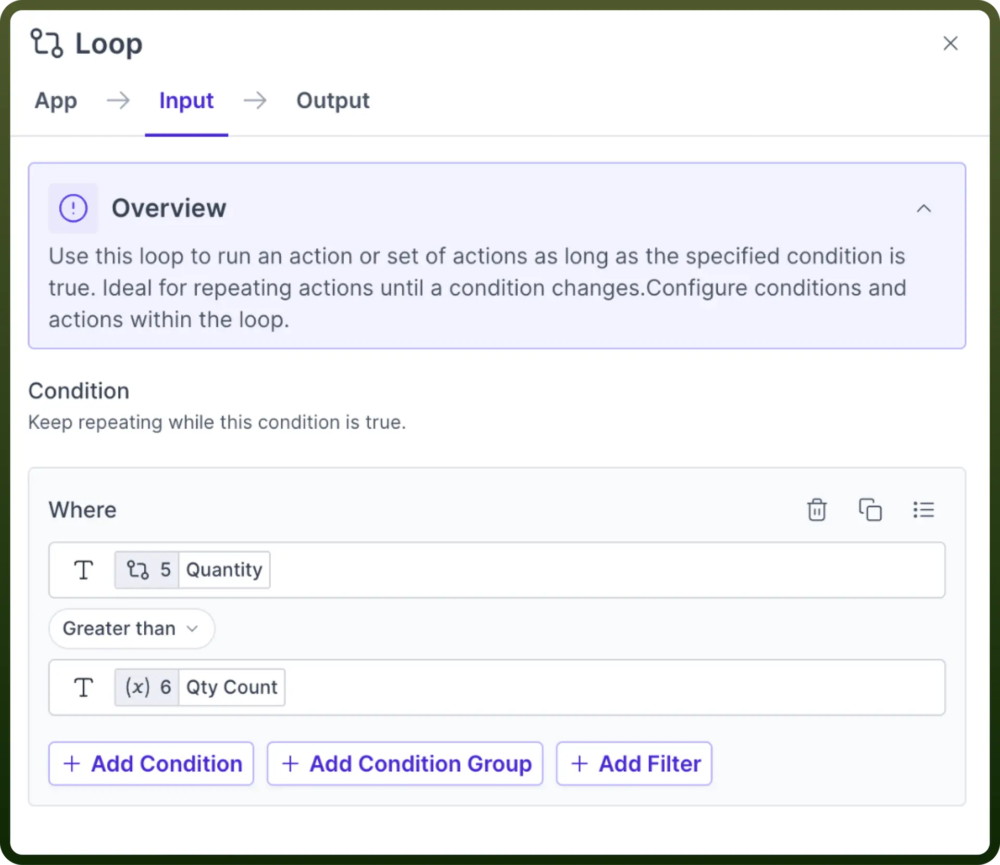
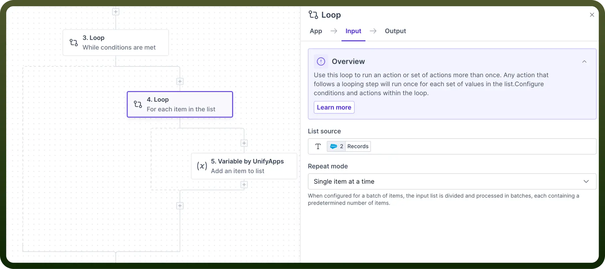

# Loop

Source: https://www.unifyapps.com/docs/unify-automations/loop
Section: automations

---

## Overview

Loop allows you to **repeat a set of steps** based on different criteria.

There are primarily two categories of loops:

`While` **Loop:** This type of loop repeats the set of actions as long as a specified condition remains true. Once the condition becomes false, the loop terminates automatically.

For **example**, you can retrieve the data from a CSV file while the number of records has reached a certain limit, such as not more than 100 records.

`For` **Loop:** A for loop iterates over a list and executes a set of actions for each element within that list. The loop concludes once all elements have been processed.

For **instance**, a for loop could be used to extract data from each record in a CSV file**.**

## Use Case

Let's look at an example where we will download a list of image URLs individually and upload them to our Amazon S3 server.

1. First, we have our list of image URLs and then pass it to Loop using “`for loop`” for every URL present in the list.

  

2. Then, we use [Files by UnifyApps](/docs/unify-automations/loop) to download the image files one after the other from their URLs and create a file object out of them.
3. Finally, we pass it to the Amazon S3 node, allowing us to upload the images to our server.

## For Loop

This action allows users to execute repetitive tasks by iterating through each item in a list and performing specified actions on each of them in the sequence.

Users can choose to execute a `single item at a time` or process `items in batches`.

> **Note:** When batch execution is selected, users must specify the batch size, with a maximum limit of **100** items per batch.

| **Input Fields** | **Description** |
|---|---|
| `List Source` | A data structure that holds a collection of items. |
| `Repeat Mode` | Type of For loop execution: **single item** or in **batches.** |

## While Loop

This action allows users to execute a logic block if a specified condition remains true.

Users can apply conditions through the input pane and can add multiple conditions.

| **Input Field** | **Description** |
|---|---|
| `Condition` | Logical expression that evaluates to True or False. |
| `Add Condition` | Add multiple conditions. |
| `Add Condition Group` | Conditions can be grouped with **AND** or **OR.** |

> **Note:** We can create hierarchies of loops by nesting them one after other to handle diverse automation scenarios effectively.

## Combine Loops

You can combine While and For each Loop in the same automation.

For **example**, a recipe can contain a For loop inside a While loop. Following example supports the above use case:

- REPEAT search for contacts using SOQL query in Salesforce WHILE pages of search results remain.
- FOR EACH record in a page of search results, retrieve contact details.

  
