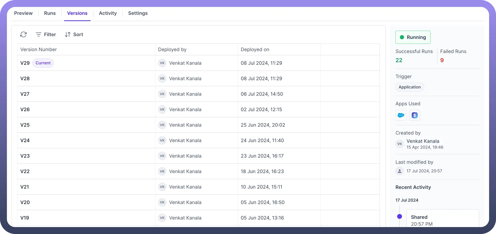
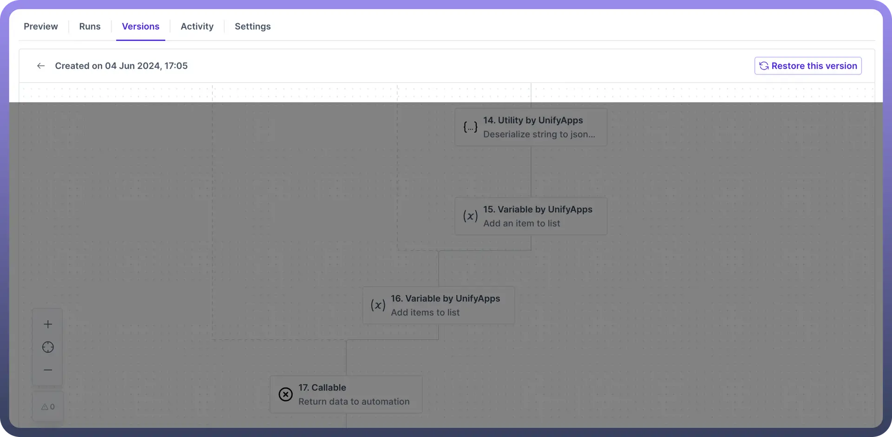

# Manage Your Versions

Source: https://www.unifyapps.com/docs/unify-automations/manage-your-versions
Section: automations

---

## Introduction

Every time an automation is deployed, a new version of the automation is created.

This versioning system allows you to **keep track** of **all the changes** and you can revert to previous versions if needed.

The current version that is currently deployed is associated with the “`current`” tag along with the version number.

Each version is associated with the user who made the change. Additionally, a timestamp is recorded to indicate when the version was deployed.

## Restore Version

To restore a version of automation, you need to:

- Click on the `Version` to open the Version details page.
- Click the “`Restore this version`” button, located in the top right corner of the page to restore the selected version

