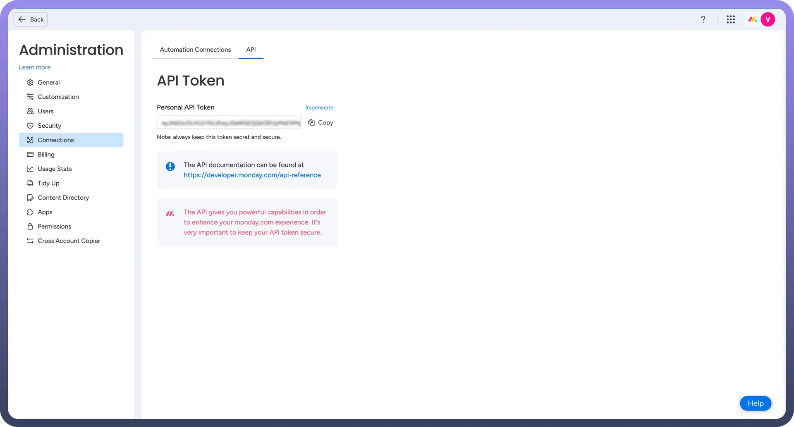
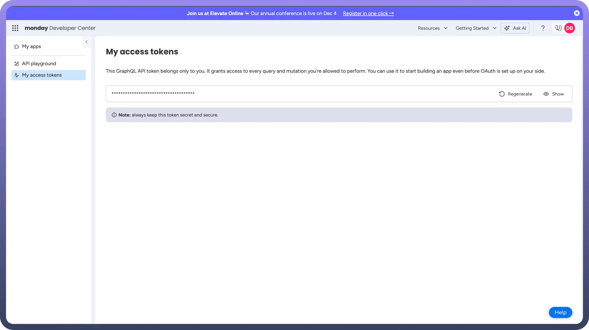

# Monday

Source: https://www.unifyapps.com/docs/unify-automations/monday
Section: automations

---

Monday.com is a work operating system that facilitates **project management** by **organizing** tasks and **tracking** progress.

Integrating it with your application streamlines task assignment, progress tracking, and team collaboration, improving overall project efficiency.

## Authentication

Ensure you have the following information ready for a seamless integration process:

- `Connection Name`: Select a descriptive name for your connection, like "MyAppMondayIntegration". This helps easily identify the connection within your application or integration settings.
- `Authentication Type`:[Monday.com](http://monday.com) supports API tokens for authentication. This method ensures secure access to[Monday.com](http://monday.com)'s functionalities and data.
- `Access Token`: You can create an access token using two methods-
  - Via Admin tab
  - Via Developer tab

## Access Token Creation

1. **Admin tab** **:**
  - Click on your profile icon in the top right corner of your[Monday.com](http://monday.com) account to access the main menu.
  - Select "`Admin`" to go to the administration section. **Note:** Only users with admin access can act in the administration section.
  - Navigate to the "`API`" section under "`Connections`".
  - Generate or copy your existing API token in the "`API Token`" section. Treat this token with high confidentiality, as it allows access to your[Monday.com](http://monday.com) account.

    

2. **Developer tab :**
  - Click on your profile icon in the top right corner of your[Monday.com](http://monday.com) account to access the main menu.
  - Select “`Developer`”. This will open the Developer Center in another tab.
  - In the Developer Center, on the left navigation menu, click on “`My Access Tokens`”.
  - Generate or copy your existing API token in the "`API Token`" section. Treat this token with high confidentiality, as it allows access to your[Monday.com](http://monday.com) account.

    

## Actions

| Actions | Description |
|---|---|
| `Archive record` | Archives a record, e.g. item, in Monday.com |
| `Clear column` | Clears a column value in Monday.com |
| `Create record` | Creates a record, e.g. item, in Monday.com |
| `Delete record` | Deletes a record, e.g. item, in Monday.com |
| `Get record` | Gets a record, e.g. item, in Monday.com |
| `Update record` | Updates a record, e.g. item, in Monday.com |
| `Get user details` | Gets a user details from Monday.com |
| `Search records` | Search records, e.g. users, in Monday.com |
| `Upload file` | Uploads a file in Monday.com |
| `Move record` | Moves a record, e.g. item, in Monday.com |
| `Custom action` | Provide and run custom GraphQL query in Monday.com |

## Triggers

| Actions | Description |
|---|---|
| `New item` | Triggers when a new item is created in Monday.com |
| `New moved item to group` | Triggers when a new item moved to group in Monday.com |
| `New user` | Triggers when a new user joins in Monday.com |
| `Updated any column value` | Triggers when any column value is updated in Monday.com |
| `Updated specific column value` | Triggers when a specific column value is updated in Monday.com |
