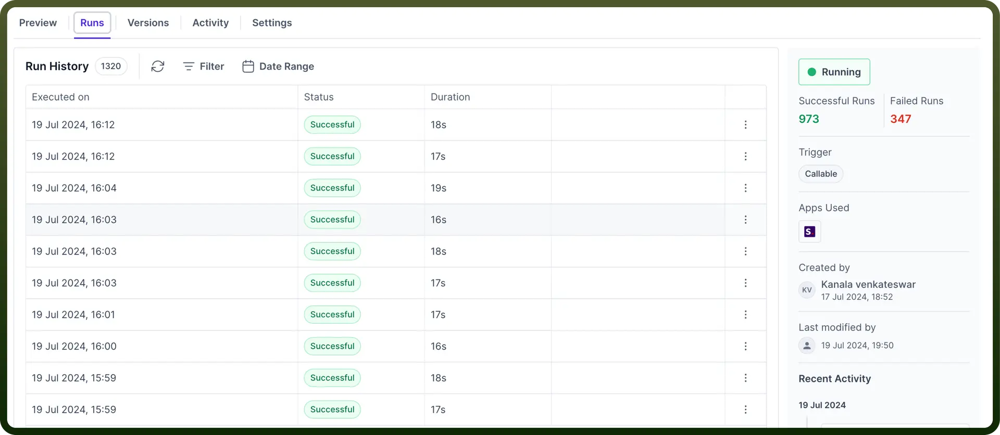
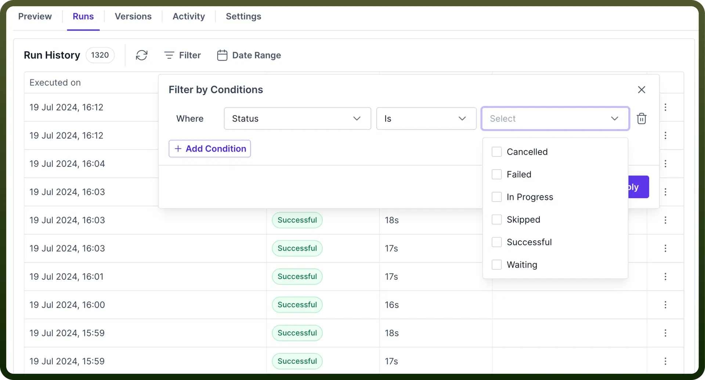
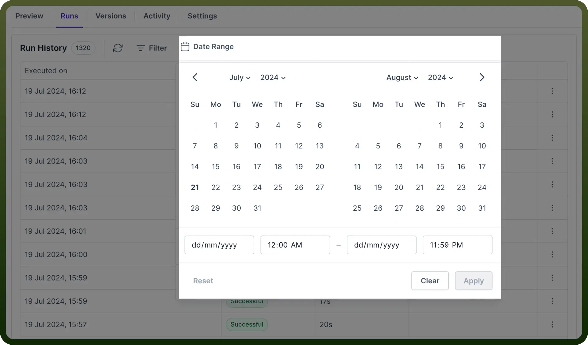
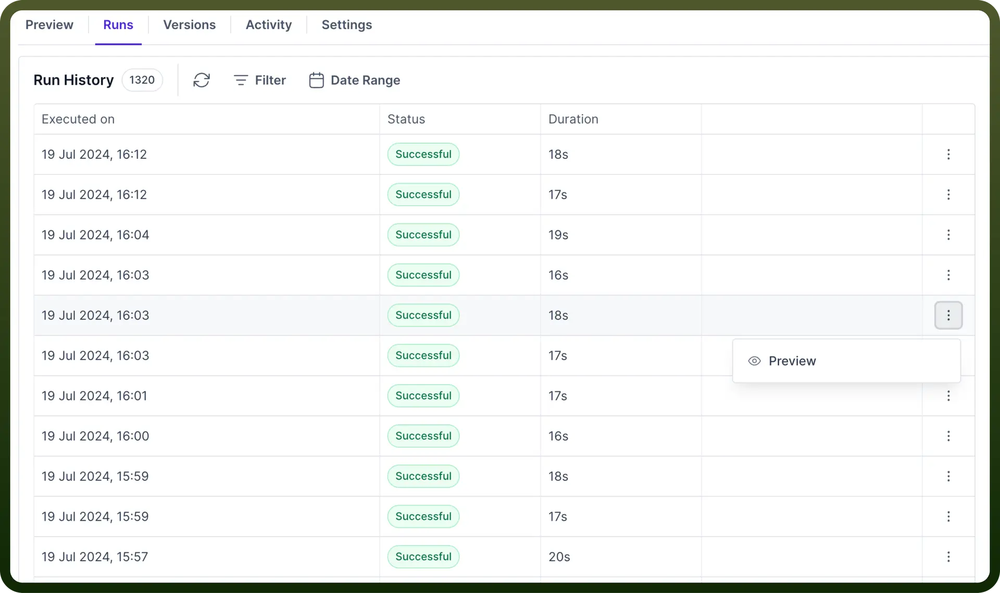
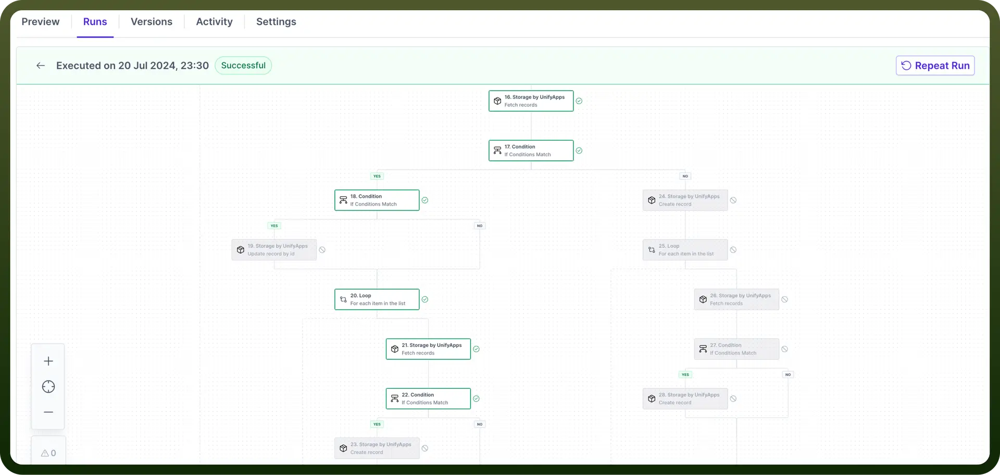
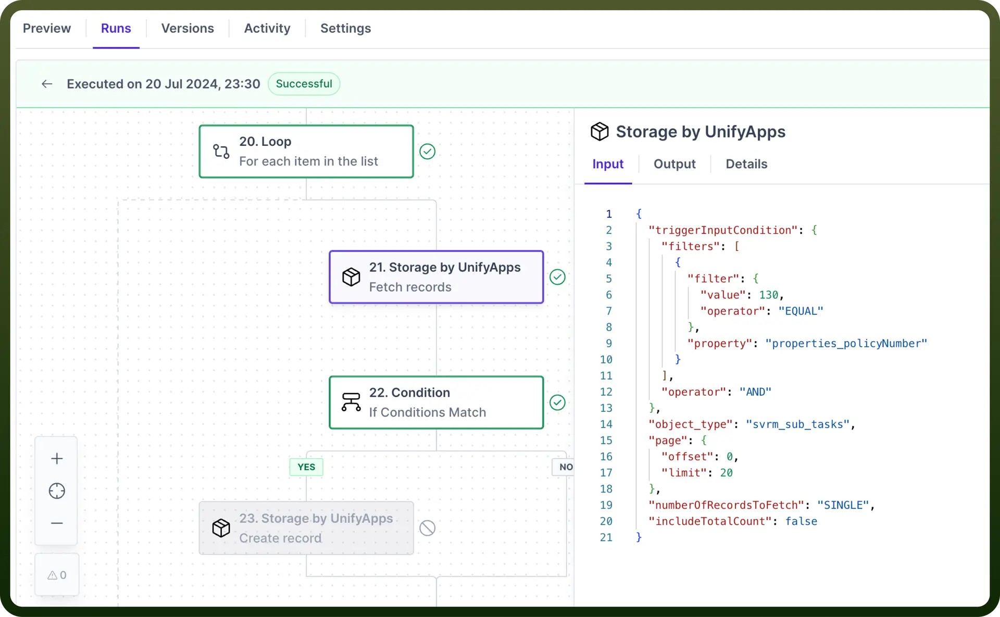
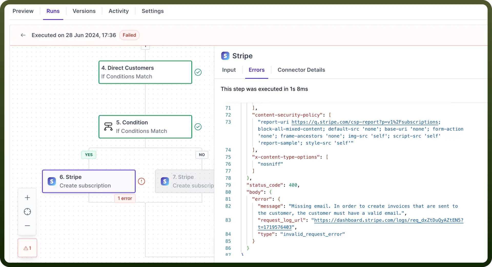
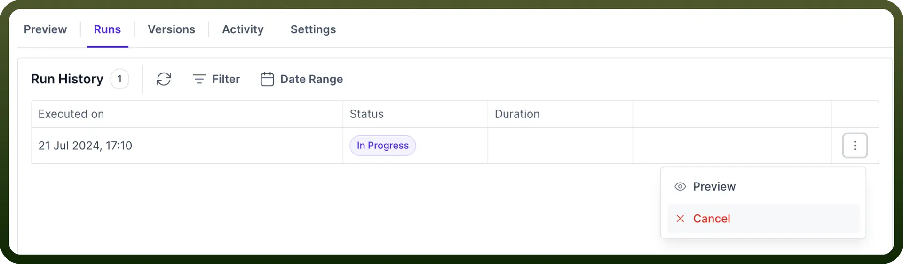
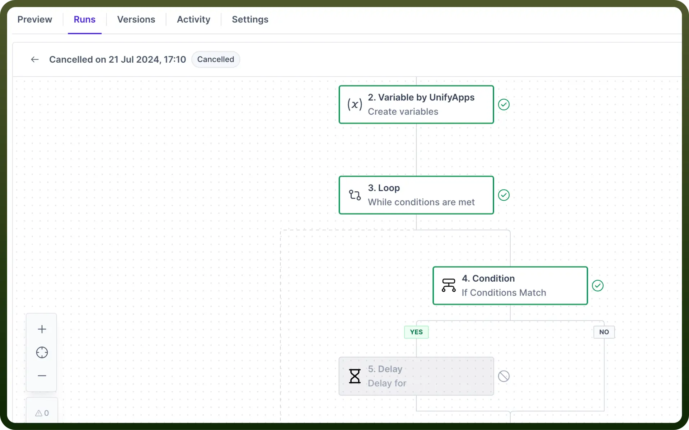

# Monitor your Runs

Source: https://www.unifyapps.com/docs/unify-automations/monitor-your-runs
Section: automations

---

## Overview

Automation Runs serves as a **comprehensive log** for your automations, enabling you to closely monitor the automation performance.

It tracks every instance an automation is initiated, providing detailed insights into its execution. With automation runs, you will have access to:

- **Performance Tracking:** Keep a record of every automation run, whether successful or failed.
- **Detailed Logs:** View timestamps for each run, along with the specific actions taken during the process.

## Run History

It is the list of all the runs executed for automation from the time it was deployed. It shows the following parameter related to the execution:

- **Total runs:** The total number of runs that were executed for the automation.
- **Executed on:** The date and time at which the automation was executed.
- **Status:** It represents whether the execution was successful or failed due to an error.
- **Duration:** It represents the time it took automation to run the execution.

## Filter

The filter functionality enables you to sort runs according to their execution status. You can apply multiple conditions using the `AND/OR` operators to obtain the desired runs.

The different statuses you can filter by include:

- Successful
- Failed
- Cancelled
- In Progress
- Skipped
- Waiting

### Date Range

It filters out the automation runs based on the time at which they were executed.

You can select the time range by clicking on the `Date Range` options and then clicking on the `Apply` button to get the runs executed within the selected time range.

> **Note:** Runs are only visible for automations that have been deployed and executed via a trigger. Runs will not be displayed for automations that are not deployed.

## Run Preview

The preview screen provides the sequence of actions that were executed for a specific run.

To preview the runs for automation, click on the specific run or navigate to the three dots menu and select "`Preview`."

### Successful Run

For a run marked as **Successful**, you can see the sequence of executed nodes. Executed nodes are highlighted in green with a check mark, while nodes that were not executed are grayed out.

Clicking on an executed node will provide the detailed information about its execution, including the following attributes:

- `Input`: Displays the input data in JSON format that the node has consumed.
- `Output`: Shows the output data generated by the node after performing its operation.
- `Details`: Provides the name of the selected action and the application associated with the node.

### Failed Run

For a run marked as Failed, the Runs section will highlight the specific action in red where the automation encountered an error, helping you **identify** and **debug** issues within your automation.

Clicking on the `Error` node provides detailed information about the error, including the error message and code.

### Cancel a Run in progress

To cancel a run that is currently "`In Progress`", navigate to the three dots menu and clicking on the "`Cancel`" button will change the status of the run to “`Cancelled`”.

Previewing a **cancelled run** will only display the successful execution of nodes that were processed before the run was cancelled. 
Nodes following the last executed node will be **grayed out**.

