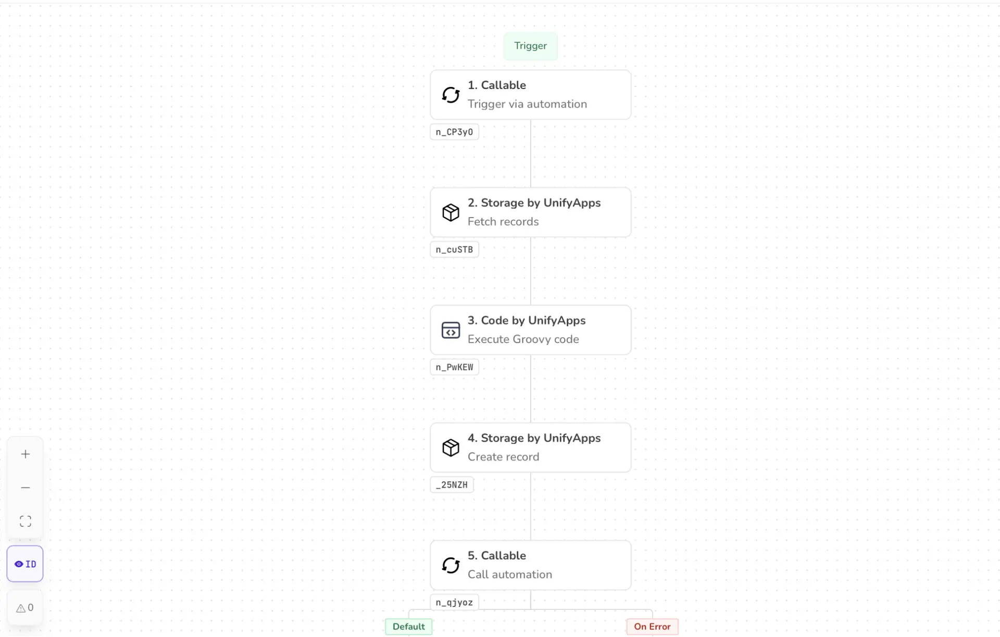

# Node ID

Source: https://www.unifyapps.com/docs/unify-automations/node-id
Section: automations

---

## Overview

A Node ID is a **unique identifier** assigned to a node (step, action, trigger, or component) inside an automation or workflow.

A *node* = one unit of work.

Eg: “HTTP Requests”, “Send Email”, “If/Else Condition”, etc.

The Node ID uniquely identifies that step, even if:

- Multiple nodes do the same thing
- The node name changes
- The workflow is duplicated or versioned

## Common use cases

1. **Execution Tracking & Debugging**

When an automation runs, the engine logs things like:

- Node ID
- Start/end time
- Inputs/outputs
- Errors

Example:

“Execution failed at node ***node_42fa9***”

Even if you rename:

“Send Slack Alert” → “Notify On Failure”

…the system still knows exactly which step failed.

2. **Connecting Nodes Internally**

Behind the scenes, workflows are graphs.

Instead of : *"Send Email" → "Wait 5 Minutes"*

The system stores: *“ node_A1B2 → node_C3D4 “*

This makes workflows:

- Faster to execute
- Easier to validate
- Safer to refactor
3. **Versioning & Workflow Diffing**

When workflows are:

- Version-controlled
- Exported as JSON/YAML
- Compared between environments (dev → prod)

Node IDs allow systems to:

- Detect what actually changed
- Migrate data safely
- Reapply mappings
4. **Conditional Logic & Branching**

In complex workflows:

- IF/ELSE
- Switches
- Loops

Conditions often point to:

- Which node produced a value
- Which node should execute next

Using Node IDs ensures:

- Conditions stay valid
- Branches don’t “lose” their targets

## Advantages of using Node IDs

- **Stability:** Names can change. IDs shouldn’t.
- **Precision:** No ambiguity when multiple nodes do similar things.
- **Scalability:** Essential for large, multi-branch workflows.
- **Maintainability:** Refactoring without breaking references.
