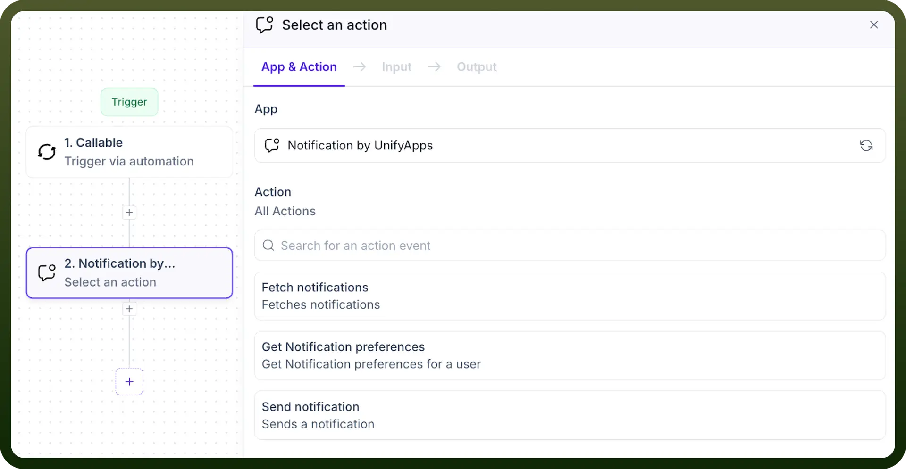
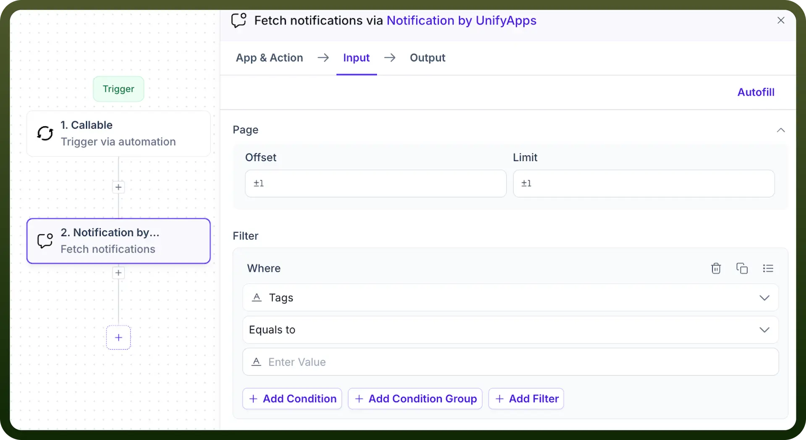
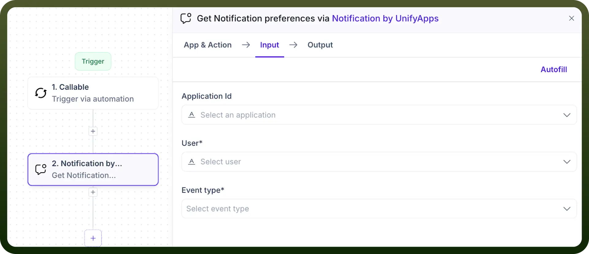
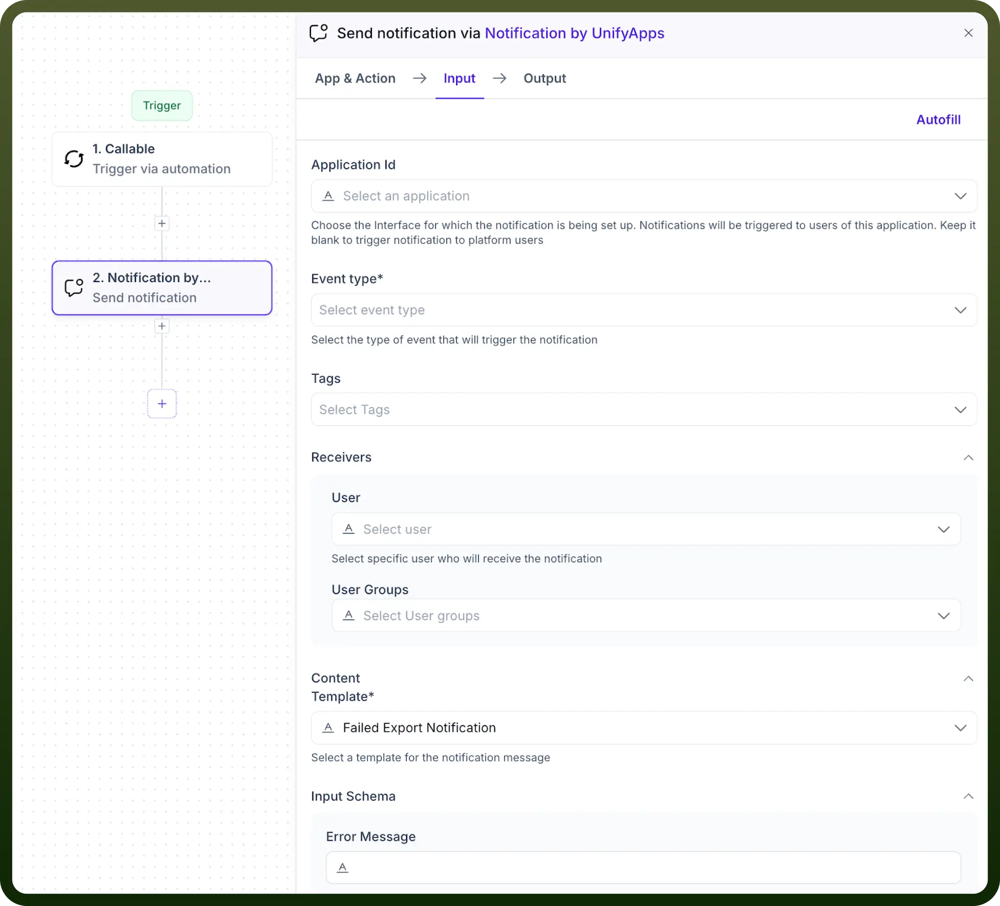
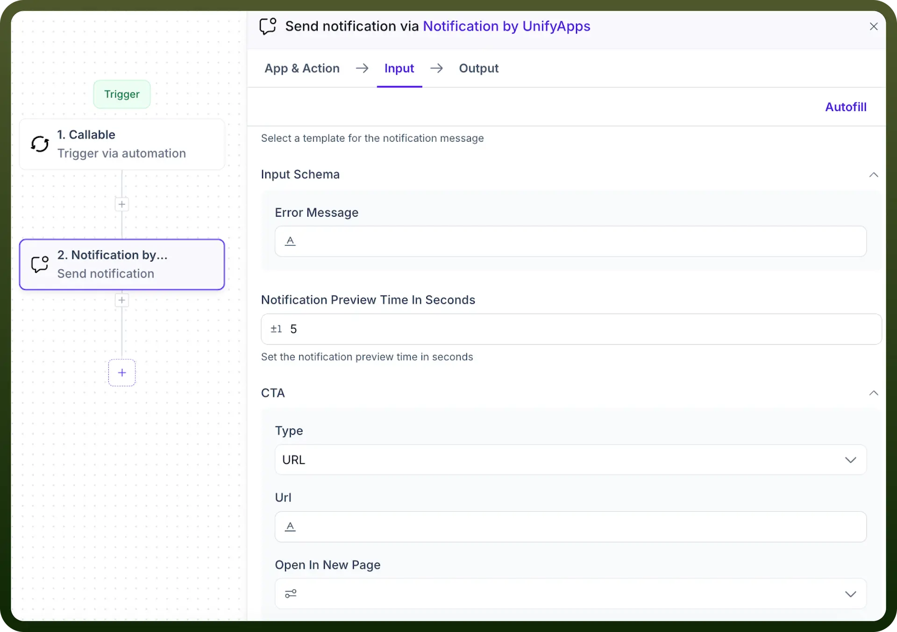

# Notifications by UnifyApps

Source: https://www.unifyapps.com/docs/unify-automations/notifications-by-unifyapps
Section: automations

---

## Overview

The Notification by UnifyApps node provides a seamless way to manage and trigger notifications across various workflows. This node is ideal for maintaining communication consistency, fetching user-specific preferences, and sending tailored alerts to enhance user engagement.

## Use Cases

1. **Tracking Task Notifications**A project manager uses the **Fetch Notifications** action to filter unread alerts tagged as "`Approval`" and "`Mentions`." This enables quick identification of pending tasks and critical updates, streamlining workflow management and ensuring no important notifications are overlooked.
2. **Configuring Notification Preferences**An admin retrieves user preferences using the **Get Notification Preferences** action to check whether a user has enabled email alerts for "`Import Success`" events. This helps in configuring event-based notifications effectively and ensures users are alerted through their preferred channels.
3. **Real-Time System Alerts**A platform admin uses the **Send Notification** action to send a failed export alert to a user group via a predefined template. The notification, tagged with "`Export`," includes a URL for corrective actions and is set to preview for 5 seconds, ensuring the message is actionable and accessible promptly.

## Fetch Notifications

Retrieve notifications based on specific tag filters. This action is useful for obtaining user activity or alert logs with detailed metadata.

**Input Requirements:**

- `Page`**:**
  - **Offset:** Starting point for fetching notifications.
  - **Limit:** Maximum number of notifications to retrieve.
- `Filter`**:**
  - **Tags Contains:** Specify tags (e.g., Alerts, Mentions) to filter notifications.

**Output:** Returns comprehensive metadata, including content, creation time, user IDs, tags, and notification status (read/unread).

## Get Notification Preferences

Fetch the notification preferences for a specific user and event type. Useful for understanding how users have configured their alert settings.

**Input Requirements:**

- `Application ID`**:** Specify the application if linked to the user (optional).
- `User`**:** Select the target user from a dropdown.
- `Event Type`**:** Choose the event type (e.g., import success, export failure).

**Output:**

- `Email` **(Boolean):** Whether notifications for the event type are sent via email.
- `In-App` **(Boolean):** Whether notifications for the event type appear in the app.

## Send Notification

Trigger a custom notification for specific users or groups. Enables real-time alerts tailored to events or user actions.

**Input Requirements:**

- `Application ID`**:** Choose the application context (optional).
- `Event Type`**:** Select the event triggering the notification (e.g., export delayed).
- `Tags`**:** Assign tags (e.g., Alerts, Mentions).
- `Receivers`**:**
  - **User:** Select individual users.
  - **User Groups:** Notify a group of users.
- `Content`**:**
  - **Template:** Choose a pre-defined notification message template (e.g., Failed Export Notification).
  - **Error Message:** Provide custom details about the alert.
  - **Notification Preview Time in Seconds:** Set how long the notification preview appears (e.g., 5 seconds).
- `CTA (Call to Action)`**:**
  - **Type:** Specify (e.g., URL).
  - **URL:** Enter the destination link.
  - **Open in New Page:** Decide whether to open links in a new tab.

**Output**:
A confirmation with details about the notification's status, recipients, and metadata.
