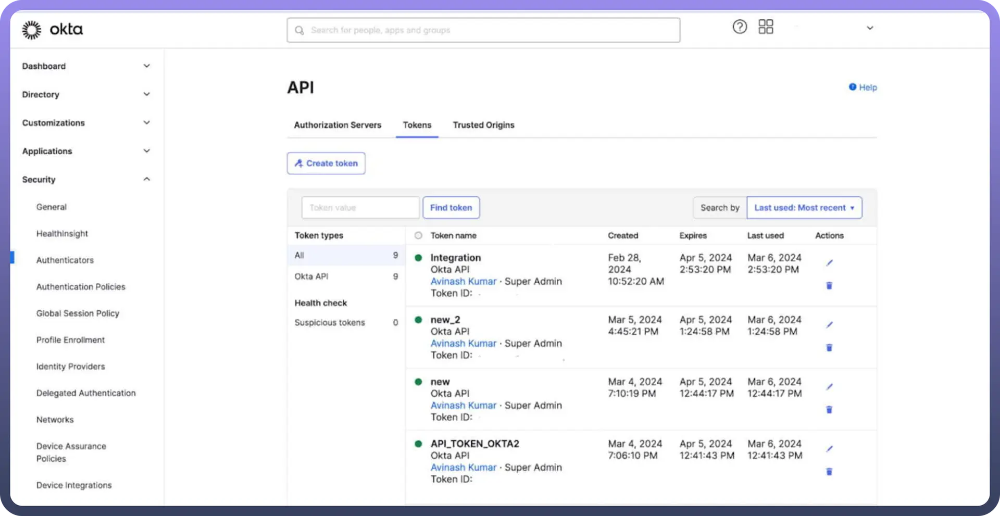
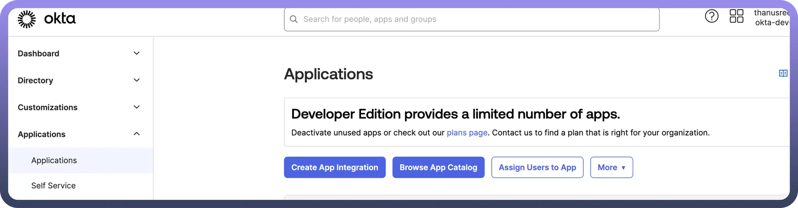
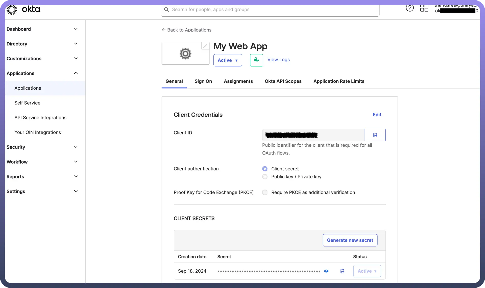
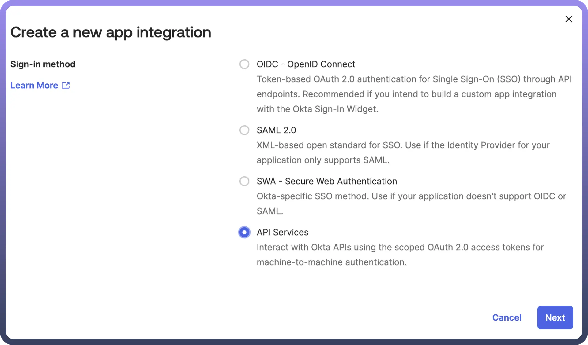
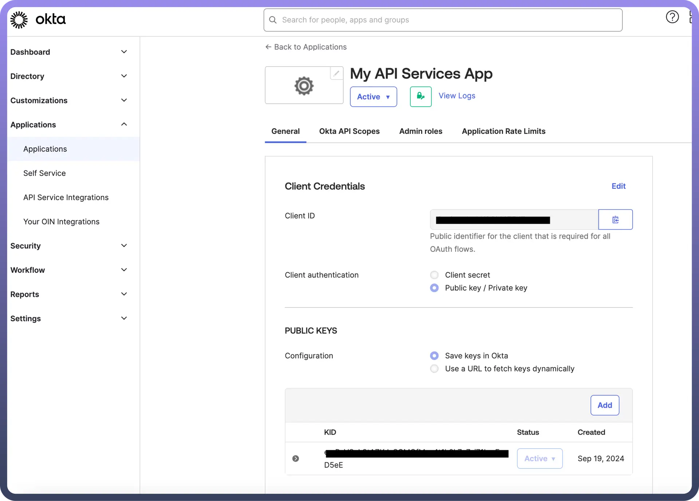

# Okta

Source: https://www.unifyapps.com/docs/unify-automations/okta
Section: automations

---

Okta is an **identity** and **access** management platform that provides secure authentication and user management.

Integrating it with your application improves security by offering seamless single sign-on (SSO) and robust access controls.

## Authentication

Before you begin, make sure you have the following information:

1. `Connection Name`: Choose a meaningful name for your connection. This name helps you identify the connection within your application or integration settings. It could be something descriptive like "MyAppOktaIntegration".
2. `Authentication Type`: Okta supports three authentication methods: token-based authentication, Authorisation code grant-based authentication and Client credentials-based Authentication.
3. `Okta Domain`: Enter your Okta domain name. This can be found in your Okta URL (e.g., mycompany.okta.com).

### Token-based Authentication

To generate an API token in Okta, follow these steps:

1. Log in to the `Okta Admin Console` using an administrator account with the required permissions.
2. On the left-hand side, expand the `Security` section.
3. From the dropdown menu, select `API` to access the API management page.
4. Navigate to the `Tokens` tab.
5. Click `Create Token` to initiate the creation of a new token.
6. Enter a `name` for the token for future identification.
7. After creating the token, ensure you copy the token value and paste it into the `API token` section in UnifyApps to establish the connection between **UnifyApps** and **Okta**.

  

### Authorisation code grant-based authentication

We must create a client ID and client secret to configure the Authorisation code grant with Okta. Follow these instructions to create them:

1. `Sign in` to your Okta organisation using your administrator account.
2. In the `Admin Console`, navigate to `Applications` > `Applications` from the left-hand menu.
3. Click on `Create App Integration` to begin creating a new app.

  

4. Select `OIDC` `- OpenID Connect` as the sign-in method on the Create a New App integration page.
5. For the application type, choose `Web Application`. This is a straightforward way to test OAuth 2.0-based access to Okta APIs using bearer tokens.
6. Provide a `name` for your app integration and ensure that the `Authorization Code` grant type is selected (it’s mandatory and pre-selected by default).
7. In the `Sign-in redirect URIs` field, specify the callback location where Okta will return the user and token post-authentication.
8. Optionally, in the `Assignments` section, you can limit access by adding specific groups or skip this for now.
9. Click `Save`, and your app integration will be created. The `Client ID` and `Client Secret` are listed under the `Client Credentials` section.

This process helps configure the client app, which can be used to securely authenticate and interact with Okta’s APIs.

### Client credentials-based Authentication

To configure the client credentials-based authentication method with Okta, please follow these steps:

1. **Log In:** Access your Okta organisation with an administrator account.
2. **Navigate to Applications:** In the Okta Admin Console, go to `Applications` and select `Applications` again.
3. **Create App Integration:** Click `Create App Integration` to start the setup process.
4. **Choose Sign-in Method:** On the new app integration page, select `API Services` as the sign-in method.

  

5. **App Integration Name:** Enter a meaningful name for your app integration, then click `Save`.
6. **Copy Client ID:** In the General tab of the newly created app integration, copy the `Client ID`.
7. **Edit Client Authentication:** Select `Edit` and choose the `Public / Private key` in the Client authentication field.
8. **Add Public Key:** Click on `Add key` in the `PUBLIC KEYS` section.
9. **Generate Key Pair:** In the `Add a Public Key` section, select `Generate a new key` to create a key pair.
10. **Copy Private Key:** Choose `PEM` in the Private key section and copy the private key for use in your connection settings, noting that it cannot be retrieved later.
11. **Finalise Key Addition:** Click `Done` to finish adding the key.
12. **Save Changes:** Return to the General tab and select `Save` to activate the key. Confirm by selecting Save again if prompted that existing client secrets will no longer be used.
13. **Assign API Scopes:** Navigate to the `Okta API Scopes` tab and assign the necessary scopes. At a minimum, include okta.logs.read and okta.schemas.read for proper access.

To successfully create a connection, paste the `Client ID`, `private key`, and `KID` value from the `public key`.

## Granular Permissions

**OAuth 2.0 Scopes**

| **Scope** | **Description** |
|---|---|
| `address` | Requests access to the address claim |
| `device_sso` | Requests a device secret used to obtain new tokens without re-prompting the user for authentication. See Native SSO |
| `email` | Requests access to the email and email_verified claims |
| `groups` | Requests access to the group claim |
| `offline_access` | Requests a refresh token used to obtain new access tokens without re-prompting the user for authentication |
| `okta.clients.manage` | Allows the app to manage clients in your Okta organisation |
| `okta.clients.read` | Allows the app to read information about clients in your Okta organisation |
| `okta.clients.register` | Allows the app to register new clients in your Okta organisation |
| `okta.universalLogout.manage` | Allows an admin or a service to initiate Universal Logout and revoke all tokens and sessions for a user |
| `okta.workflows.invoke.manage` | Allows the app to trigger an OAuth 2.0-protected flow |
| `openid` | Identifies the request as an OpenID Connect request |
| `phone` | Requests access to the phone_number and phone_number_verified claims |
| `profile` | Requests access to the end user's default profile claims |

## Actions

| **Action Name** | **Description** |
|---|---|
| `Activate user` | Activate a user in Okta |
| `Add user to group` | Add an existing user to a group in Okta |
| `Create user` | Create a new user in Okta |
| `Update user` | Update user details in Okta |
| `Deactivate user` | Deactivate a user in Okta |
| `Delete user` | Delete a user in Okta |
| `Expire an existing user password` | Expire an existing user's password in Okta |
| `Get group members` | Retrieve the list of members in a group in Okta |
| `Get groups by name` | Retrieve groups by name in Okta |
| `Get recent logon events by IP address` | Retrieve recent logon events by IP address in Okta |
| `Get user groups` | Retrieve the groups a user belongs to in Okta |
| `Remove user from group` | Remove an existing user from a group in Okta |
| `Reset user password` | Reset a user's password in Okta |
| `Search Users` | Search for users in Okta |
| `Suspend user` | Suspend a user in Okta |
| `Unsuspend user` | Unsuspend a user in Okta |
| `Get user by ID` | Retrieve a user by their ID in Okta |
| `List applications assigned to user` | List applications assigned to user in Okta |
| `Reset forgotten user password` | Retreive password reset link when user has forgotten his password in Okta |

## Triggers

| **Trigger Name** | **Description** |
|---|---|
| `New events (real-time)` | Triggers immediately when a new event is created in Okta |
| `New events` | Triggers when a new event is created in Okta |
| `Scheduled event search using filter` | Search for system log events on a specified schedule and returns as lists of events |
