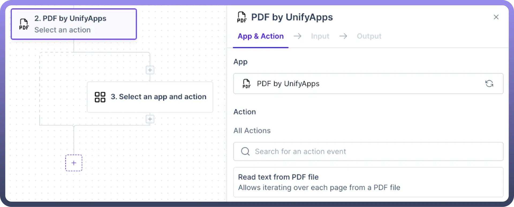
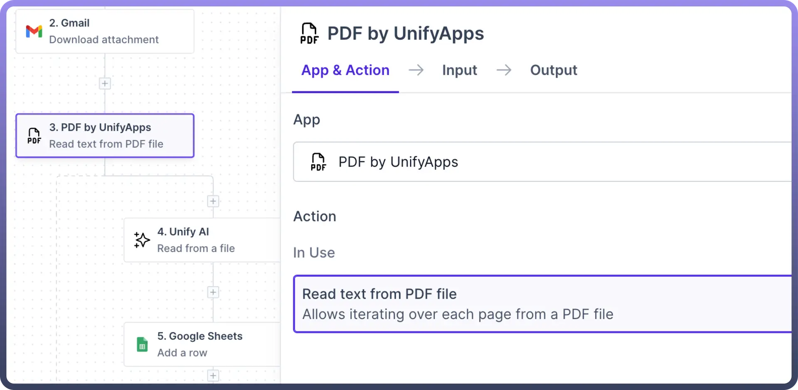
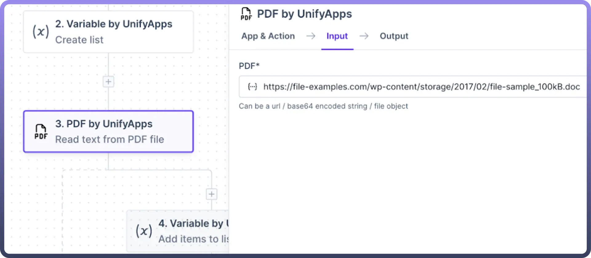
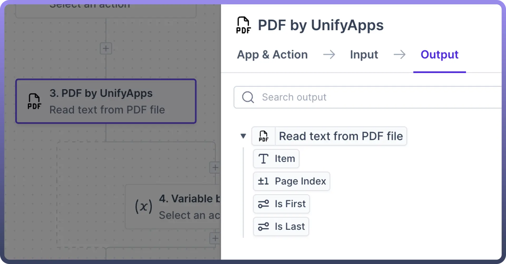
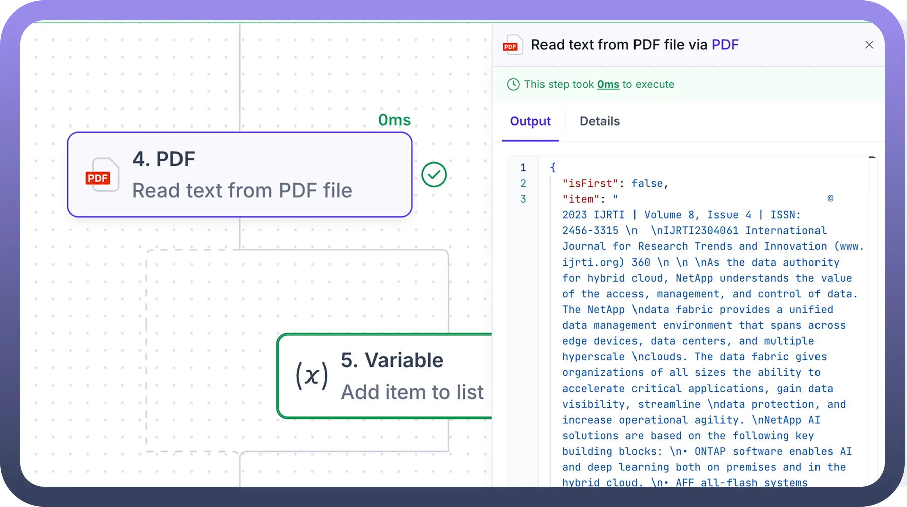

# PDF by UnifyApps

Source: https://www.unifyapps.com/docs/unify-automations/pdf-by-unifyapps
Section: automations

---

## Overview

PDF by UnifyApps **processes information** by going through each page of the PDF and **extracting** the data.

This data can then be used in the rest of the automation using data pills.

## Use Case

Let’s say you want to collect all invoices received from Gmail and make a Google Sheet of key information.

1. We’ll use PDF by UnifyApps to **extract pages** one after another. We can then leverage [Unify AI](/docs/unify-automations/pdf-by-unifyapps) to split the text and obtain information essential to us, such as Name, Source, Amount, etc.

  

2. The data pill obtained from the PDF by UnifyApps can now be used to add a row to our Google Sheets file.
3. With the help of PDF by UnifyApps, this automation enables us to streamline the invoice collection process and maintain clean records.

## How to Parse PDF?

1. We will add the `PDF by UnifyApps` node, select `Read text from the PDF file`**,** and proceed with providing input for the PDF field.
2. The input can be either a `URL`, `base64 encoded string`, or a `file object` that you would need to map from the upstream node.

  

3. After setting the input parameter, add an `App & Action` inside the node's iteration. For **example**, here we are using Variable by UnifyApps to add pages to the list created earlier, one by one.

  

4. You can now extract the data from the PDF using the output datapill, which consists of:
  - an **Item** with the text from the page,
  - a **Page Index** denoting the page number,
  - **Is First** and **Is Last,** indicating if the current index is the first or the last page. **Note:** Users **must** **add a step** after PDF by UnifyApps Node to complete the Automation. The Automation can’t be deployed without this step.

    
