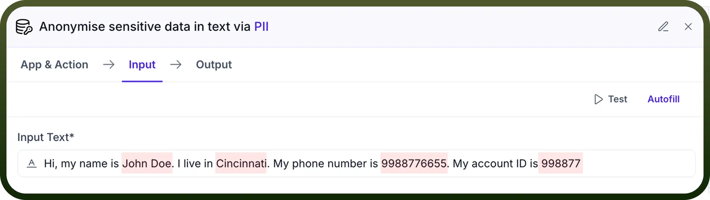
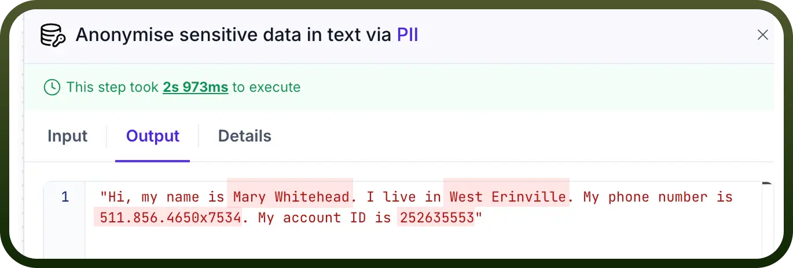
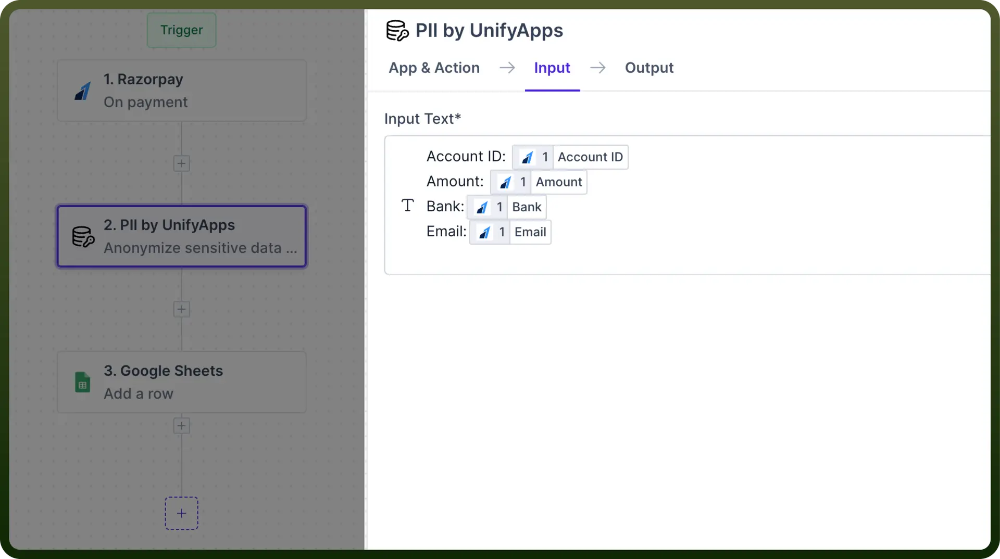
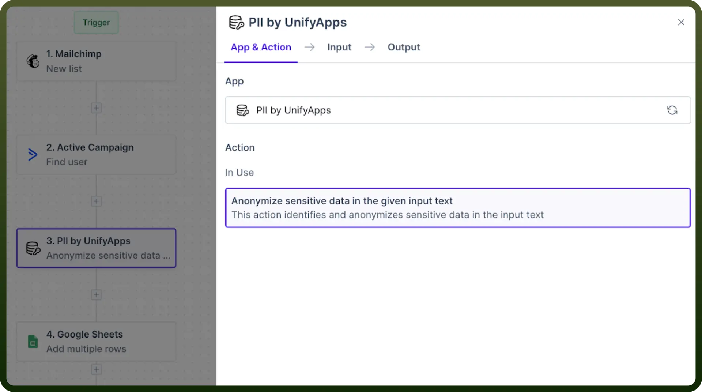
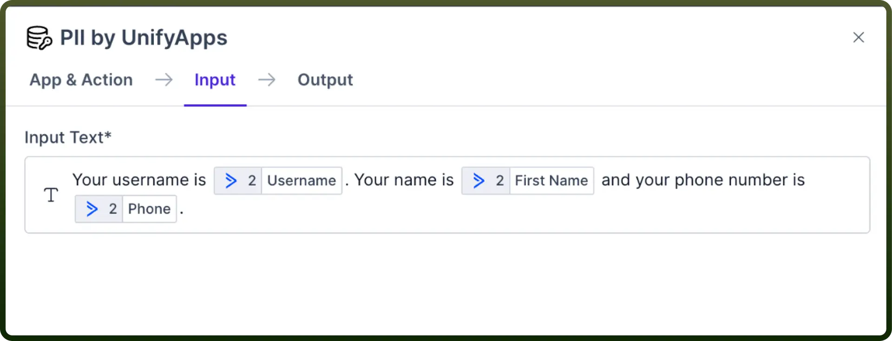

# PII by UnifyApps

Source: https://www.unifyapps.com/docs/unify-automations/pii-by-unifyapps
Section: automations

---

## Overview

Users' **PII** or **Personally Identifiable Information** can be vulnerable to attacks, and therefore, one would like to be able to mask such information.

"PII by UnifyApps solves such use cases where it **uses AI to recognise** bits of information from the given input text that can be particularly sensitive and **masks** it by anonymising said information."

## Use Case

Let's say you want to make a sample database of all your organisation's transactions through Razorpay.

In this scenario, you must mask sensitive information to avoid data misuse.

1. We fetch the `Account ID`, `Amount`, `Bank Details`, and `Email ID` of the users from Razorpay and use that as input for PII by UnifyApps.
2. Then, the masked data is stored in the Google sheet.

  

## How to mask your data?

1. Locate the step before which masking is required.
2. Add `PII by UnifyApps` node, and select the action `Anonymize sensitive data`.

  

3. Proceed to the input tab and enter the text or variables you wish to mask in the input field.

  

4. The resultant output will be anonymised and used as a datapill in the downstream automation.

  
