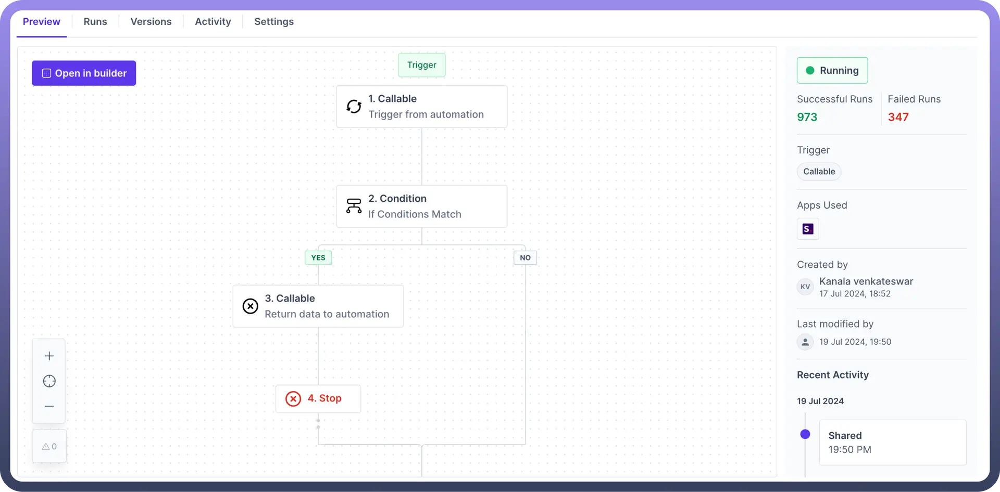
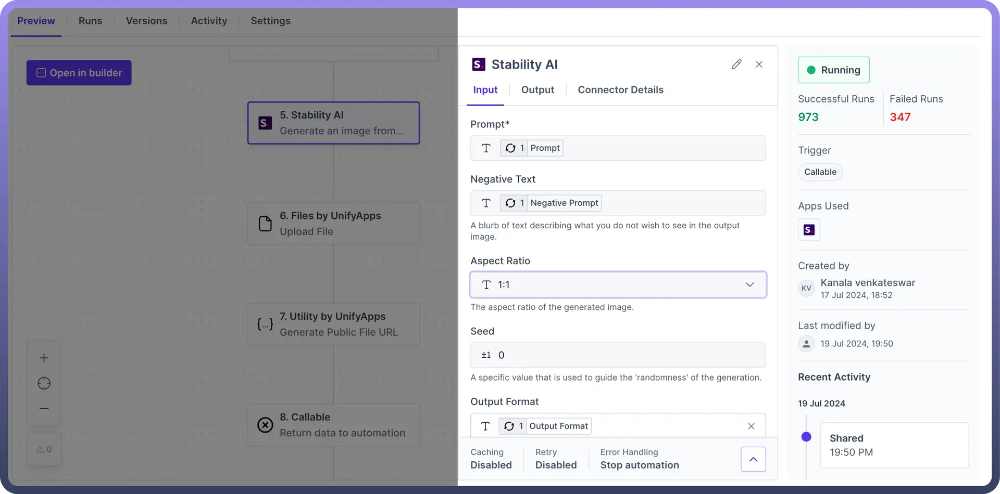
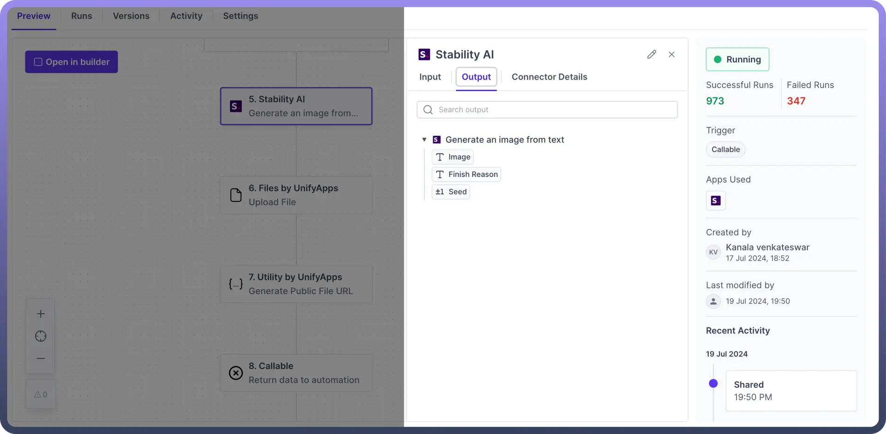
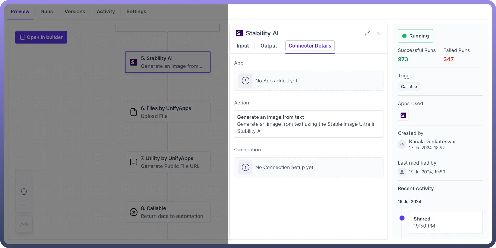
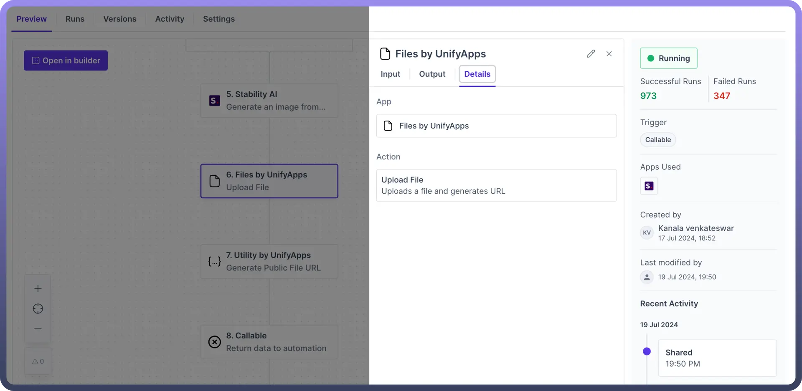

# Preview Your Work

Source: https://www.unifyapps.com/docs/unify-automations/preview-your-work
Section: automations

---

## Overview

Preview of the automation enables users to effortlessly **review** and **understand** their automation setup.

It provides a comprehensive overview, including the number of **successful** and **failed** runs, the type of trigger, the apps used, last updated by and recent activity.

It enables users to monitor the success and failure of each step, ensuring efficient automation processing and prompt issue resolution.

## Key Features

- `Run Summary`: Instantly see the number of successful and failed runs.
- `Trigger Type`: Identify the type of trigger that initiates the automation.
- `Apps Used`: View the applications involved in the automation.
- `Creation and Last Updated Dates`: Know when the automation was created and last modified.
- `Recent Activities`: All the updates made to the automation are logged in the activity section.
- `Navigation`: Easily navigate through the preview to understand the automation and logic of your automation.

  

### Run Summary

It provides the status of the automation whether it is `running` or `paused`. Along with this it provides the user with the number of successful and failed runs for that particular automation.

**Successful Runs**: Indicates the number of times the automation has run successfully.

**Failed Runs:** Indicates the number of times the automation has encountered errors.

### Trigger Type

It lets you know the type of trigger being used in the automation. Whether it is `callable`, `scheduler`, `webhook`, or any application(such as [Amazon S3](/docs/unify-automations/preview-your-work), [Salesforce](/docs/unify-automations/salesforce), etc)

### Apps Used

It provides the visual representation (Logos) of the applications involved in the automation.

### Created and Last Updated Dates

**Created by:** It shows the user who created the automation and the date and time of creation.

**Last modified by:** It shows the user who last modified the automation and the date and time of the last modification.

### Recent Activity

**Activity Log**: Displays recent activities related to the automation, including deployments and modifications. Users will be navigated to the activity tab if you want to drill down on any specific activity.

## Node level Preview

If you want to understand the node-level configuration of the automation, then you can click on the specific node to view the specification of the node in the third pane view.

Each node prominently displays three key components:

- **Input:** The Input section reveals the parameters and configurations specified during the automation setup.

  

- **Output:** The Output section provides the data structure of the output corresponding to the action selected.

  

- **Details/Connection Details:** In the case of an application node, the Connection Details section outlines the following attributes:

  

  - The **Name** of the application
  - The **Action** selected for the application
  - The **Connections** used to authenticate the application

In the case of an Internal node, the detail section outlines the following attributes:

- The **Name** of the application (Internal Node)
- The **Action** selected for the application.

