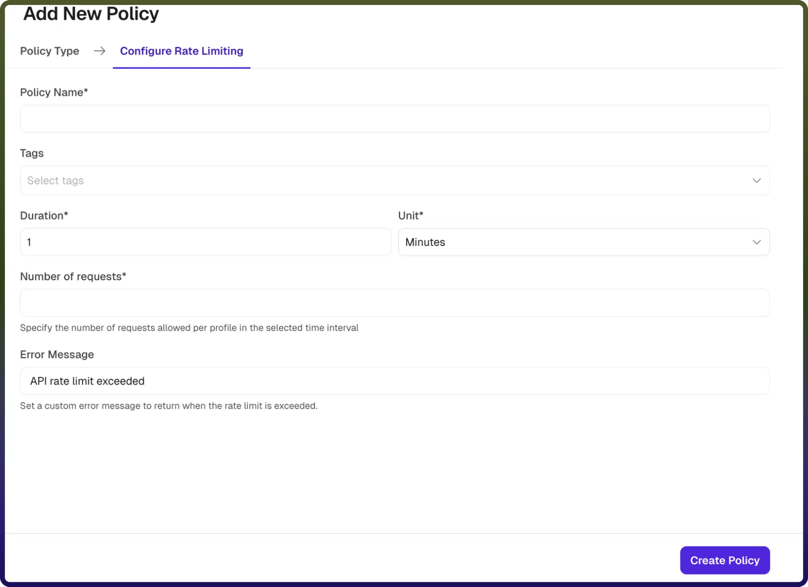

# Rate Limiting Policy

Source: https://www.unifyapps.com/docs/unify-automations/rate-limiting-policy
Section: automations

---

### **Overview**

A Rate Limiting policy controls how many API requests a client profile can make within a defined time window. It protects your backend services from traffic overload, prevents abuse, and ensures fair usage across all API consumers.

Once the configured request limit is reached for a profile within the time window, any further requests are rejected and the configured error message is returned. The counter resets after the window expires.

| **Field Reference** | **Description** |
|---|---|
| `Policy Name` | A unique identifier for the policy, used across logs, dashboards, and API group configurations. **Required** |
| `Tags` | Custom labels to organize and filter the policy by environment, team, or functionality. **Optional** |
| `Duration` | Specifies the length of the time window during which requests are tracked for each client profile. **Required** |
| `Unit` | Defines the time unit for the duration (e.g., Seconds, Minutes, Hours, Days). 
**Required** |
| `Number of Requests` | The maximum number of requests allowed per client profile within the defined time window before access is restricted. **Required** |
| `Error Message` | The message is returned to the client when their request is denied due to exceeding the rate limit. Default: *“API rate limit exceeded”* **Optional** |

### 

## How It Works

1. `Request received`**:** The gateway identifies the client using an API key, IP address, or user ID.
2. `Counter check`**:** The system retrieves the request count for the client within the current time window.
3. `Limit evaluation :`If the count is below the configured limit, the request is forwarded and the counter is incremented , else the limit is reached or exceeded, the request is rejected
4. `Error response`**:** Rejected requests receive an error indicating that the rate limit has been exceeded.
5. `Window reset`**:** After the time window expires, the counter resets and the client can send requests again.

## Attaching a Policy to an API Group

Once a Rate Limiting policy is created, it can be attached to one or more API Groups. Multiple policies can be applied to an API Group and their execution order can be configured by dragging them into the desired sequence.
