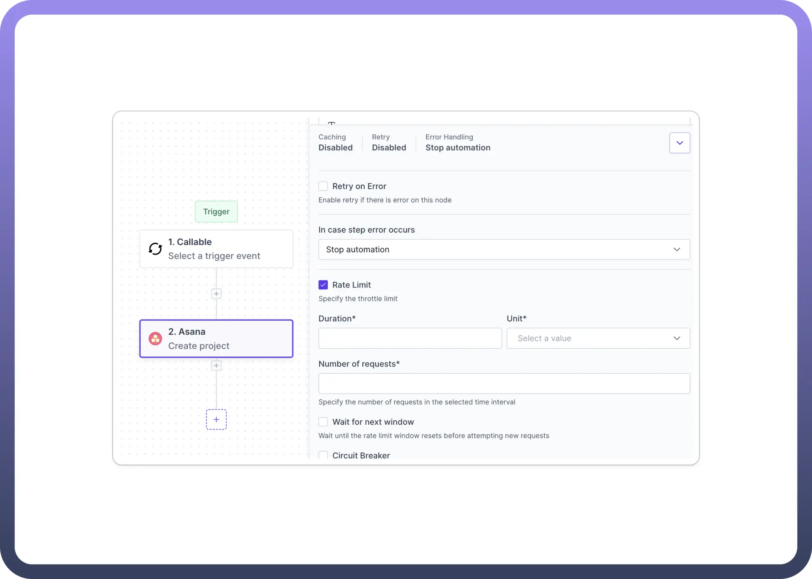

# Rate limiting

Source: https://www.unifyapps.com/docs/unify-automations/rate-limiting
Section: automations

---

## Overview

**Rate Limiting** allows you to control the frequency of requests made by your automations, ensuring compliance with API rate limits, preventing overload, and maintaining stable operations.

## Use Cases

**API Compliance**

Your automation needs to interact with an external API with strict rate limits. For example. Asana has a standard rate limit policy of 1500 requests per minute.

In such cases we need to Configure rate limiting to match the API's restrictions, ensuring your automation doesn't exceed allowed request quotas.

## Detailed Breakdown

1. **Rate Limit Toggle** Users can independently enable or disable the rate-limiting functionality for each node. This granular control allows for optimized request management across different parts of a workflow.
2. **Duration and Unit** Set the time interval for the rate limit. The duration is a numeric value, and the unit can be selected from options like seconds, minutes, or hours, allowing for flexible rate limit configurations.
3. **Number of Requests** Specify the maximum number of requests allowed within the defined time interval. This helps adhere to API quotas and prevent request overload.
4. **Wait for the Next Window** This option causes the automation to pause and wait until the rate limit window resets before attempting new requests. This helps manage workflows that process large volumes of data over time.

## Configuration Steps

1. **Access Node Settings**
  - Select the node you want to configure in your workflow for rate limiting.
  - Look for the `Rate Limit` section in the node's settings panel.
2. **Enable Rate Limiting**
  - Locate the `Rate Limit` checkbox and enable it.
3. **Set Duration and Unit**
  - Find the `Duration` field and enter a numeric value.
  - In the `Unit` dropdown, select the appropriate time unit (e.g., seconds, minutes, hours).
4. **Configure Number of Requests**
  - Enter the maximum number of allowed requests in the `Number of requests` field.
  - This value represents how many requests can be made within the specified duration.
5. **Enable Wait for Next Window (Optional)**
  - If you want the automation to pause and wait for the next rate limit window, check the `Wait for next window` option.
