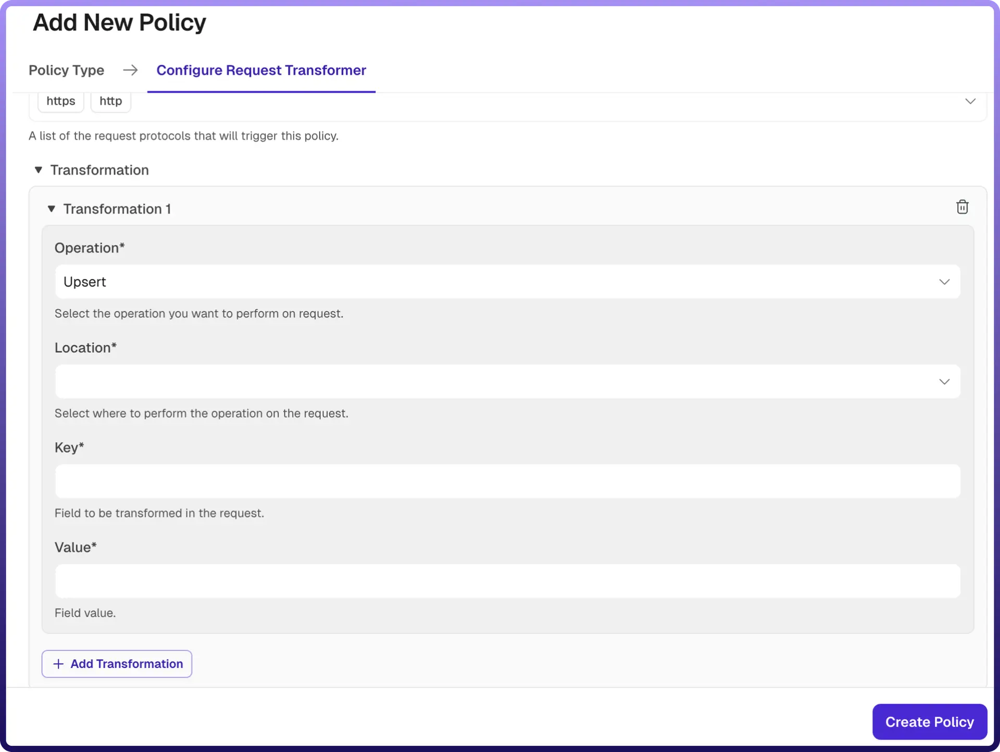

# Request Transformer Policy

Source: https://www.unifyapps.com/docs/unify-automations/request-transformer-policy
Section: automations

---

## Overview

A Request Transformer Policy allows you to modify incoming API requests before they are forwarded to the backend service. It enables dynamic transformation of request data such as headers, query parameters, and body content.

This policy is useful for enforcing standards, enriching requests, removing unnecessary data, or adapting client requests to match backend requirements without changing the client or service implementation.

| **Field Reference** | **Description** |
|---|---|
| `Policy Name` | A unique identifier for the policy, used across logs, dashboards, and API group configurations. **Required** |
| `Tags` | Custom labels to organize and filter the policy by environment, team, or functionality. **Optional** |
| `Protocols` | Specifies the request protocols for which this policy is applied (e.g., HTTP, HTTPS). 
 Only requests matching the selected protocols will trigger this policy. **Required** |
| `Transformations` | Defines one or more transformation rules to be applied to the response. Each rule contains Operation, Location, Key, and Value. |
| `Operation` | Specifies the type of transformation to perform. **Required**
 Supported operations include: 
 → **Upsert**: Adds a new field or updates it if it already exists 
 → **Remove**: Deletes a field from the response 
 → **Rename**: Renames an existing field 
 → **Replace**: Replaces the value of an existing field |
| `Location` | Specifies where the transformation should be applied in the response: 
 → **Header**: Modify HTTP response headers 
 → **Body**: Modify the response payload 
**Required** |
| `Key` | Defines the field name (key) to be transformed. 
 → For **Header**, this refers to the header name 
 → For **Body**, this refers to the field in the response payload 
**Required** |
| `Value` | Defines the value or expression to be applied during the transformation. 
 → For **Upsert/Replace**, this is the new value 
 → For **Rename**, this is the new key name 
 → For **Remove**, this may specify the field to be removed**Required** |

## How It Works

1. `Request received`**:**The gateway receives an incoming API request.
2. `Policy evaluation`**:** The request is checked against the configured protocols to determine if the policy applies.
3. `Transformation execution`**:** Each transformation rule is applied in sequence:
4. `Modified request forwarded`**:** After all transformations are applied, the updated request is forwarded to the backend service.

## Attaching a Policy to an API Group

Once a Request Transformer Policy is created, it can be attached to one or more API Groups. Multiple policies can be applied to an API Group, and their execution order can be configured by arranging them in the desired sequence.
