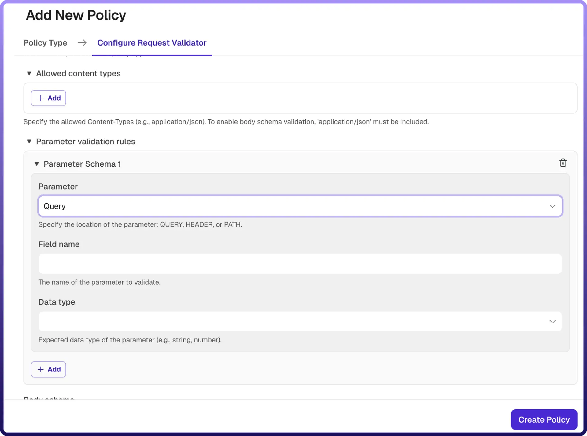

# Request Validator Policy

Source: https://www.unifyapps.com/docs/unify-automations/request-validator-policy
Section: automations

---

## Overview

A Request Validator Policy ensures that incoming API requests conform to defined rules before they are forwarded to the backend service. It helps enforce data integrity, improve API reliability, and prevent malformed or invalid requests from reaching backend systems.

The policy validates request parameters (query, header, path) and optionally the request body against a defined schema.

| **Field Reference** | **Description** |
|---|---|
| `Policy Name` | A unique identifier for the policy, used across logs, dashboards, and API group configurations. **Required** |
| `Tags` | Custom labels to organize and filter the policy by environment, team, or functionality. **Optional** |
| `Protocols` | Specifies the request protocols for which this policy is applied (e.g., HTTP, HTTPS). 
 Only requests matching the selected protocols will trigger this policy. **Required** |
| `Allowed Content Types` | Defines the list of accepted Content-Type headers for incoming requests (e.g., application/json ). 
 → Requests with content types not listed here will be rejected 
 → To enable body schema validation, application/json must be included 
**Optional** |
| `Parameter Validation Rules` | Defines validation rules for request parameters. Multiple parameter schemas can be configured. 
 Each parameter schema includes Parameter Location, Field Name, Data Type. |
| `Parameter Location` | Specifies where the parameter exists in the request: 
 → **QUERY**: Query parameters 
 → **HEADER**: HTTP headers 
 → **PATH**: URL path parameters 
**Required** |
| `Field Name` | The name of the parameter to validate. 
**Required** |
| `Data Type` | Specifies the expected data type of the parameter (e.g., string, number, boolean). Requests with mismatched data types will be rejected. **Required** |
| `Body Schema` | Defines a JSON schema used to validate the request body. (**Optional**) 
 → Applicable only when the request Content-Type is application/json 
 → Requests that do not conform to the schema will be rejected |

## How It Works

1. `Request received`**:** The gateway receives an incoming API request.
2. `Protocol check`**:** The request is validated against the configured protocols.
3. `Content type validation`**:** The Content-Type header is checked against the allowed content types.
4. `Parameter validation`**:** Defined parameter rules are applied:
5. `Body validation (if applicable)`**:** If a JSON schema is defined and content type is application/json , the request body is validated against the schema.
6. `Validation outcome`**:** If all validations pass, the request is forwarded to the backend, else any validation fails, the request is rejected with an appropriate error response

## Attaching a Policy to an API Group

Once a Request Validator Policy is created, it can be attached to one or more API Groups. Multiple policies can be applied to an API Group, and their execution order can be configured by arranging them in the desired sequence.
