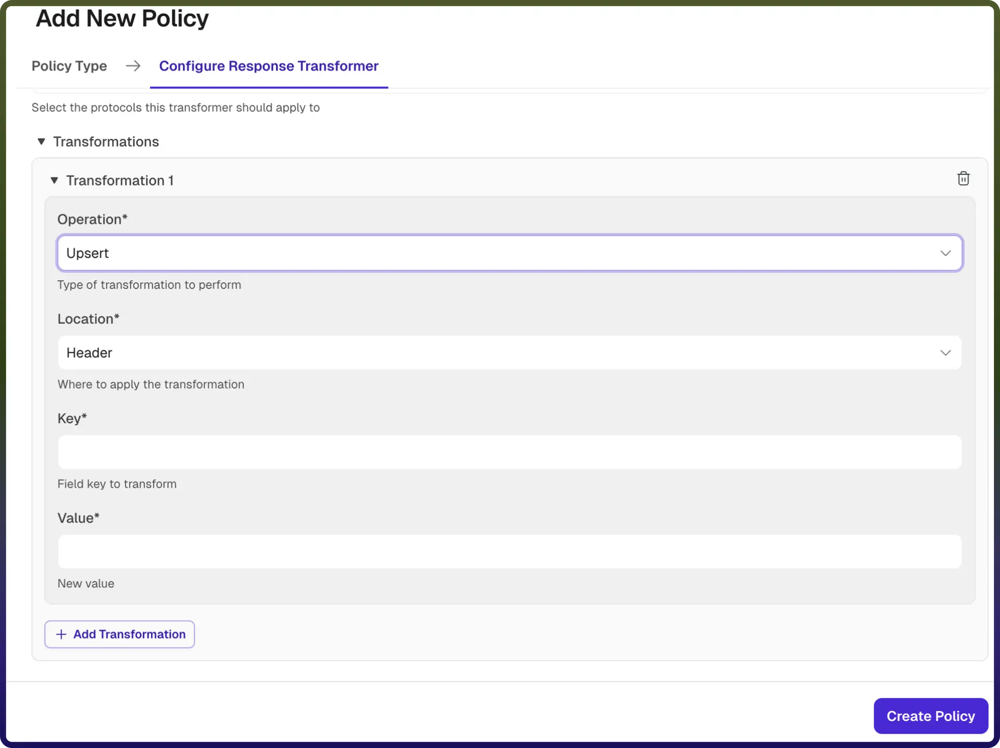

# Response Transformer Policy

Source: https://www.unifyapps.com/docs/unify-automations/response-transformer-policy
Section: automations

---

## Response Transformer Policy Overview

A Response Transformer Policy allows you to modify API responses before they are sent back to the client. It enables transformation of response data such as headers, payload, or metadata to meet client expectations or enforce standardization.

This policy is useful for formatting responses, adding or removing headers, masking sensitive data, or adapting backend responses without modifying the backend service.

| **Field Reference** | **Description** |
|---|---|
| `Policy Name` | A unique identifier for the policy, used across logs, dashboards, and API group configurations. **Required** |
| `Tags` | Custom labels to organize and filter the policy by environment, team, or functionality. **Optional** |
| `Protocols` | Specifies the response protocols for which this policy is applied (e.g., HTTP, HTTPS). 
 Only responses matching the selected protocols will trigger this policy. **Required** |
| `Transformations` | Defines one or more transformation rules to be applied to the response. Each rule contains Operation, Location, Key, and Value. |
| `Operation` | Specifies the type of transformation to perform. 
 Supported operations include: 
 → **Upsert**: Adds a new field or updates it if it already exists 
 → **Remove**: Deletes a field from the response 
 → **Rename**: Renames an existing field 
 → **Replace**: Replaces the value of an existing field 
**Required** |
| `Location` | Specifies where the transformation should be applied in the response: 
 → **Header**: Modify HTTP response headers 
 → **Body**: Modify the response payload 
**Required** |
| `Key` | Defines the field name (key) to be transformed. 
 → For **Header**, this refers to the header name 
 → For **Body**, this refers to the field in the response payload**Required** |
| `Value` | Defines the value or expression to be applied during the transformation. 
 → For **Upsert/Replace**, this is the new value 
 → For **Rename**, this is the new key name 
 → For **Remove**, this may specify the field to be removed**Required** |

## How It Works :

1. `Response received from backend`**:** The backend service processes the request and returns a response to the gateway.
2. `Policy evaluation`**:** The response is checked against the configured protocols to determine if the policy applies.
3. `Transformation execution`**:** Each transformation rule is applied sequentially:
4. `Modified response returned`**:** After all transformations are applied, the updated response is sent back to the client.

## Attaching a Policy to an API Group

Once a Response Transformer Policy is created, it can be attached to one or more API Groups. Multiple policies can be applied to an API Group, and their execution order can be configured by arranging them in the desired sequence.

##
