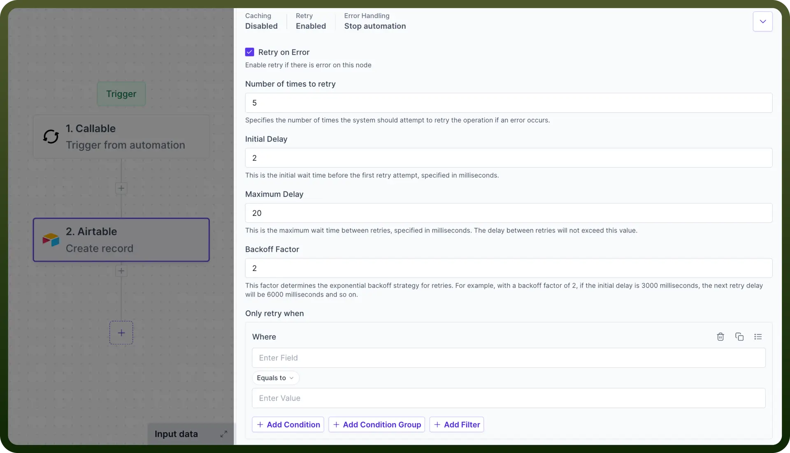
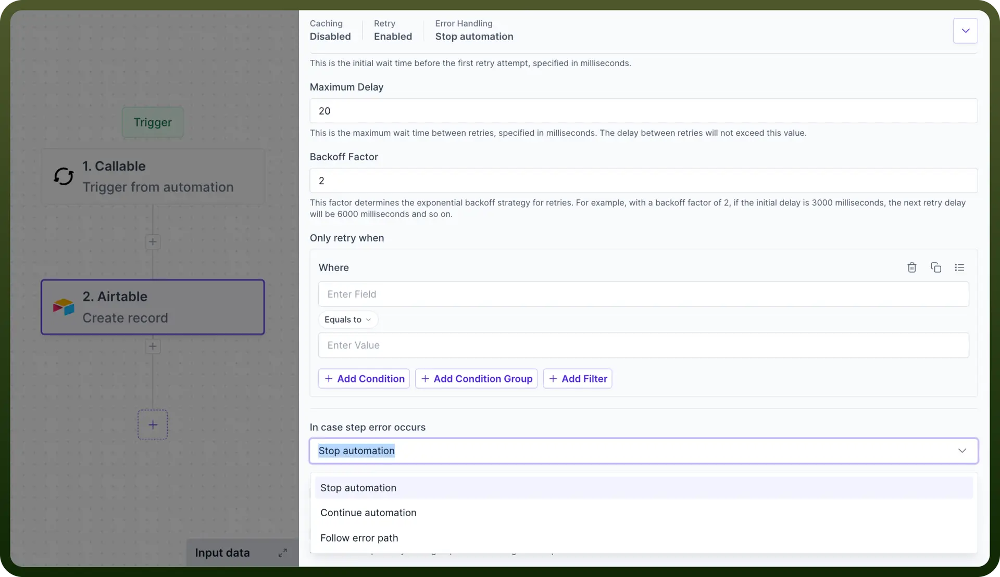
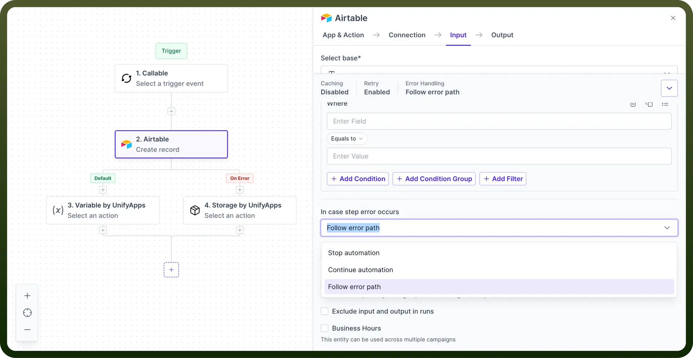

# Retry on Error

Source: https://www.unifyapps.com/docs/unify-automations/retry-on-error
Section: automations

---

## Overview

The Retry on Error is an **error-handling mechanism** that allows nodes within your automation to **automatically** retry in case of node level failures.

This reduces the need for manual intervention and improving the overall success rate of your automations.

## Use Cases

1. **API Rate Limit Handling**
  - **Scenario:** An automation frequently hits API rate limits when fetching data.
  - **Solution:** Implement retry with exponential backoff to automatically handle rate limit errors and resume operation after appropriate delays.
2. **Network Instability Management**
  - **Scenario:** Automations operating in environments with unreliable network connections often fail due to timeout errors.
  - **Solution:** Configure retries with appropriate initial and maximum delays to overcome temporary network issues.

## Detailed Features Breakdown

1. **Retry Enable/Disable:** Users can independently enable or disable the retry functionality for each node. " This granular control allows for optimised error-handling strategies across different parts of a automation."
2. **Number of Retry Attempts:** Specify how often the system should attempt to retry the operation if an error occurs. " This helps prevent infinite loops while still providing ample opportunity for recovery."
3. **Initial Delay:** Set the initial wait time before the first retry attempt, specified in milliseconds. " This delay can help in scenarios where errors might be caused by temporary network issues or resource unavailability."
4. **Maximum Delay:** Define the maximum wait time between retries, specified in milliseconds. " This ensures the delay between retries is relatively short, even with exponential backoff."
5. **Backoff Factor:** Implement an exponential backoff strategy by setting a backoff factor. " This progressively increases the delay between retry attempts, which can be crucial for avoiding overload on external systems or APIs."
6. **Error Handling Options:** Choose how the automation should proceed if all retry attempts fail. Options include stopping the automation, continuing to the next step or following a dedicated error path.

## How to configure?

1. **Access Node Settings :** In your automation, select the node you want to configure for retry on error. In the node's settings panel, enable the `Retry on Error` checkbox.
2. **Set the Number of Retries :** Enter the desired number of retry attempts (e.g., 3, 5, 10).
3. **Configure Initial Delay :** Enter the wait time in milliseconds before the first retry (e.g., enter 1000 for 1 second).
4. **Set Maximum Delay:** Enter the maximum allowable delay between retries in milliseconds.
5. **Define Backoff Factor:** In the `Backoff Factor` field, enter a value to determine the exponential increase in delay times. For example, a factor of 2 with an initial delay of 1000ms would result in delays of 1000ms, 2000ms, 4000ms, etc.

  

6. **Configure Conditional Retries (Optional)** : Use the condition builder to specify scenarios for retry attempts. Click `Add Condition` or `Add Condition Group` to create complex retry logic.
7. **Set Final Error Handling**: In the '`In case step error occurs`' dropdown, select the desired behaviour after all retries are exhausted. Common options include **Stop automation,** **Continue automation** or **Follow an error path**.
  - `Stop Automation` will automatically stop the automation and fail the execution in case of an error.
  - `Continue automation` will continue the execution even in case of any error.
  - `Follow error path` will allow defining a separate error branch to handle the flow execution.

    
