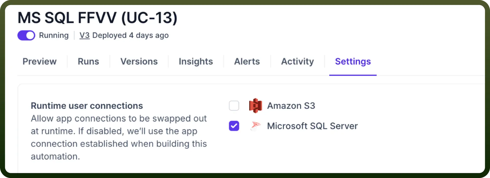
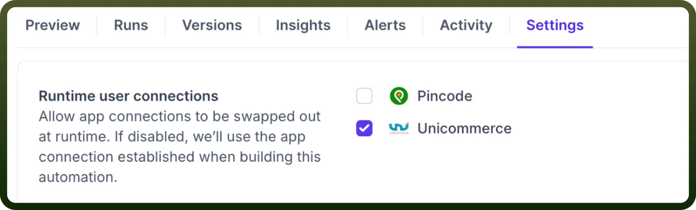
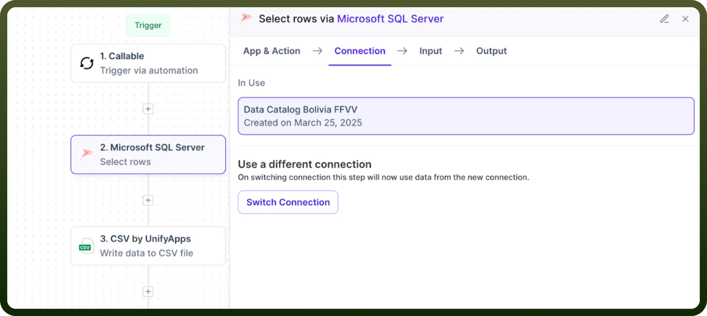
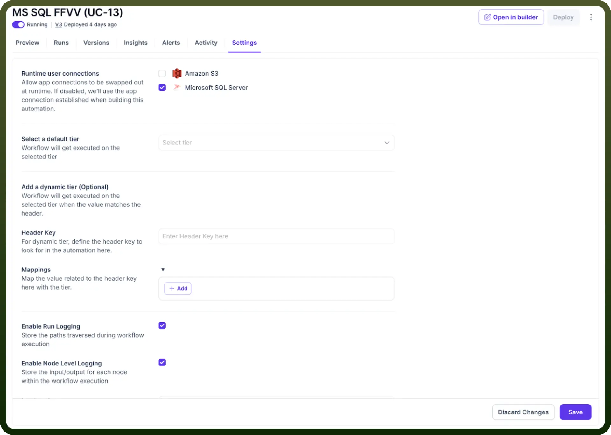
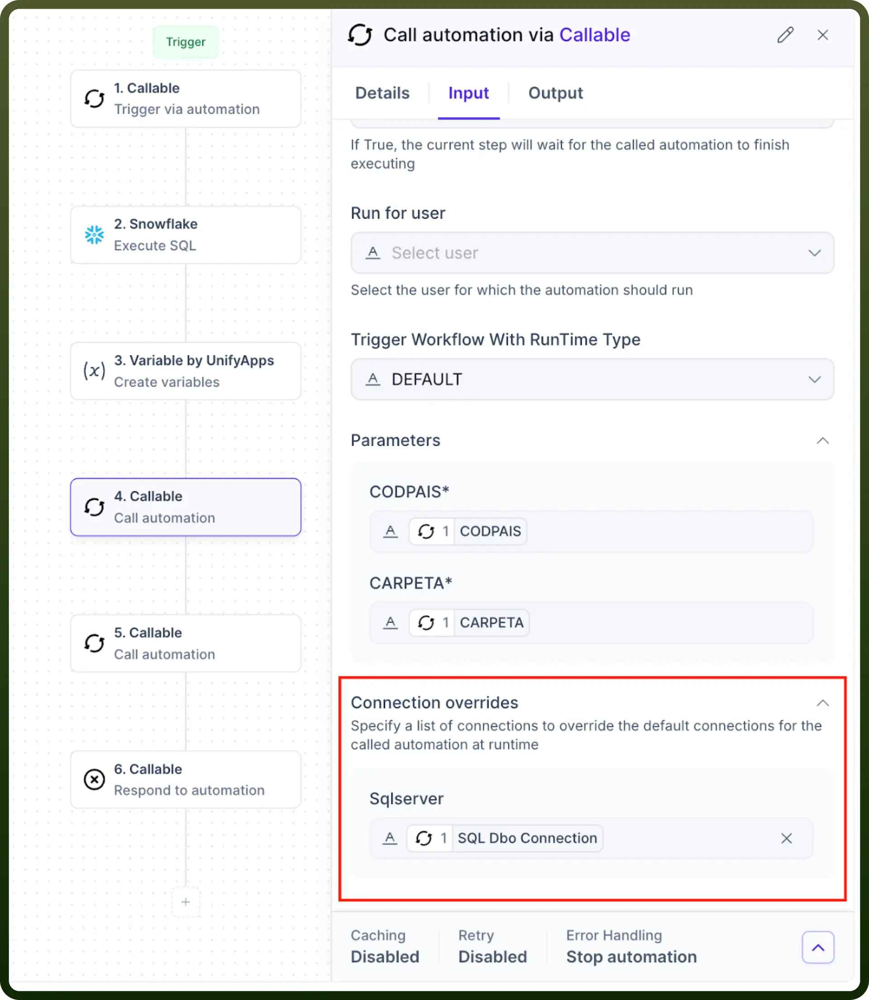

# Runtime Connection Switching

Source: https://www.unifyapps.com/docs/unify-automations/runtime-connection-switching
Section: automations

---

## Overview

**Runtime connection switching** is a powerful feature in automation platforms that allows the connection details used by automation to be determined at runtime rather than being hard-coded during development.

When an automation is configured with runtime connection switching, it can accept connection parameters as inputs or override default connections based on runtime conditions. This is particularly valuable for organizations that operate in multi-environment setups or need to process data across various systems.

## Use case

One of the major applications for runtime connection switching is in multi-store inventory management systems. In this scenario, an organisation needs to pull inventory data from Unicommerce for multiple individual stores, each with its own unique connection credentials and parameters.

Using runtime connection switching, a single automation can be designed to:

1. Accept store-specific connection details as input parameters
2. Dynamically establish a connection to the appropriate Unicommerce account for each store
3. Extract the current inventory data for that specific store
4. Process and transform the data as needed
5. Push the updated inventory information to a centralized system via a POST API

Without runtime connection switching, this would require creating and maintaining separate automations for each store, resulting in significant duplication of code and increased maintenance efforts. The dynamic approach allows for a scalable solution that can easily accommodate new stores by simply providing new connection details without modifying the automation logic.

## How to Set Up Runtime Connection Switching?

Setting up runtime connection switching typically involves the following steps:

- To swap connections dynamically during runtime, it is essential that your automation is triggered via a callable only. Then you can proceed with setting up the rest of your automation.
- You can choose your default connection in the relevant application as you would normally do. This will act as your fallback connection in case no swapping is required.

  

- Next you have to enable "`Runtime user connections`" for all the relevant applications in the Settings tab of your automation and then save it. This critical setting allows connections to be swapped out at runtime.

  

- Finally, configure "`Connection overrides`" when setting up your callable automation. In this section, specify the connection ID that should swap out the default connection in runtime.

  

> **Note:** You can use the `Get connection details` action in `Standard Entities by UnifyApps` to fetch the connection ID of your desired connection.
