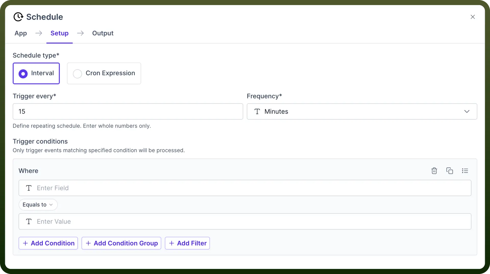
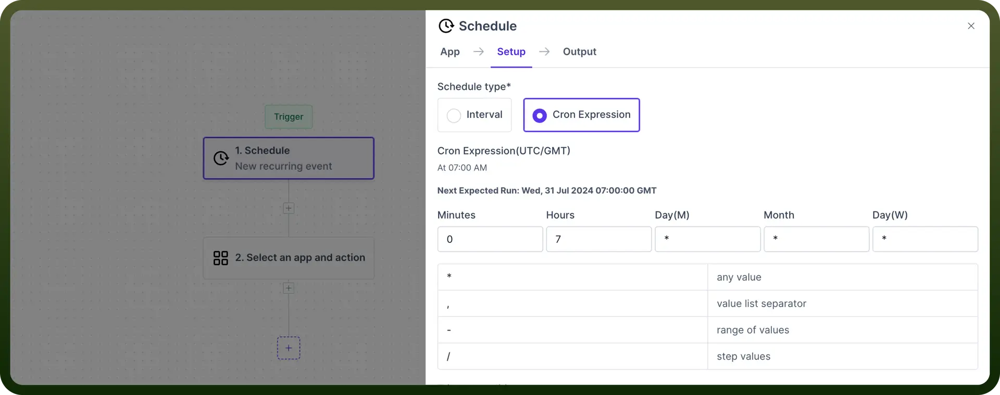
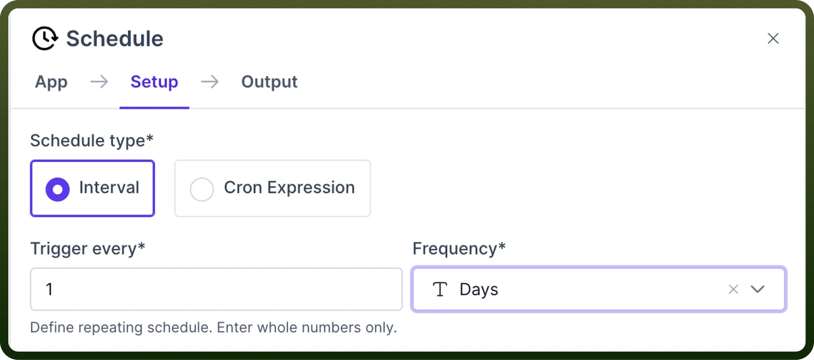
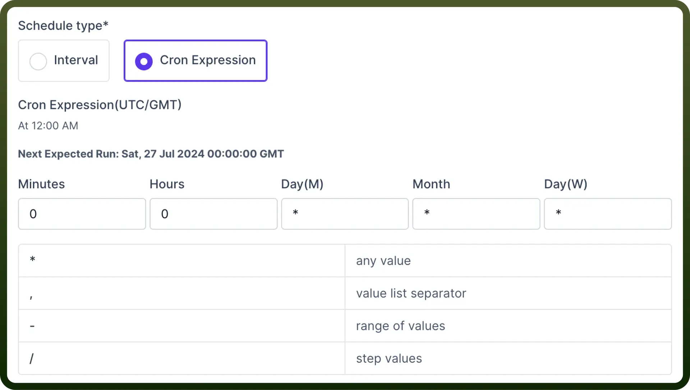
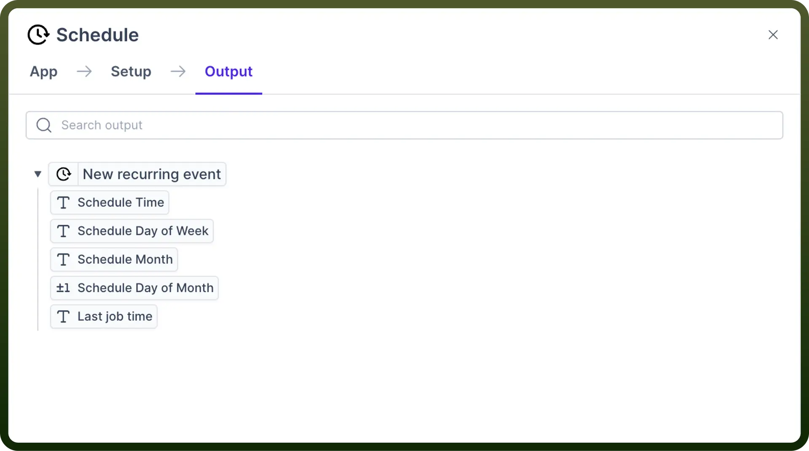

# Schedule

Source: https://www.unifyapps.com/docs/unify-automations/schedule
Section: automations

---

## Overview

Schedule trigger helps users run an automation at **predefined** time intervals.

Users can configure schedule triggers to recur at set intervals, such as **hourly**, **daily**, or **monthly**, and/or to activate at a **specific** date and time using a **Cron** Expression.

## Use Case

A customer support team wants a daily **summary** of all Zendesk tickets, including their assignees, subjects, and statuses. This summary should be posted daily in a dedicated Slack channel to keep the team informed and aligned.

1. We configure a `Schedule` trigger to activate at **7:00 AM** every day starting from 31/7, Wednesday.
2. We can obtain a list of all tickets from Zendesk.
3. Finally, the above list can be posted on our dedicated **Slack** channel.

## How to use Schedule?

1. Add the `Schedule` node as your trigger and select `New recurring event` as the action.
2. Next, fill in the following input parameters: **Schedule type:** Select your **Interval** and/or **Cron Expression,** depending on whether you want the automation to run at set intervals from the current moment or you want the automation to begin at a specific time and then continue at repeated intervals.
  - `Interval`
    - **Trigger every:** Input the value for your trigger duration.
    - **Frequency:** Select your units, e.g., hours, days, etc.
    - **Trigger conditions:** Set any conditions you want that are valid for running the Schedule.

      

  - `Cron Expression`
    - **Expression:** It is a series of fields describing the exact time when the Schedule should run.
    - **Trigger conditions:** Set any conditions you want that are valid for running the Schedule.

      

    - Finally, we obtain the output with the following information pieces.

      
