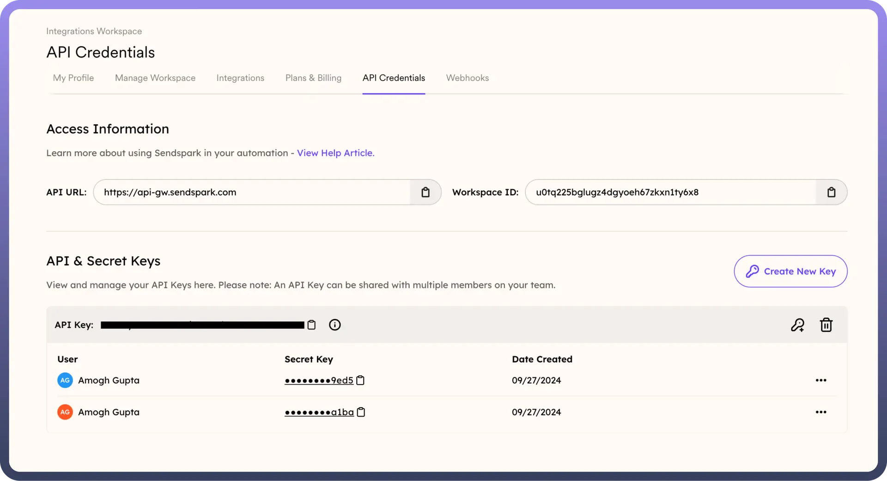
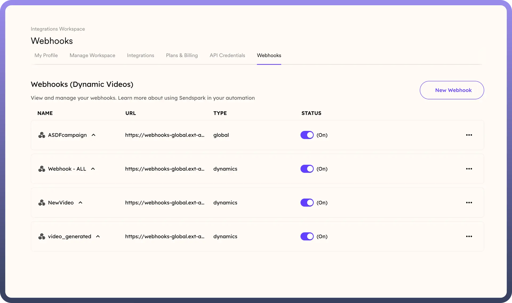

# Sendspark

Source: https://www.unifyapps.com/docs/unify-automations/sendspark
Section: automations

---

Sendspark is a video messaging platform that empowers businesses to **create**, **send**, and **track** personalised video content. It simplifies communication by allowing users to quickly **record** or **upload** videos and share them via email, social media, or other digital channels.

Integrating your application with Sendspark enhances **video-based communication**, allowing you to easily create, send, and track personalised video messages.

## Authentication

To ensure a smooth integration process, have the following information ready:

- `Connection Name`: Select a descriptive name for your connection, such as "MyAppSendsparkIntegration". This will help you easily identify the connection within your application or integration settings.
- `Authentication Type`**:** You can use token-based authentication to connect to your Sendspark account.

### Token based Authentication

You can use token-based authentication to connect your Sendspark account to an external application as follows :

- Navigate to the Sendspark platform and log in with your credentials.
- From the left sidebar, go to the `Integrations` section and from the dropdown menu, select [API credentials](https://sendspark.com/settings/api-credentials).

  

- In the **API Credentials** section, generate an `API Key` specific to your workspace by clicking the `Create New Key option`**.**
- You must also generate a `Secret Token` specific to your user in that workspace by clicking on the `Key` icon beside the API key.
- Treat the API Key and Secret Token with high confidentiality, as it allows access to your Sendspark account.

## How to setup webhook in the Sendspark application?

- Navigate to the Sendspark platform and log in with your credentials
- On the left sidebar, select webhooks from the Integrations section from the dropdown menu.
- Click on `Create New Webhook` or `Add Webhook` and enter a Webhook Name that helps you easily identify it.
- In the `Webhook URL` field, enter the URL of your external application where you want to receive the Webhook data.
- Select the events that will trigger the webhook and associate them with the relevant campaign by clicking `Connect Campaign`. You can choose one or multiple events based on your requirements.

  

## Triggers

| **Triggers** | **Description** |
|---|---|
| `On new event` | Use this trigger to start the automation when a new event occurs in Sendspark. |

## Actions

| **Actions** | **Description** |
|---|---|
| `Add multiple prospects to dynamic video campaign` | Use this action to add multiple prospects to a dynamic video campaign in Sendspark. |
| `Add a prospect to dynamic video campaign` | Use this action to add a single prospect to a dynamic video campaign in Sendspark. |
| `Create Dynamic Video Campaign` | Use this action to create a dynamic video campaign in Sendspark.. |
| `Get Dynamic Video Campaign` | Use this action to get a dynamic video campaign by id in Sendspark. |
| `List of Dynamic Video Campaigns` | Use this action to get the list of dynamic video campaigns in Sendspark. |
