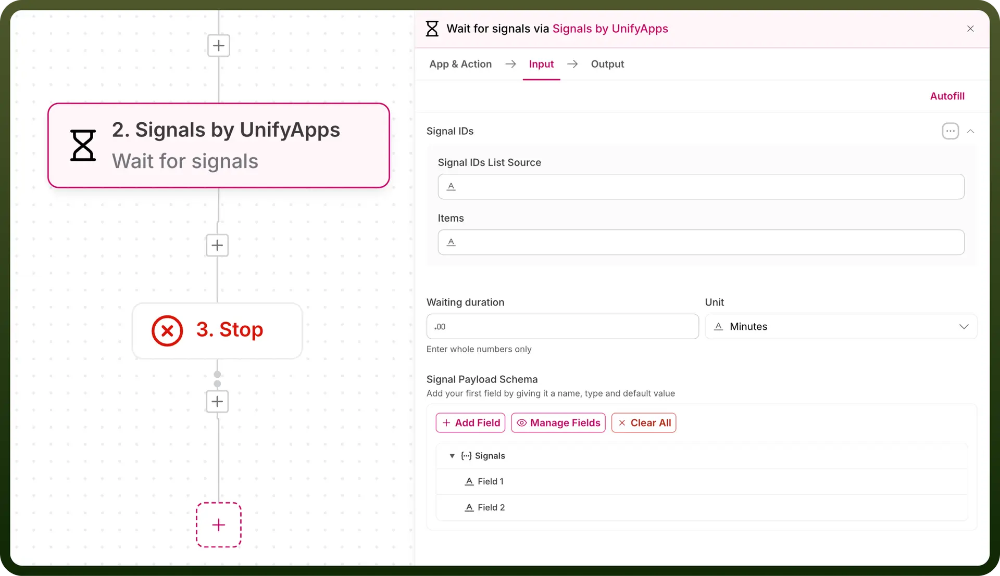
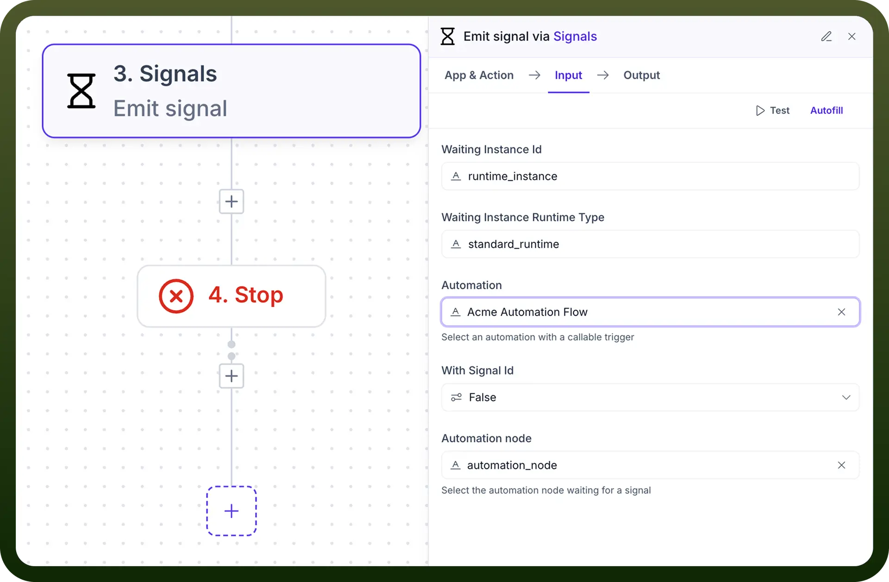
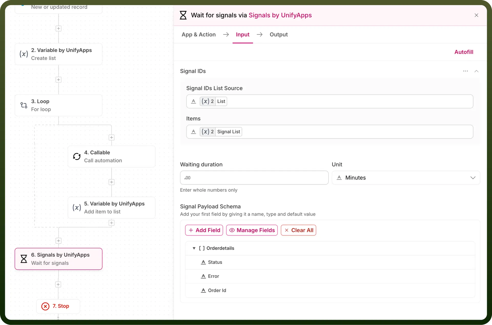
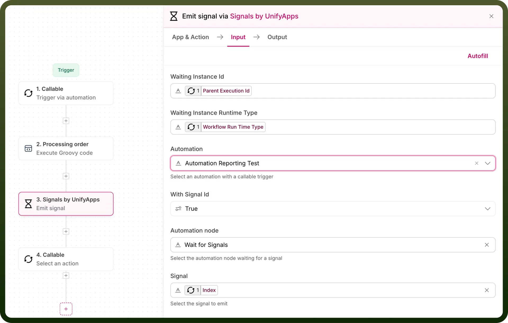

# Signals by UnifyApps

Source: https://www.unifyapps.com/docs/unify-automations/signals-by-unifyapps
Section: automations

---

## Overview

Signal Nodes are powerful features in UnifyApps that help manage complex asynchronous operations, especially when dealing with parallel processing and parent-child automation relationships.

## Wait for Signals Node

A control node in parent automation that pauses execution until it receives all specified signals from child automations. Think of it as a collection point that waits to hear back from all child processes before moving forward.

### Signal IDs

A list where we specify which signals the Wait Signal node should wait for. We need to provide the list of signal identifiers that we expect to receive from child automations.

For example, if processing multiple orders:

1. Create an empty list called '`signalList`' before the loop
2. Inside the loop, add identifiers like "`index`" to signalList (index of the iteration)
3. Map this signalList to Wait Signal node's Signal IDs field
4. Now the node knows exactly which signals to wait for (order_signal_1, order_signal_2, etc.)

This way, the Wait Signal node can track which child automations have responded and ensure all expected signals are received before proceeding.

### Signal Payload Schema

Define the structure of the response you expect from child automations. For example, if you're expecting status and error details from each child, define these fields in the schema. You can either:

- Add fields manually
- Use code snippet for complex data structures
- Map schema from previous steps

## Emit Signal Node

Used in child automations to send processing results back to the parent automation's Wait Signal node. When child automations complete their processing, they need to inform the parent automation. The Emit Signal node accomplishes this by sending both the signal (to match against the parent's Signal IDs list) and the processing results (matching the parent's defined payload schema).

### Waiting Instance ID & Runtime Type

These are parent automation's identifiers that must be passed to child automation through callable triggers.

- Waiting Instance ID: Parent automation's execution id
- Waiting Instance Runtime Type: Parent workflow's runtime type Map both these values from callable input to maintain the connection between parent and child.

### Automation Selection & Node

First, select the parent automation, then choose the specific Wait Signal node that should receive this response. This ensures signals are sent to the correct waiting point in the parent automation.

### With Signal ID

Enable this option to match signals with their corresponding Signal IDs in the parent's wait node. This ensures each child's response is properly tracked.

### Signal Parameters

In the parent automation, you define the expected data structure in Signal Payload Schema. Here in child automation, map your actual data to match those defined fields. For example, if a parent expects 'status' and 'result', provide these values here.

## Example: Parallel Order Processing

Let's take an example of parallel order processing using Signal Nodes:

Let's say we receive 1000 orders that need to be processed. To handle this efficiently and quickly:

### In Parent Automation

1. First, we get the list of 1000 orders
2. Create an empty list '`orderSignals`' to track our processing
3. Start a loop for these orders:
  - For each order, add "`Index`" to orderSignals list
  - Start child automation for order processing
4. Use Wait Signal node:
  - Map our orderSignals list to Signal IDs
  - Define what response we expect (order status, processing time)
5. After receiving all signals, it moves to subsequent step

  

### In Child Automation

1. Each child gets one order to process
2. After processing:
  - Map `Waiting Instance ID` and `Runtime Type` from callable input in emit signal node
  - Uses Emit Signal to send results back to parent
  - Includes success/failure status and processing details

    

By using Signal Nodes this way, instead of taking 1000 minutes (if processed one by one), we can process all orders in parallel, potentially completing the entire batch in just a few minutes.
