# Standard entities by UnifyApps

Source: https://www.unifyapps.com/docs/unify-automations/standard-entities-by-unifyapps
Section: automations

---

## Overview

The **Standard Entities** **node by UnifyApps** is designed to streamline user management, role assignments, metadata aggregation, and detailed auditing across applications. It empowers teams to efficiently manage users, roles, entities, and automations while maintaining comprehensive access to application-level data and configurations. This node is ideal for administrators and developers handling multi-layered applications and workflows.

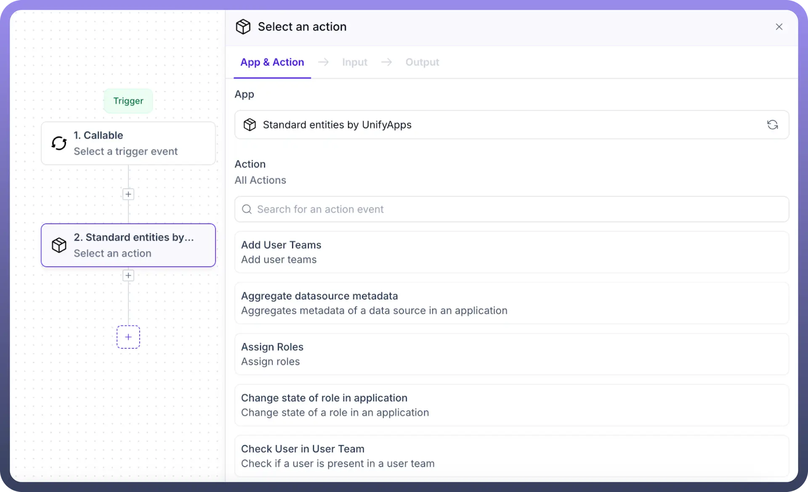

## Use Cases

1. **Team Collaboration Management** A project administrator uses the "Add User Teams" action to assign team memberships to users across applications. This ensures that users gain access to resources and permissions tailored to their roles within the team.
2. **Metadata Exploration for Reporting** Developers leverage the "Aggregate Datasource Metadata" action to explore and validate metadata of datasources within application pages. This facilitates accurate reporting and integration into custom workflows.
3. **User Audit Compliance** For compliance audits, administrators employ the "Get User Audit" action to review changes made by users, such as role assignments or application configurations, ensuring adherence to company policies.

## Actions

1. **Add User Teams** This action allows the assignment of one or more user teams to a specific user within an application. It ensures users are associated with the appropriate teams for streamlined collaboration and access control. **Input Requirements:**

  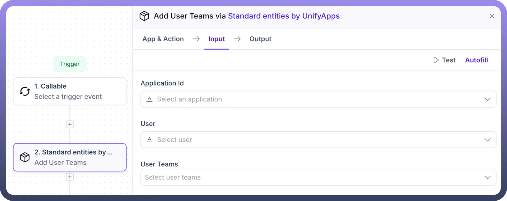

  - **Application ID:** Specify the application ID where the assignment is being made.
  - **User:** A dropdown menu listing all the users of the application. Only one user can be selected at a time.
  - **User Teams:** A dropdown menu with all user teams associated with the application. Select one or more user teams to assign to the user.
2. **Aggregate Datasource Metadata** This action provides a detailed breakdown of all metadata for a specified datasource used in creating a page. It helps in understanding the structure and properties of the datasource for better reporting and integrations. **Input Requirements:** **Output:** Metadata about the datasource object and its fields, including:

  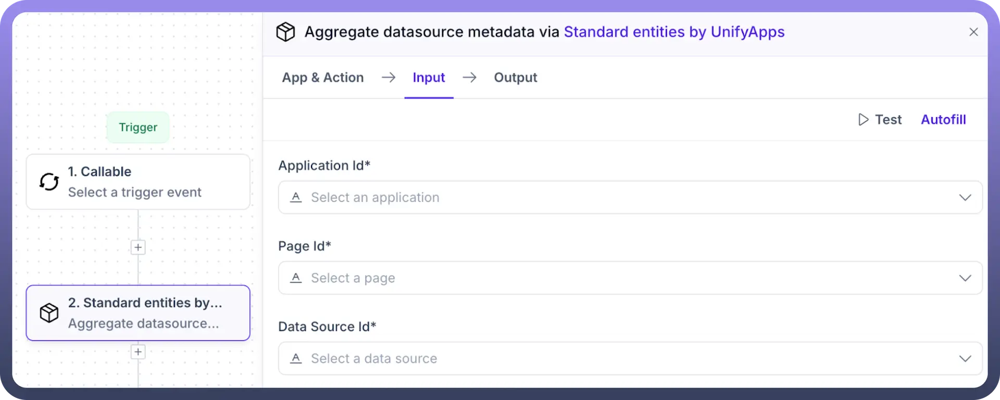

  - **Application ID:** Specify the application ID where the page resides.
  - **Page ID:** A dropdown menu with all page IDs in the application. Only one page ID can be selected.
  - **Datasource ID:** A dropdown menu with all datasources present on the selected page. Choose the datasource for which metadata is required.
  - Display Name
  - Entity Type
  - Field Type
  - Searchable (true/false)
  - Updatable (true/false)
  - Sortable (true/false)
3. **Assign Roles** This action enables assigning one or more roles to a specific user or user team within the application, ensuring appropriate permissions. **Input Requirements:**

  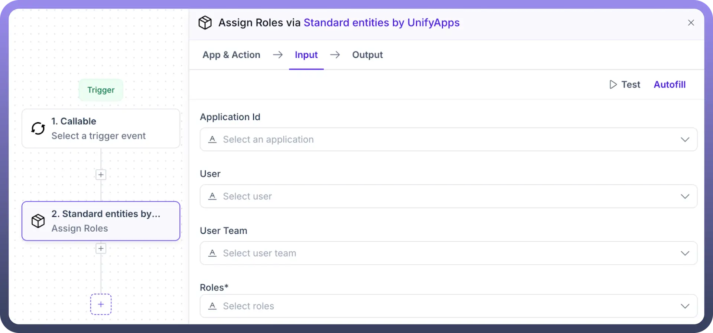

  - **Application ID:** Specify the application ID.
  - **User:** A dropdown menu listing all users of the application. Only one user can be selected.
  - **User Teams:** A dropdown menu listing all user teams of the application. Only one user team can be selected.
  - **Roles:** A dropdown menu listing all roles in the application. Select one or more roles to assign to the user or user team.
4. **Change State of Role in Application** This action toggles the state of a specified role between enabled and disabled, providing flexibility in managing role-based permissions. **Input Requirements:**

  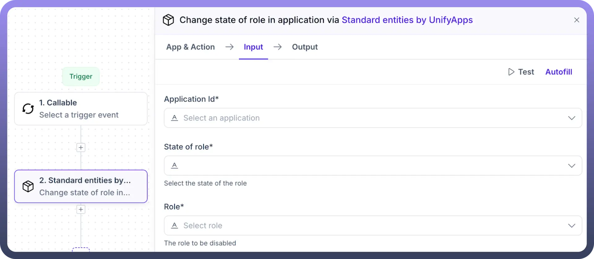

  - **Application ID:** Specify the application ID where the role resides.
  - **State of Role:** Choose the desired state for the role: Enable or Disable.
  - **Role:** Select the role whose state needs to be changed.
5. **Check User in User Team** This action verifies whether a specific user is part of a specified user team. The output is a boolean value (true/false). **Input Requirements:** **Output:**True if the user is part of the user team, otherwise false

  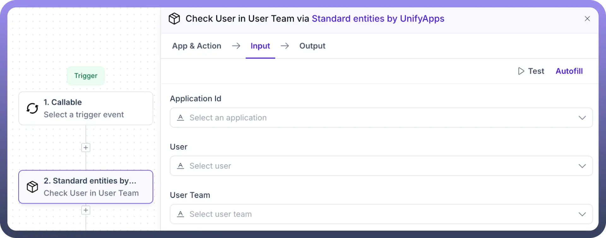

  - **Application ID:** Specify the application ID where the user and user team exist.
  - **User:** A dropdown menu listing all users of the application. Only one user can be selected.
  - **User Team:** A dropdown menu listing all user teams of the application. Only one user team can be selected.
6. **Create or Update Role in Application** This action is used to create a new role or update an existing role within an application. It provides detailed customization of roles with descriptions and permissions. **Input Requirements:**

  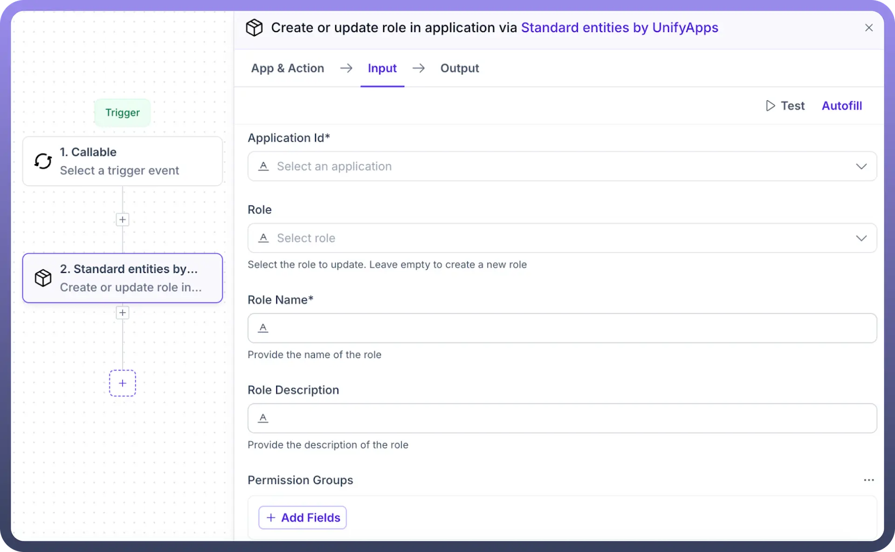

  - **Application ID:** Specify the application where the role will be created or updated.
  - **Role:** Select the role to update. Leave this field empty to create a new role.
  - **Role Name:** Provide a name for the role.
  - **Role Description:** Provide a brief description of the role.
  - **Permission Groups:**
    - **Permission Groups List Source:** Specify the source of the permission groups.
    - **Items (Permission Group):** Select the relevant permission groups.
    - **Permissions:** Specify the permissions from the list source and items.
7. **Create User** This action creates a new user for an application. It ensures users are added with the necessary details and access configurations. **Input Requirements:**

  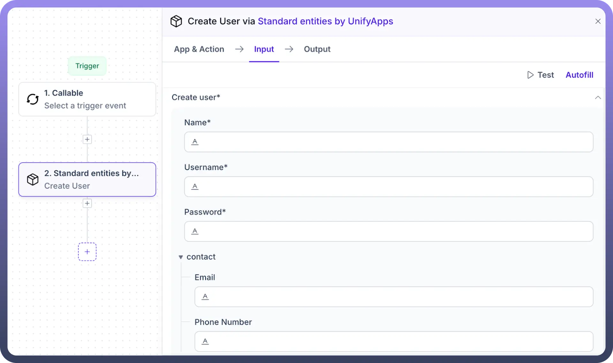

  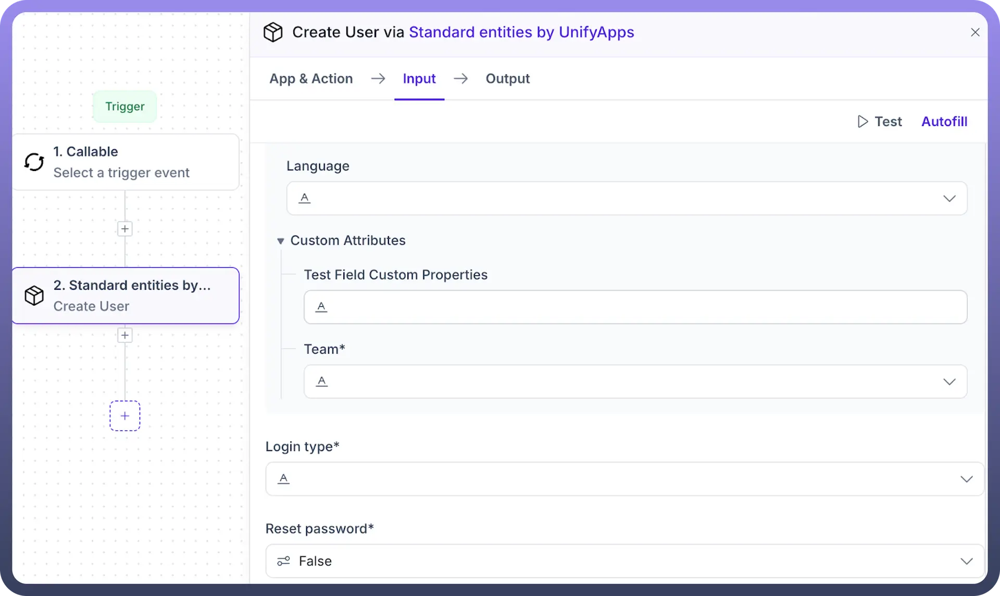

  - **Create User:**
    - Name
    - Username
    - Password
    - Contact
    - Email
    - Phone Number
    - Application ID
    - State: Options include Active, Locked, Disabled, Deleted.
    - Language: Options include English, French, Spanish, Arabic.
    - Custom Attributes:
      - Test Field Custom Properties
      - Team
    - **Login Type:** Choose between Password or SSO.
    - **Reset Password:** Boolean value (true/false).
8. **Delete User** This action deletes a user from the application. **Input Requirements:**

  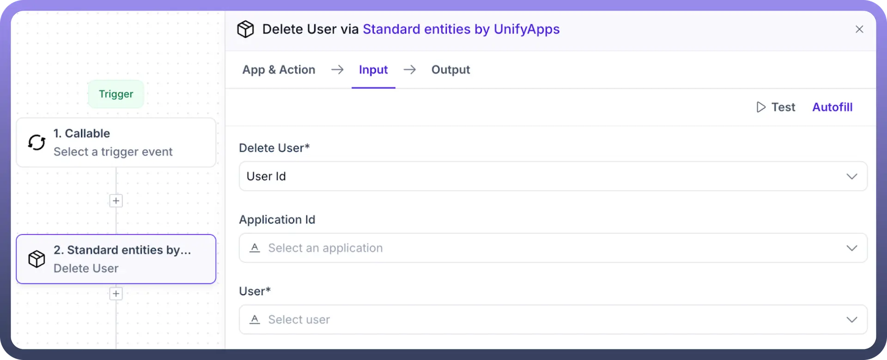

  - **Delete User:** Specify by Username or User ID.
  - **Application ID:** Select an application.
  - **User:** A dropdown menu listing all user IDs/usernames based on the selection above. Choose the user to delete.
9. **Delete Role** This action deletes a role from the platform. **Input Requirements:**

  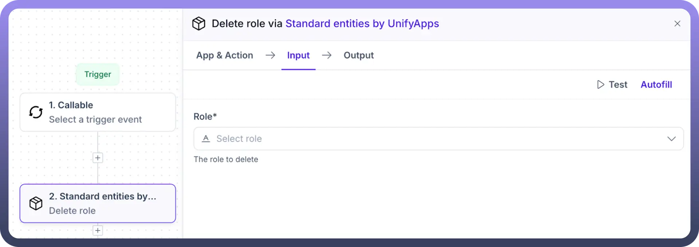

  - **Role:** A dropdown menu listing all roles available in the platform. Select the role to delete.
10. **Delete Connections** This action deletes one or more connections from the platform. **Input Requirements:**

  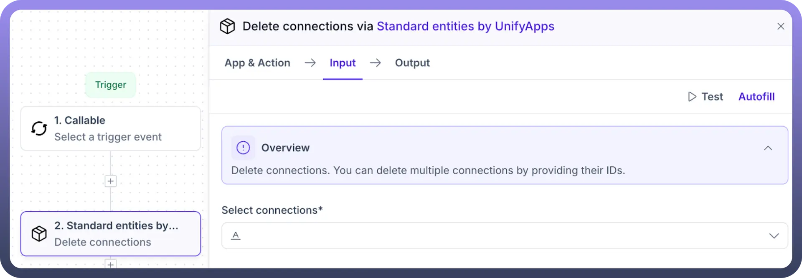

  - **Connection:** A dropdown menu listing all connections available in the platform. Select the connection(s) to delete.
11. **Enable Role** This action enables a specific role in the platform. **Input Requirements:**

  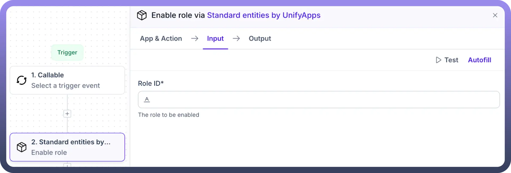

  - **Role:** A dropdown menu listing all roles in the platform. Select the role to enable.
12. **Fetch User** This action retrieves detailed information about a specified user. **Input Requirements:** **Output:** Fetches user information such as:

  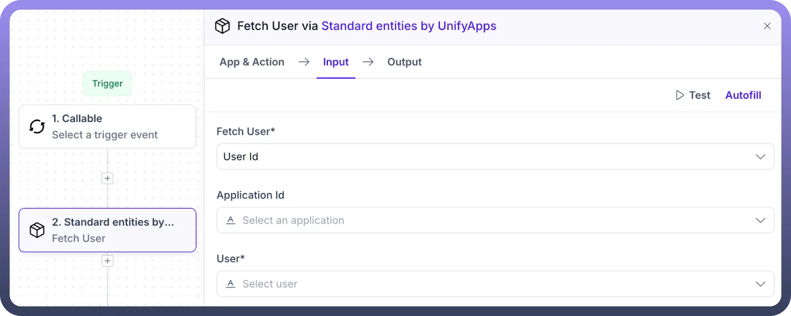

  - **Fetch User:** Specify by User ID or Username.
  - **Application ID:** Select the application.
  - **User:** A dropdown menu listing all users of the application. Select the user to fetch details for.
  - Contact Details
  - Created Time
  - State
  - Username
  - Owner User ID
  - Last Login At
  - Last Modified By
  - User Groups, etc.
13. **Fetch Roles** This action retrieves all deleted roles from the platform based on specific filters. **Input Requirements:**

  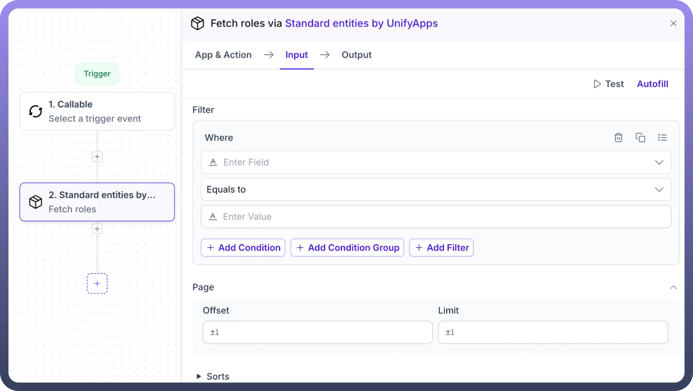

  - **Filter**: Define criteria such as ID, Application ID, Created On, Edited By, Last Edited, Project, Is Standard Role, State, Tags, etc.
    - Add Condition
    - Add Condition Group
    - Add Filter
  - **Page**: Specify Offset and Limit.
  - **Sorts**: Add fields and sorting options.
  - **Include** Disabled: Boolean value (default is true).
  - **Include Total Count**: Boolean value to fetch the total count of records.
14. **Fetch Entities** This action retrieves information about standard entities in the platform. **Input Requirements:**

  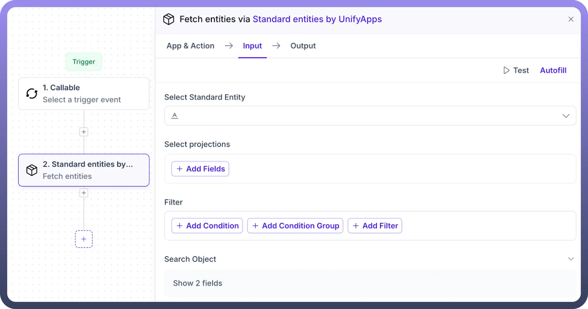

  - **Select Standard Entity:** Specify the standard entity to fetch.
  - **Projections:** Define projections, including the name and fields to include.
  - **Filter:**
    - Add Condition
    - Add Condition Group
    - Add Filter
  - **Search Object:**
    - Fields: Enter fields to search.
    - Value: Provide the value to search for.
  - **Page:** Specify Offset and Limit.
  - **Sorts:** Add fields and sorting options.
  - **Include Total Count:** Boolean value (true/false) to include the total count of records.
15. **Get Asset Count** This action provides the count of data pipelines based on specific criteria. **Input Requirements:**

  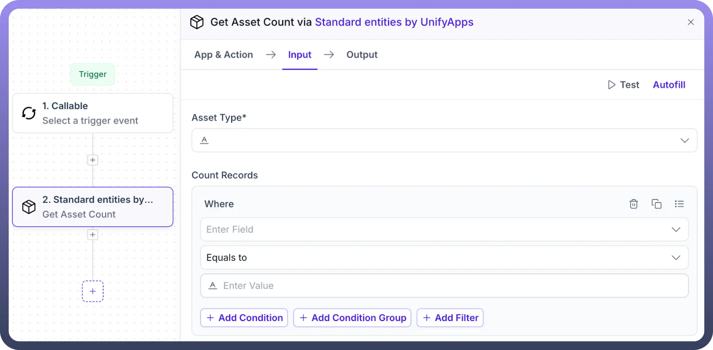

  - **Asset Type:** Specify the type as Data Pipeline.
  - **Filter Count Records:** Define filters based on criteria such as Deployment Status, Destination, ID, Last Modified By, Owner User, etc.
16. **Get Entity Details** Fetch detailed information about a specific object or its reporting schema. **Input Requirements:** **Output:**

  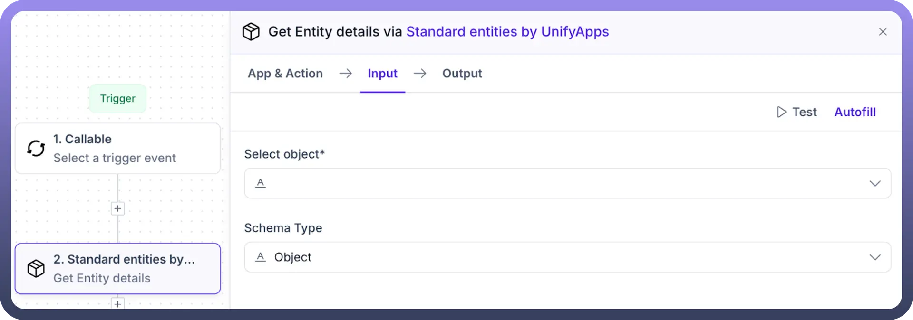

  - **Select Object:** Dropdown with all objects.
  - **Schema Type:** Options are Object or Reporting.
    - If Reporting, select Group (Platform or Storage).
  - **Object:** Provides field-level details.
  - **Reporting + Platform:** Includes reporting table name, schema, and ID.
  - **Reporting + Storage:** Details fields relevant to data storage.
17. **Get Unified Entity Model Reporting Details** Fetches comprehensive reporting details about a Unified Entity Model (UEM), including its entities and associated fields. **Input Requirements:**

  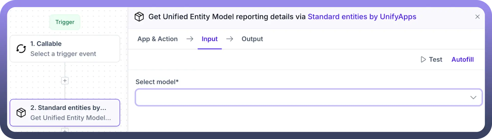

  - **Select Model:** Dropdown to select the desired UEM.
18. **Get User Audit** Provides detailed information about audits performed by a specific user, aiding in activity monitoring and compliance. **Input Requirements:**

  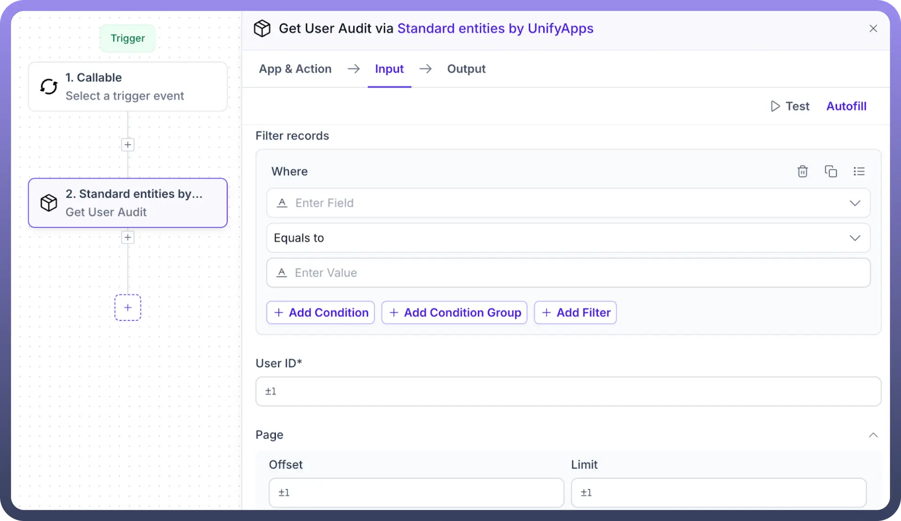

  - **Filter Records:** Define criteria (e.g., Asset Class, Asset Version, Activity Type, Tags).
  - **User ID:** Input the unique ID of the user.
19. **Get Reachable Nodes Schema for a Node in a Workflow** Retrieve the schema for a specific node within a workflow. **Input Requirements:**

  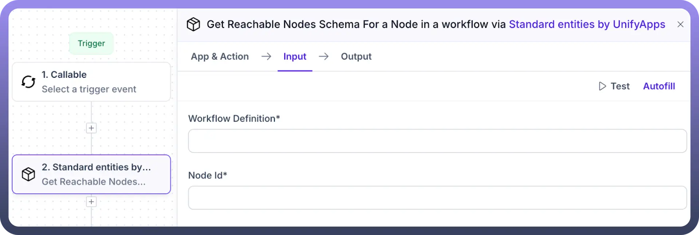

  - **Workflow Definition**
  - **Node IDs**
20. **Get Audit Records** Fetches audit-related information for a specific asset, including its versions and change history. **Input Requirements:** **Output:**

  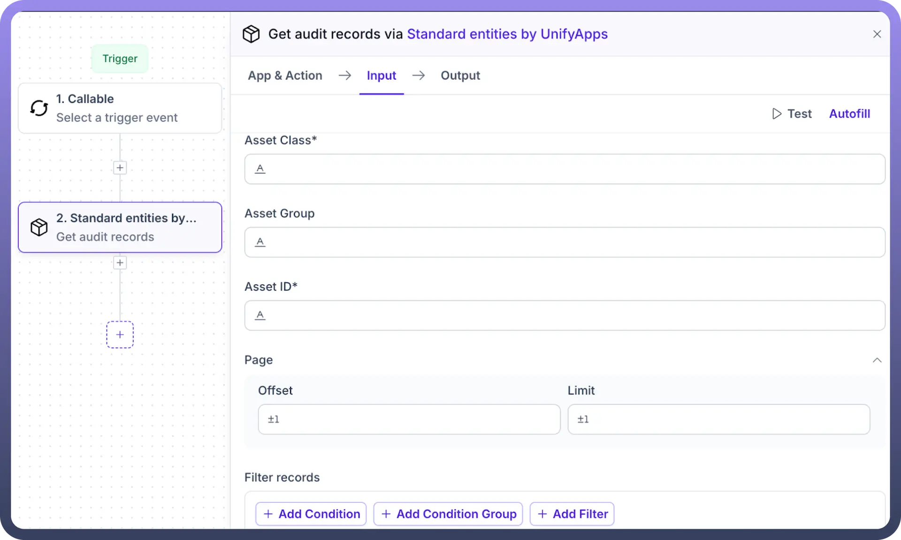

  - **Asset Class -** Enter the asset class. Eg. WORKFLOW_DEFINITION for an automation
  - **Asset Group -**
    - **Asset ID -** Enter the asset id
  - Details such as Created Time, Owner User ID, Modified Time, Asset Version, and differences between New Value and Old Value.
21. **Get Connection Details** Provides details about one or more connections within the platform, useful for integration and configuration analysis. **Input Requirements:**

  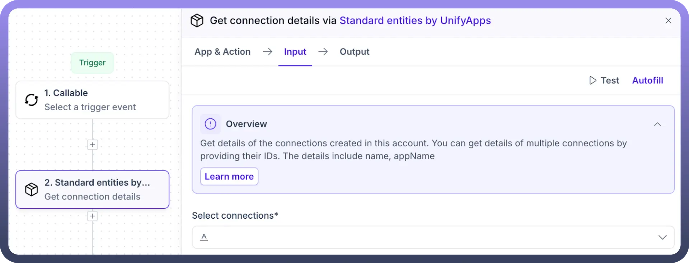

  - **Select Connections:** Dropdown to select one or multiple connections.
22. **Get Data Pipeline Details** Fetches detailed information about data pipelines. Filtering options allow for targeted retrieval without specifying pipeline names. **Input Requirements:** **Output:**

  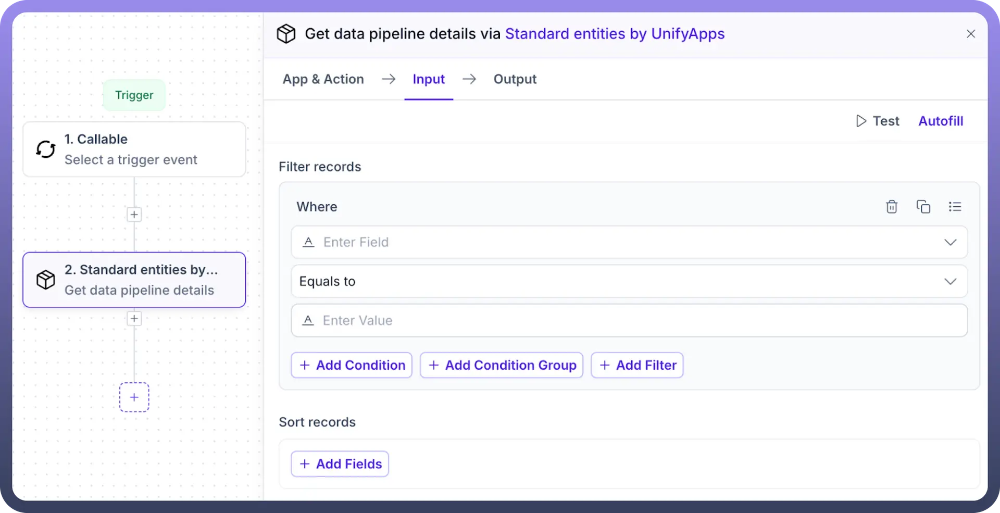

  - **Filter:** Based on parameters like Deployed Status, Created Time, Destination, Modified Time, Resumable Status, etc.
  - Includes fields like Modified Time, Source Connection ID, Name, Created Time
23. **Get Connections** Fetches information about platform connections with flexible filtering for relevant details. **Input Requirements:** **Output:**

  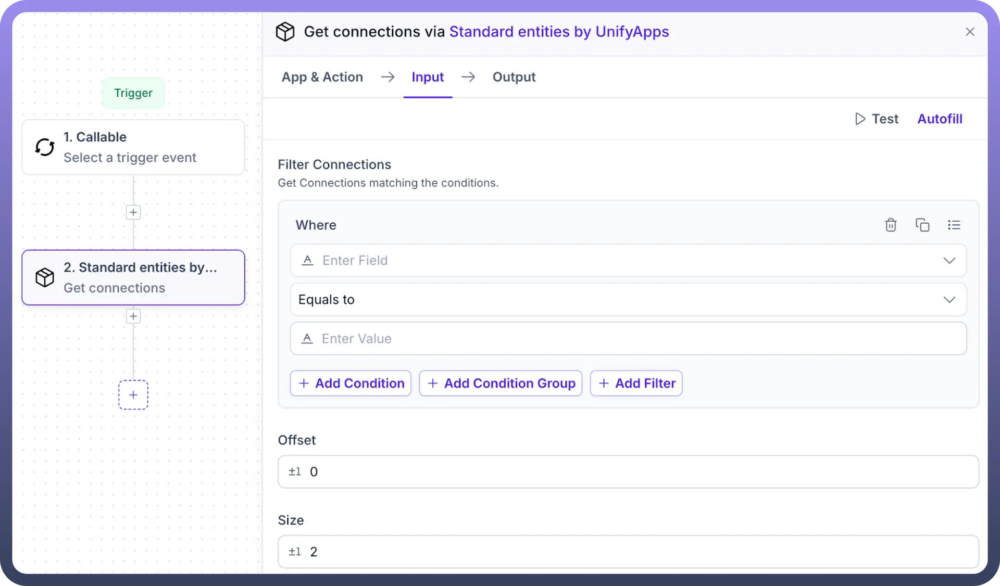

  - **Filter:** Criteria include Active, App Name, Created Time, Tag, ID, Last Modified By, Owner User, Modified Time, and Projects.
  - Provides connection details such as App Name, Name, Active Status, and ID.
24. **Get Automation Details** Retrieves detailed information about selected automation workflows, including nodes and edges if specified. **Input Requirements:** **Output:**

  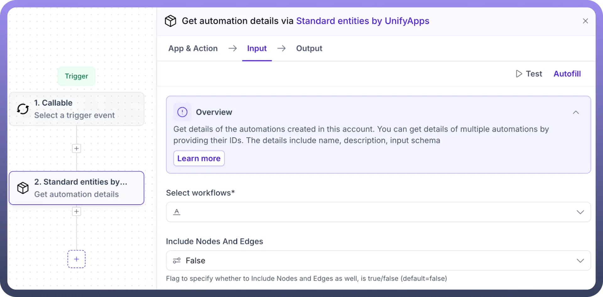

  - **Select Workflows:** Dropdown to select one or more workflows.
  - **Include Nodes and Edges:** Boolean flag (default: False).
  - Workflow details such as Name, Description, ID, Input Schema, and Content Type.
25. **Import Changeset** Imports a changeset, optionally deploying assets or updating existing ones. **Input Requirements:**

  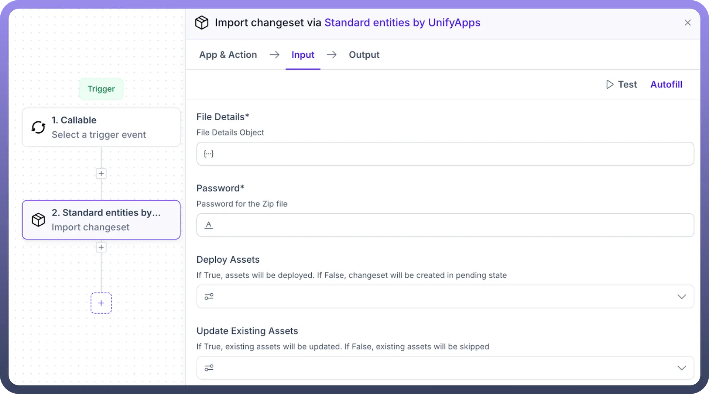

  - **File Details**: Connect the data pill containing the file.
  - **Password:** Password for the ZIP file.
  - **Deploy Assets:** Boolean (True/False) to deploy assets immediately.
  - **Update Existing Assets:** Boolean (True/False) to update existing assets.
26. **Modify Automation** Performs operations on a selected automation, such as pausing, unpausing, or deleting it. **Input Requirements:**

  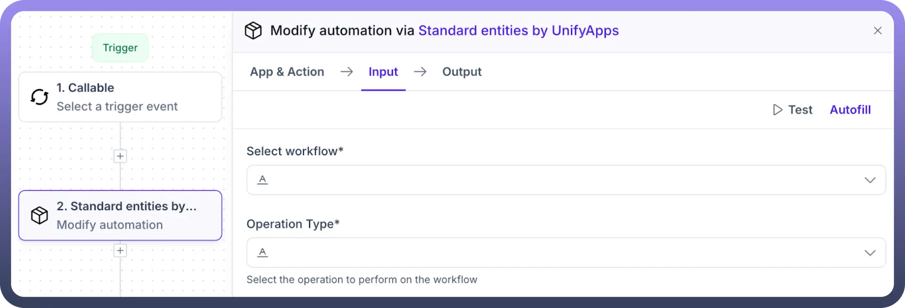

  - **Select Workflow:** Dropdown to select a single workflow.
  - **Operation Type:** Choose from Pause, Unpause, or Delete.
27. **Restore Deleted Role** Restores a previously deleted role in the application. **Input Requirements:**

  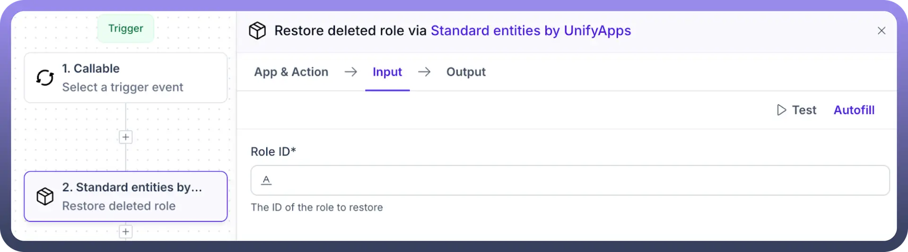

  - **Role ID:** Specify the ID of the role to restore.
28. **Update User State** Updates the state of a user within an application to one of the predefined statuses. **Input Requirements:**

  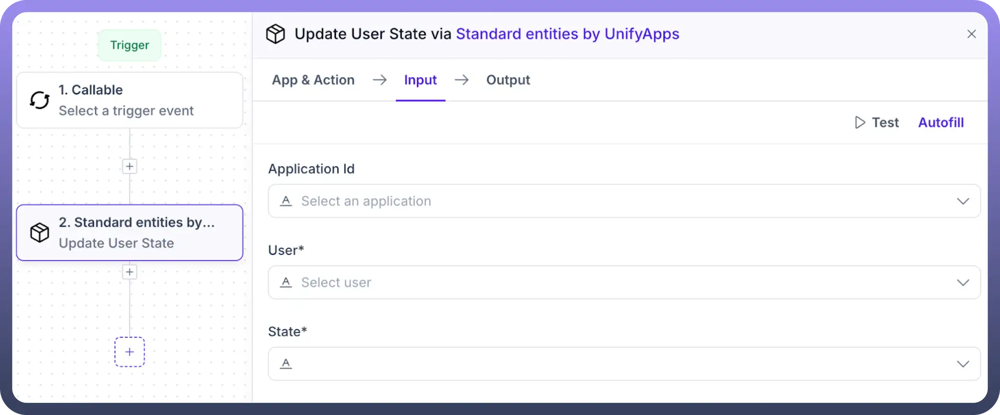

  - **Application ID:** Specify the application.
  - **User:** Select the user within the application.
  - **State:** Choose the new state (Active, Disabled, Deleted, Locked).
29. **Update User Properties** This action allows updating specific custom properties of a user within an application. **Input Requirements:**

  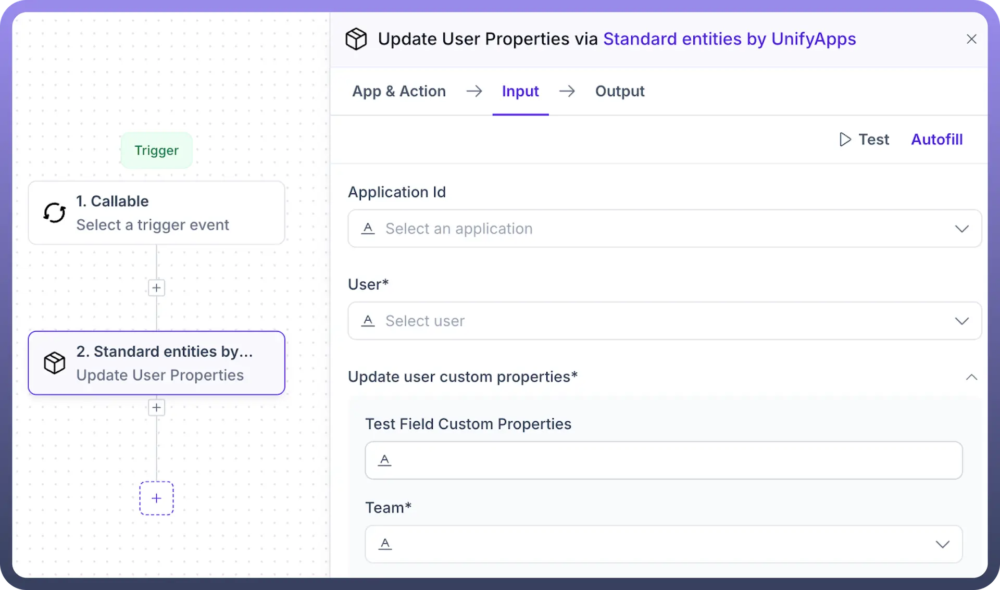

  - **Application ID:** Provide if the user belongs to an application; otherwise, leave blank.
  - **User:** Dropdown listing all users. Select one user to update.
  - **Update User Custom Properties:**
    - Test Field Custom Properties: Specify the test field properties to be updated.
    - Team: Choose one from the following options: Engineering, Finance, Design, or Marketing.
30. **Reset Password** This action resets the password for the user account associated with your current login. **Input Required:**

  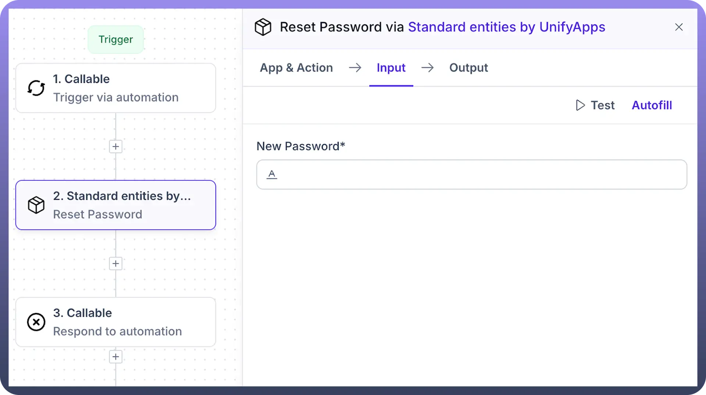

  - **New Password:** Enter the new password.
