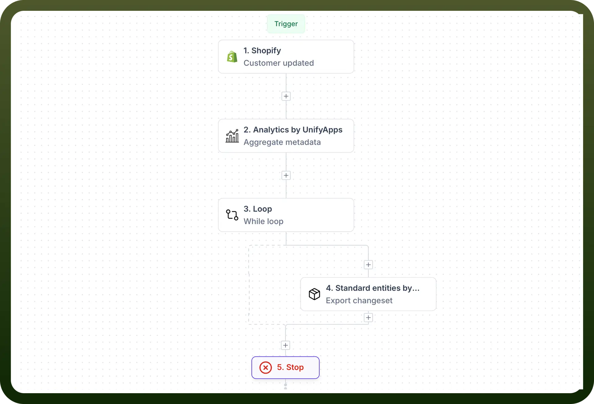

# Stop

Source: https://www.unifyapps.com/docs/unify-automations/stop
Section: automations

---

## Overview

The STOP Node is a crucial control element in automation workflows that serves as a definitive endpoint for a specific branch or path within your automation sequence. Unlike other nodes that transform, process, or route data, the STOP Node's primary function is to halt the execution of the current branch, preventing any subsequent nodes from running in that particular path.

Think of it as a "dead end" sign in your automation - when the workflow reaches this node, it comes to a complete stop for that branch, while other parallel branches can continue running independently.

## Key Characteristics and Behavior

**Immediate Termination**

When a STOP Node is encountered, it immediately terminates the execution of that specific branch. No data is passed forward, and no further processing occurs in that path.

**Branch-Specific Impact**

The STOP Node only affects the branch it's placed in. If your automation has multiple parallel branches, other branches will continue executing normally, making it perfect for conditional termination scenarios.

**Clean Exit**

Unlike error states that might leave processes hanging or create logs filled with exceptions, the STOP Node provides a clean, intentional exit from the workflow.

