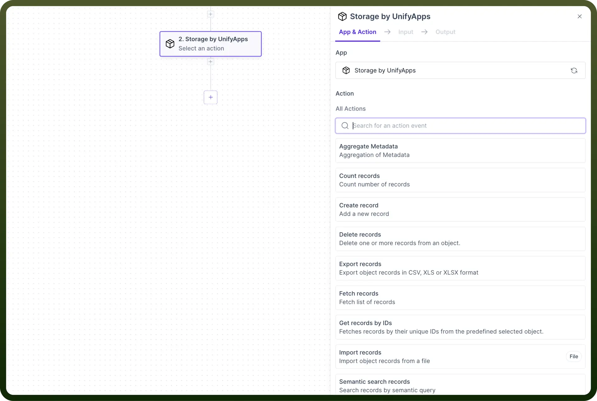

# Storage by UnifyApps

Source: https://www.unifyapps.com/docs/unify-automations/storage-by-unifyapps
Section: automations

---

## Overview

Storage by UnifyApps is a key feature of the UnifyApps Automation Builder, offering robust data management directly within your automations.

 It allows users to easily perform a variety of data operations, including `creating`, `reading`, `updating`, and `deleting` records, as well as more advanced tasks like semantic search and metadata aggregation.

## Key Features

- Create, `read`, `update`, and `delete` records.
- `Export` and `import` records in various formats.
- `Aggregate` metadata for advanced analysis.
- `Perform` semantic searches on stored data.
- `Share` records with specific users or teams.
- `Count` and `fetch` records based on various criteria.

## Detailed Breakdown

#### Aggregate Metadata

The "Aggregate Metadata" action allows you to perform **data analysis** and **summarization** on your stored records. This can be useful for generating reports, gaining insights, or preparing data for further processing.

#### Count Records

Use the "Count records" action to get the **total number of records** in your storage. This is essential for `reporting`, `pagination`, or `conditional logic` in your automations.

#### Create Record

The "Create record" action enables you to **add new data** to your storage, which is fundamental for capturing information within your automation processes.

#### Delete Records

With the "Delete records" action, you can **remove one or more records** from an object in your storage, facilitating data cleanup and management.

#### Export Records

The "Export records" feature allows you to **extract data from your storage** in `CSV`, `XLS`, or `XLSX` formats. This is crucial for data portability, reporting, and integration with other systems.

#### Fetch Records

Use the "Fetch records" action to **retrieve a list of records** from your storage, bringing existing data into your automation for processing or decision-making.

#### Get Records by IDs

The "Get records by IDs" action **fetches specific records** using their unique identifiers from a predefined selected object, allowing for precise data retrieval.

#### Import Records

With the "Import records" action, you can **bulk add data to your storage** from external files, streamlining the process of populating your database or updating large datasets.

#### Semantic Search Records

The "Semantic search records" feature enables you to **search through your data** using natural language queries, providing more intuitive and flexible data retrieval options.

#### Share Records

The "Share records" action allows you to grant **access to specific records** for particular users or teams, enhancing collaboration and data security within your organization.

#### Update Record by ID

This action lets you modify an existing record or **create a new one** if the specified ID doesn't exist, providing flexibility in managing individual data entries.

#### Update Records by Query

The "Update records by query" action allows you to **modify multiple records** that match specific criteria, enabling efficient batch updates or data transformations.

## Use Cases

1. **Advanced Customer Relationship Management**
  - **Scenario**: A sales team needs to manage customer data, interactions, and generate reports.
  - **Solution**: Utilize create and update actions for maintaining customer records, semantic search for quick information retrieval, and export features for generating reports.
2. **Collaborative Project Management**
  - **Scenario**: A project team needs to share and update task information across departments.
  - **Solution**: Use the create record action for new tasks, share records feature to control access, and update by query for batch status changes
3. **Data-Driven Decision Making**
  - **Scenario**: Executives need up-to-date aggregated data for strategic planning.
  - **Solution**: Implement automations using aggregate metadata and semantic search to compile and analyze relevant data points quickly.
4. **Automated Data Cleansing**
  - **Scenario**: An organization needs to maintain data quality across large datasets.
  - **Solution**: Create automations that use fetch records and update by query actions to identify and correct data inconsistencies periodically.
5. **Dynamic Content Management**
  - **Scenario**: A website needs to update content based on user interactions and external data sources.
  - **Solution**: Use import records to bring in new content, semantic search to categorize it, and update records to refresh displayed information dynamically.
