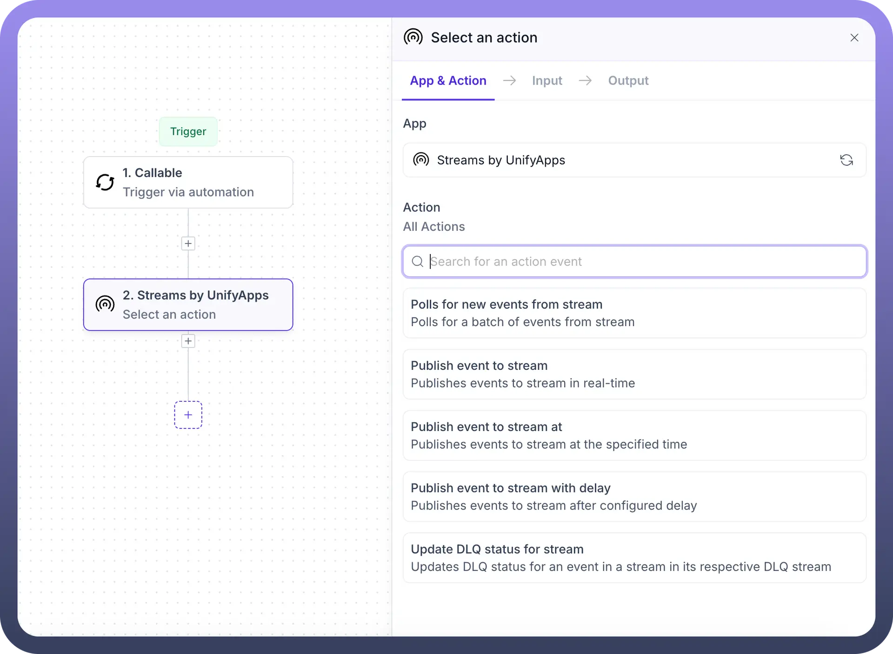
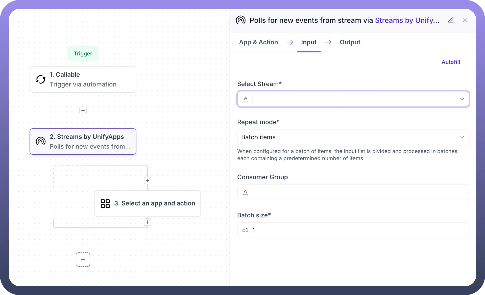
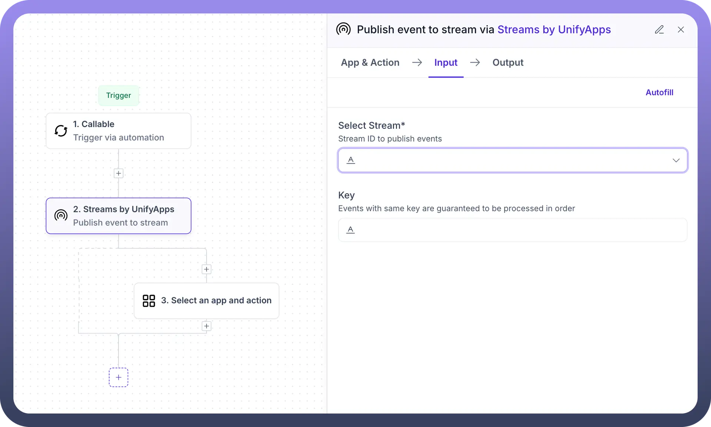
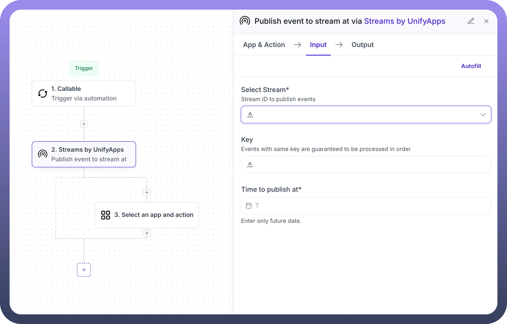
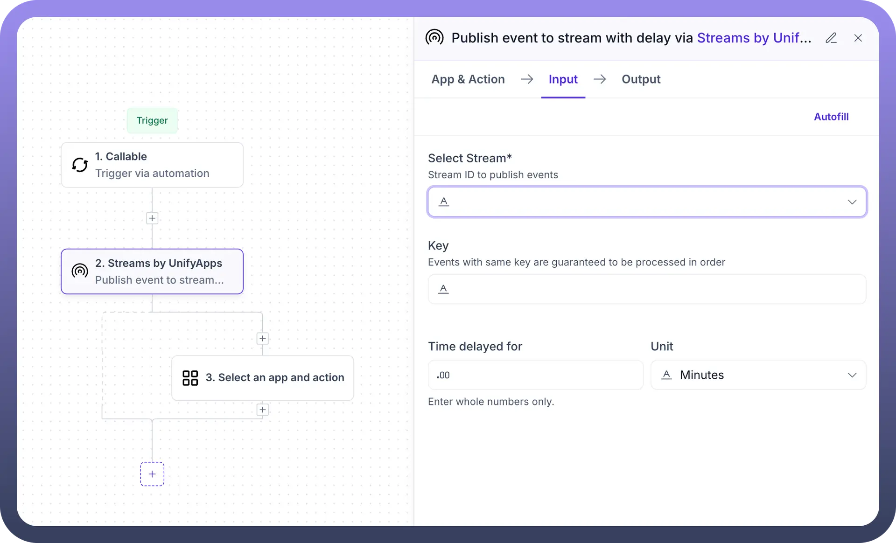
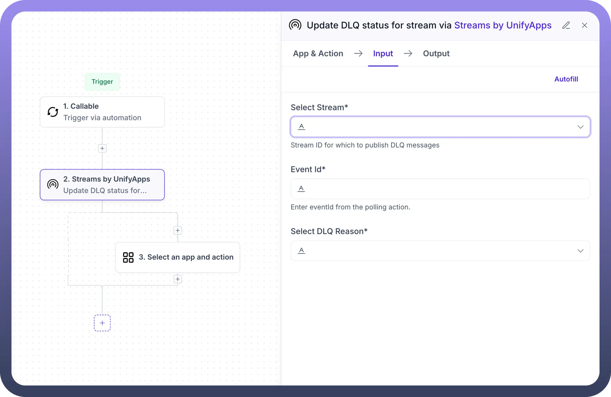
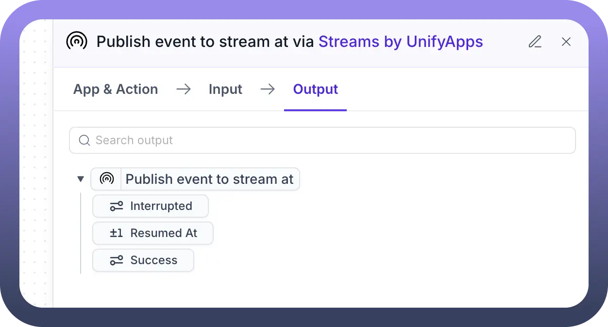

# Streams by UnifyApps

Source: https://www.unifyapps.com/docs/unify-automations/streams-by-unifyapps
Section: automations

---

## Overview

Streams by UnifyApps provides powerful event streaming capabilities for real-time data processing and event-driven automation. This functionality enables you to publish, consume, and process events across your applications in a reliable and scalable way, facilitating seamless communication between different components of your system.

## Use Cases

**Real-time Event Processing:** Stream events from multiple sources and trigger automated workflows based on these events. This enables immediate responses to business events, system changes, or user actions.

**Scheduled Event Publishing:** Schedule events to be published at specific times or with configured delays, allowing for time-based automation and orchestration of complex business processes.

**Batch Processing:** Collect events in batches for efficient processing, enabling optimized handling of high-volume data streams without overloading your systems.

**Message Queueing and Guaranteed Delivery:** Ensure reliable delivery of critical events with key-based processing guarantees, maintaining the order of related events and preventing data loss.

## Actions

### Polls for new events from stream

This action allows you to consume new events from a specified stream, triggering subsequent automation steps for each event or batch of events.

**Input Fields:**

- **Select Stream**: Choose the stream to poll for new events
- **Repeat mode**: Select how events should be processed
  - **Batch items**: Process multiple events in predefined batches
- **Consumer Group**: Optionally specify a consumer group for distributed processing
- **Batch size**: Define how many events to process in each batch (when using batch mode)

**When to use:**

- For continuous monitoring of event streams
- To trigger automated workflows based on incoming events
- For processing new events as they arrive in the system

### Publish event to stream

This action enables you to send events to a specified stream for real-time processing by consumers.

**Input Fields:**

- **Select Stream**: Choose the target stream for publishing
- **Key**: Optional identifier that guarantees events with the same key are processed in order
- Event data: The payload to be published to the stream

**When to use:**

- To trigger downstream processes in real-time
- For broadcasting system changes to multiple consumers
- To initiate event-driven workflows

### Publish event to stream at

This action allows you to schedule events to be published at a specific time in the future.

**Input Fields:**

- **Select Stream**: Choose the target stream for publishing
- **Key**: Optional identifier that guarantees events with the same key are processed in order
- **Time to publish at**: Specify the exact future date and time when the event should be published
- Event data: The payload to be published to the stream

**When to use:**

- For scheduling time-sensitive operations
- To trigger workflows at specific times
- For implementing time-based business logic

### Publish event to stream with delay

This action publishes events to a stream after a specified delay period.

**Input Fields:**

- **Select Stream**: Choose the target stream for publishing
- **Key**: Optional identifier that guarantees events with the same key are processed in order
- **Time delayed for**: Specify the delay duration
- **Unit**: Select the time unit (seconds, minutes, hours, etc.)
- Event data: The payload to be published to the stream

**When to use:**

- To implement retry mechanisms with increasing delays
- For processes that need to wait before proceeding
- When orchestrating sequential workflows with timing requirements

### Update DLQ status for stream

This action allows you to update the Dead Letter Queue (DLQ) status for an event in a stream, handling message processing failures and retries.

**Input Fields:**

- **Select Stream**: Choose the stream containing the event
- **Event Id**: Specify the ID of the event to update
- **Select DLQ Reason**: Choose the reason for the status update

**When to use:**

- To manage failed event processing
- For implementing custom retry logic
- When troubleshooting event processing issues

## Output Examples

After executing a Streams action, you can track the status and results of the operation in the Output tab.

**Common Output Fields:**

- **Interrupted**: Indicates if the process was interrupted
- **Resumed At**: When an interrupted process was resumed
- **Success**: Confirmation of successful completion

## Implementation Steps

1. **Add a Streams by UnifyApps action**:
  - Start with a trigger or preceding action
  - Click the "`+`" button to add a new action
  - Select "`Streams by UnifyApps`" from the app list
  - Choose the specific action you need
2. **Configure the action**:
  - Select the target stream
  - Configure event keys, batch settings, or timing as needed
  - Define event data to be processed or published
3. **Connect with downstream actions**:
  - Use the output from Streams actions to trigger subsequent steps
  - Process event data in follow-up actions
  - Implement conditional logic based on streaming results
4. **Monitor and handle exceptions**:
  - Use DLQ management for error handling
  - Implement retry logic for failed events
  - Set up notifications for critical stream processing issues
