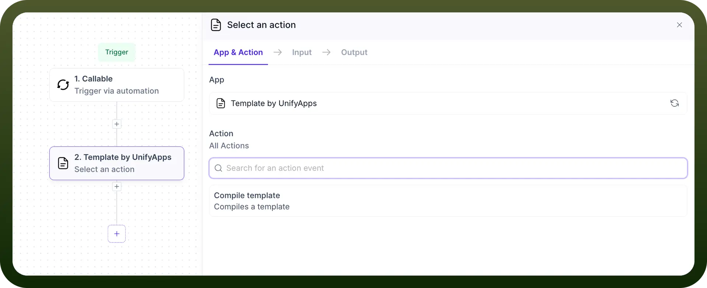
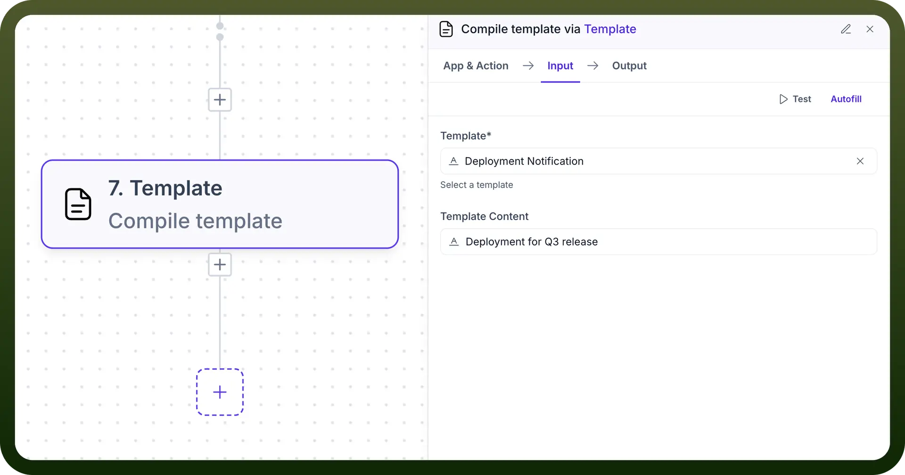

# Template by UnifyApps

Source: https://www.unifyapps.com/docs/unify-automations/template-by-unifyapps
Section: automations

---

## Overview

The "Template by UnifyApps" node is a powerful component in the automation workflow that allows you to compile templates for various notification purposes. This node enables you to select from existing templates or create new ones to integrate into your automation pipeline and compile them to use further.

## Key Features

- Compile templates for different types (Email, Prompt, WhatsApp, SMS)
- Select from existing templates or create custom templates
- Configure template variables and parameters
- Integrate as part of a larger automation workflow

## Actions

**Compile template**

**Purpose:** This action compiles a template with dynamic variables, generating the final content for various communication types (Email, Prompt, WhatsApp, SMS) based on the selected template. 

**Inputs:**

- `Template``*`: Select the specific template you wish to compile from available standard and custom templates.
- `Template Content`: It contains the content of the template you want to use. If used, it overrides the template input schema and existing content
- `Variables`: Define values for any variables included in the selected template.
- `Schema Properties`: Configure any additional parameters needed inside template *(Mandatory fields are marked with an asterisk *)*

**Outputs:**

- **Compiled Content**: The fully processed template with all variables replaced with actual values.
- **Status**: Success or failure status of the compilation process.
- **Error Messages**: Any validation or processing errors encountered during compilation.
