# Test your automation

Source: https://www.unifyapps.com/docs/unify-automations/test-your-automation
Section: automations

---

## Overview

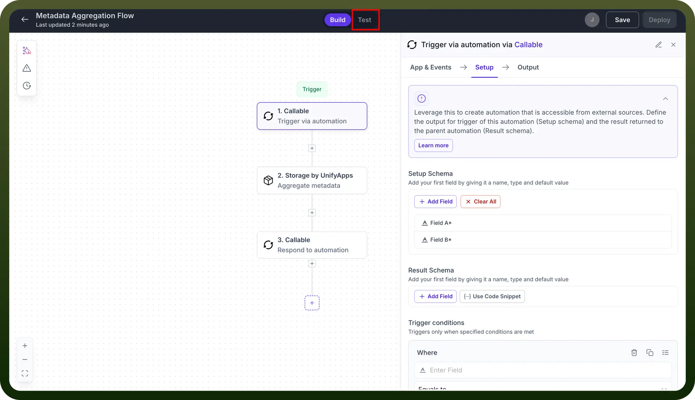

The **Test** feature enables users to execute their automation once to verify or test its functionality. During this process, the automation runs a single instance using a predefined hard-coded setup schema(if present). For example, an automation designed to fetch an object's metadata when tested will execute it and generate a result. The results from each test are stored for easy access and reference.

## How to test your automation?

1. After creating an automation, navigate to the `Test` section.

  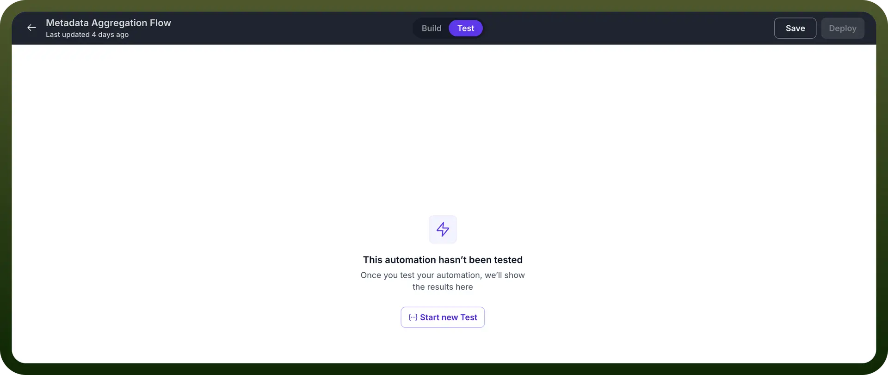

2. Click the `Start New Test` button

  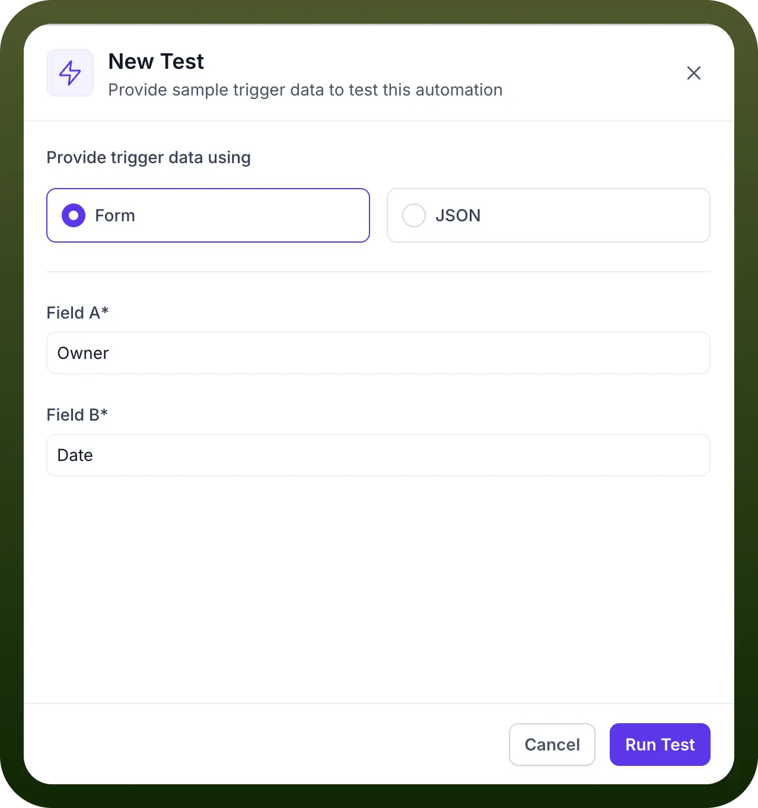

  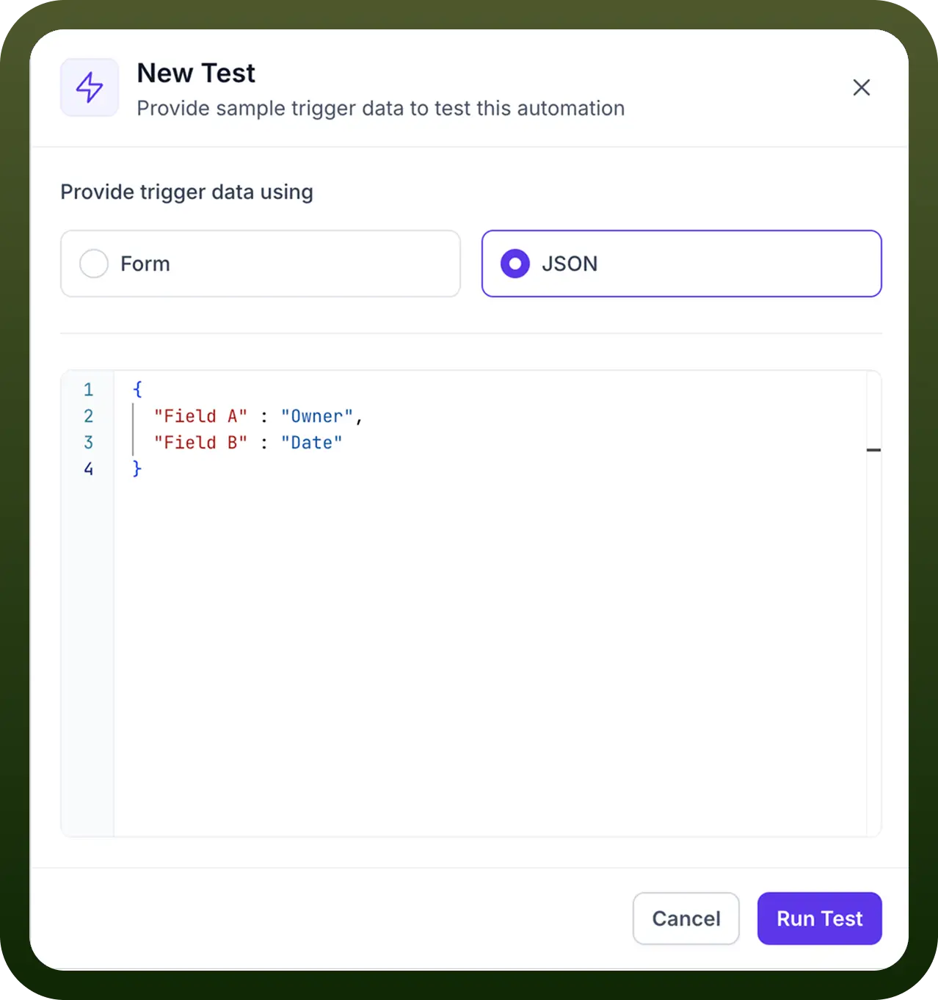

3. A dialog box will appear for entering the setup schema. You can choose one of the following options to input the data:
  - `Form`**:** Manually enter the data for the setup schema.
  - `JSON`**:** Provide the setup data in JSON format.
4. Click the `Run Test` button located at the bottom-right corner of the dialog box.

  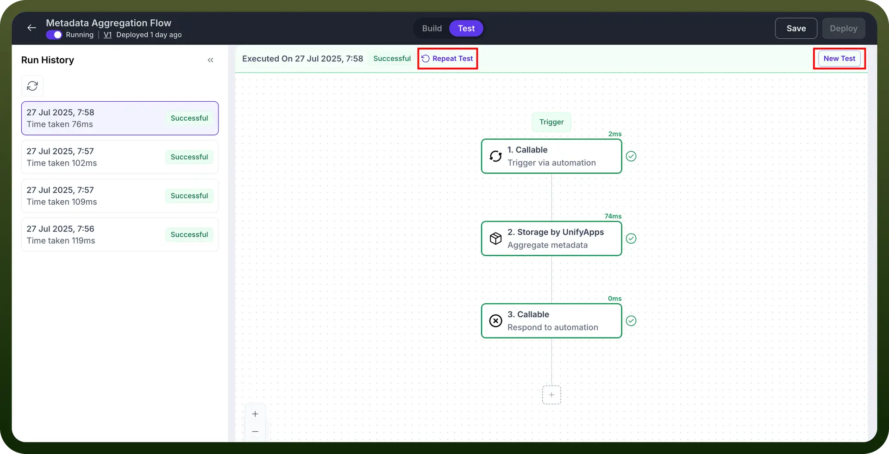

5. Click the `Repeat Test` button to retest your automation using the same setup data
6. Click the `New Test` button to retest your automation with different setup data.

→ If no setup schema is defined in the automation, the test will execute without it.

## The Test Page

1. **Run History** The Run History section is located on the left side of the test page, it displays:

  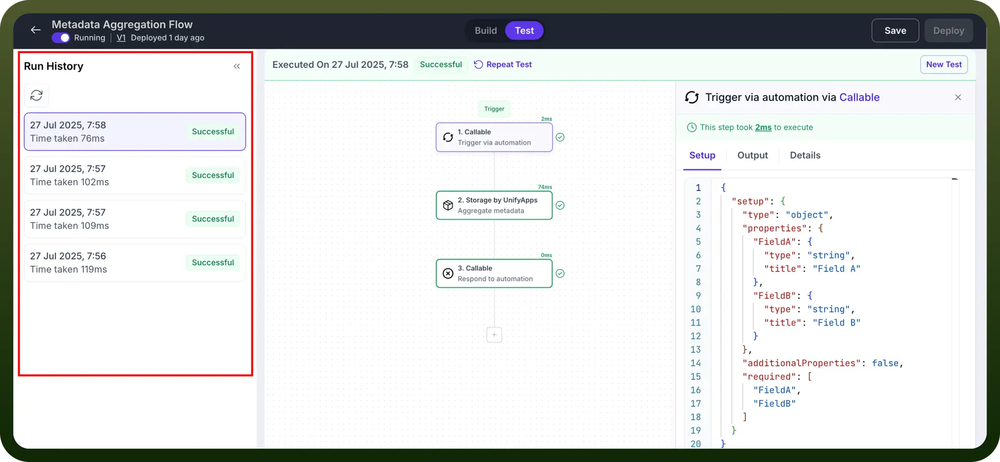

  - A list of all tests performed on the automation so far.
  - Details for each test, including the execution date and time, the duration of the test, and a status tag indicating whether the test was successful, failed, canceled, etc.
2. **The Automation** At the center of the page, the automation version for the selected test is displayed.

  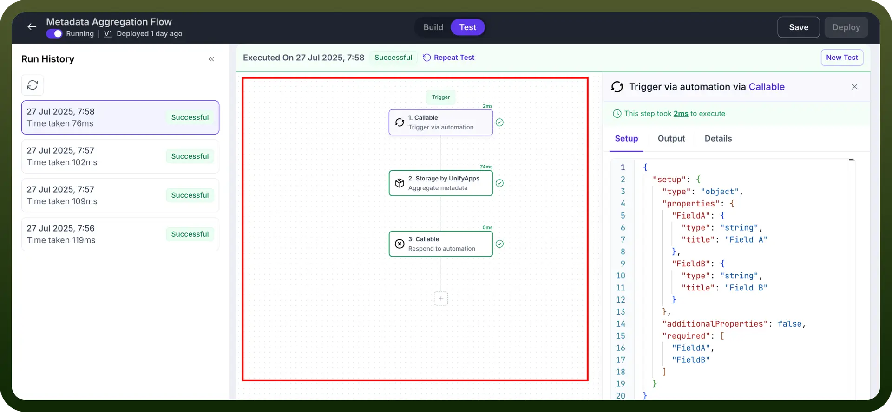

  - Each node includes the duration it took to execute during the test, shown at the top-right corner of the node.
  - The status of each node is also indicated:
    - A green outline means the test successfully passed through the node.
    - A red outline indicates an error with the node, with details about the error available in the Output tab.
3. **The Input, Output and Details** This section provides detailed information about the input, output, and details of the currently selected node.

  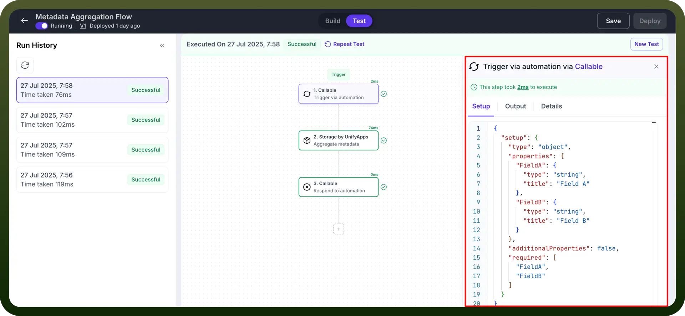

  - **Input Tab** Displays all the input data for the node, including their schemas, in JSON format.

    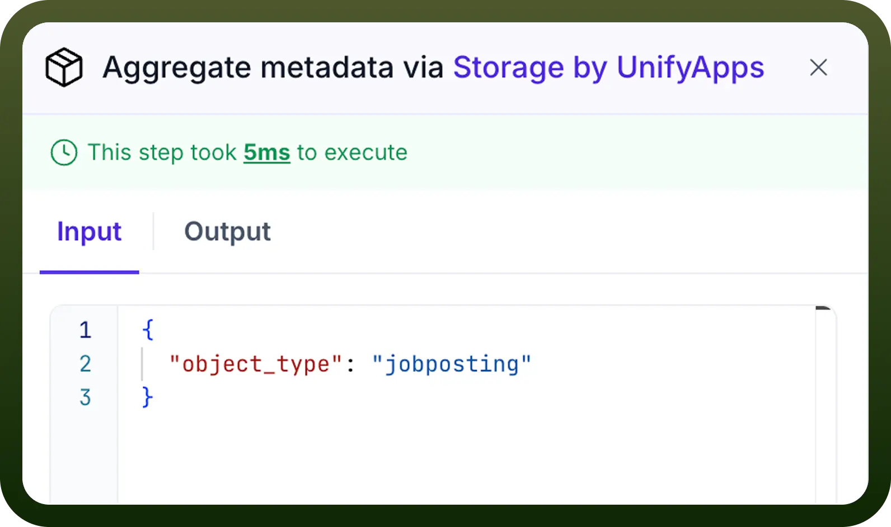

  - **Output Tab** Shows the expected output when the automation is tested.

    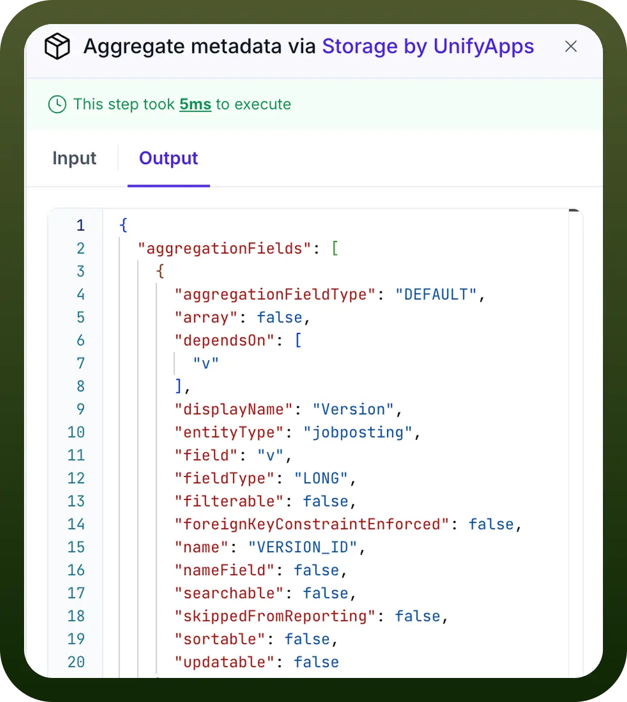

  - **Details Tab** Highlights the App and Action associated with the selected node.

    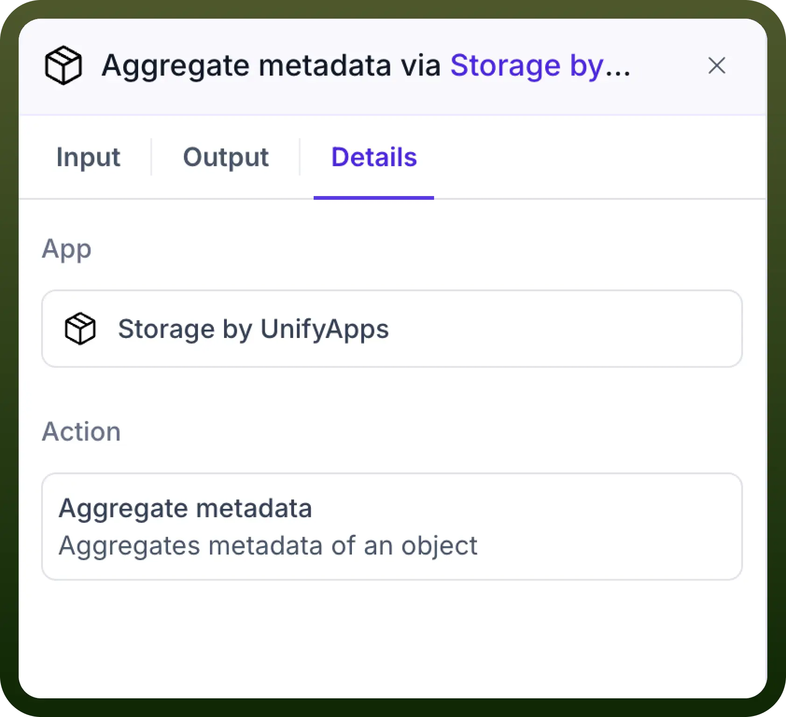

  - **Error Tab** If the automation fails at the node, this tab provides details about the error.

    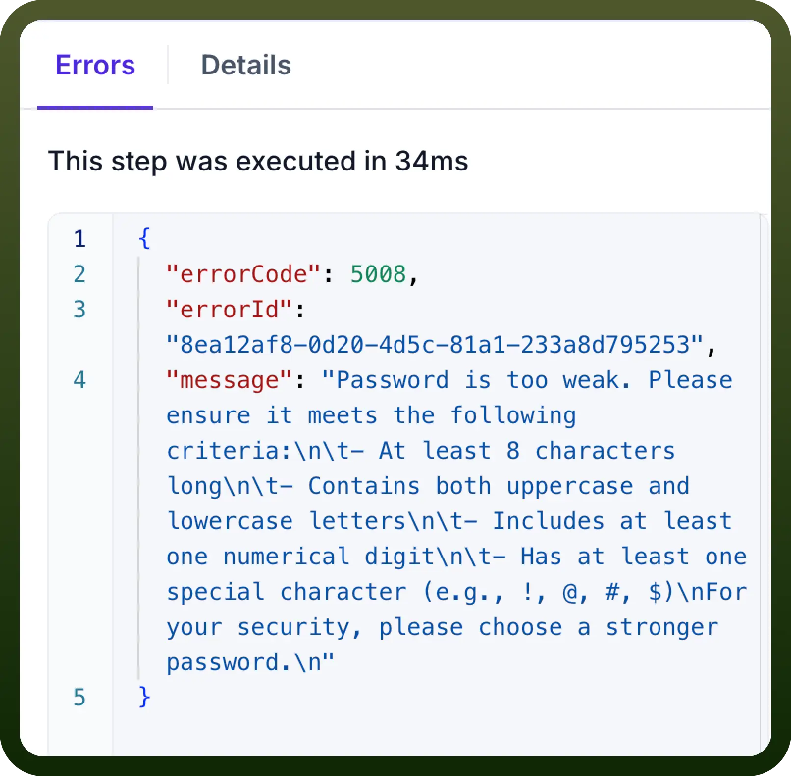
