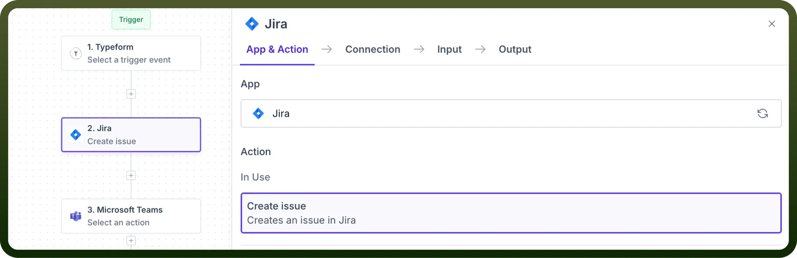

# Ticketing

Source: https://www.unifyapps.com/docs/unify-automations/ticketing
Section: automations

---

## Overview

Ticketing apps improve **project management** by integrating key processes such as task **tracking** and **issue resolution**.

Ticketing connectors in UnifyApps facilitate smooth connections between ticketing systems and other applications, automating complex project automations and enhancing collaboration.

## Use Case

To automate the bug tracking and resolution process, beginning from collecting user feedback, we can use ticketing connectors.

1. We **trigger** our automation whenever a new bug report is submitted through our form in Typeform.
2. We can automatically **create** a new issue in Jira with the details from the Typeform submission.
3. Finally, we can post a message in Microsoft Teams to notify the development team about the new Jira issue and its priority.
