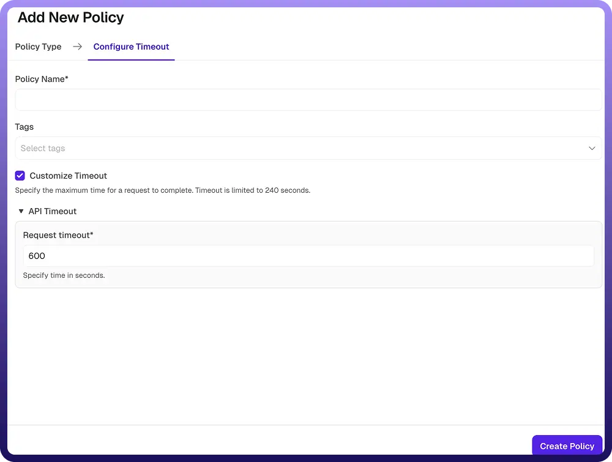

# Timeout Policy

Source: https://www.unifyapps.com/docs/unify-automations/timeout-policy
Section: automations

---

## Overview :

A Timeout Policy defines the maximum amount of time the gateway will wait for a backend service to respond to an API request. It helps prevent long-running or unresponsive requests from consuming system resources and degrading overall performance.

If a backend service does not respond within the configured timeout duration, the request is terminated, and an error response is returned to the client.

| **Field Reference** | **Description** |
|---|---|
| `Policy Name` | A unique identifier for the policy, used across logs, dashboards, and API group configurations. **Required** |
| `Tags` | Custom labels to organize and filter the policy by environment, team, or functionality. **Optional** |
| `Customize Timeout` | Enables or disables custom timeout configuration for the API requests. When enabled, the specified timeout value is enforced. **Required (Enabled when configuring timeout)** |
| `Request Timeout` | Specifies the maximum time the gateway will wait for a backend response before terminating the request. 
 The value is defined in seconds (e.g., maximum allowed limit may apply such as 240 seconds). **Required** |

### 

## How It Works :

1. `Request initiated`**:** The gateway forwards the incoming API request to the backend service.
2. `Timer starts`**:** A timer begins based on the configured request timeout value.
3. `Response received within time`**:** If the backend responds before the timeout expires, the response is returned to the client successfully.
4. `Timeout exceeded`**:** If the backend does not respond within the configured time, the request is terminated.
5. `Error returned`**:** An error response (e.g., timeout error) is sent back to the client indicating that the request took too long to complete.

### Attaching a Policy to an API Group :

Once a Timeout Policy is created, it can be attached to one or more API Groups. Multiple policies can be applied to an API Group, and their execution order can be configured by arranging them in the desired sequence.
