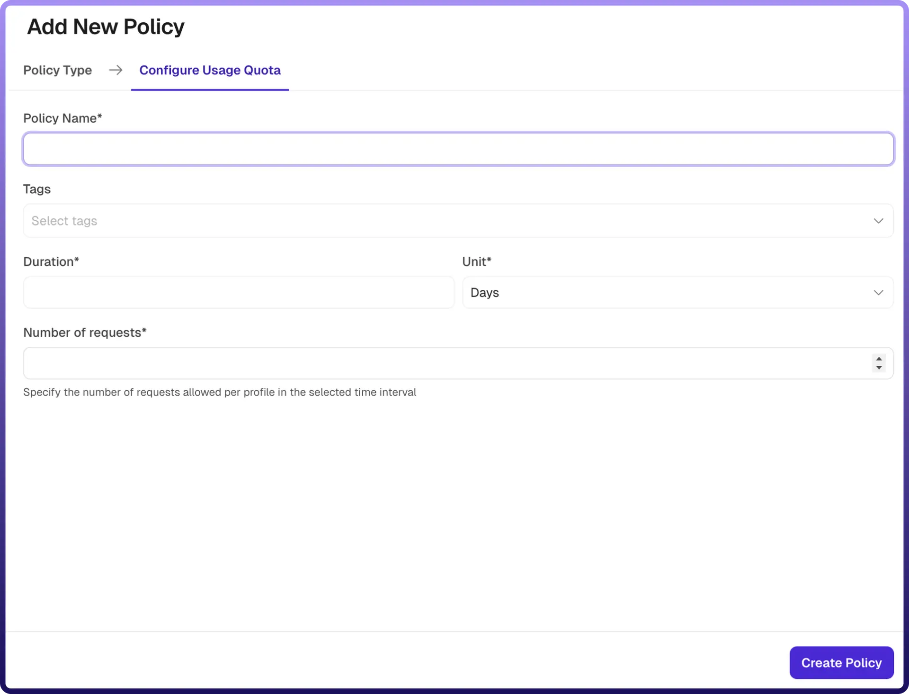

# Usage Quota Policy

Source: https://www.unifyapps.com/docs/unify-automations/usage-quota-policy
Section: automations

---

## Overview

A Usage Quota Policy limits the total number of API requests a client profile can make over a defined time period. It helps control overall API consumption, enforce fair usage, and prevent excessive or unintended usage over longer durations.

Unlike rate limiting (which controls traffic in short bursts), a usage quota enforces limits over extended periods such as days or months.

| **Field Reference** | **Description** |
|---|---|
| `Policy Name` | A unique identifier for the policy, used across logs, dashboards, and API group configurations. **Required** |
| `Tags` | Custom labels to organize and filter the policy by environment, team, or functionality. **Optional** |
| `Duration` | Specifies the length of time over which API usage is tracked. For example, a duration of 1 with unit Days defines a daily quota. **Required** |
| `Unit` | Defines the time unit for the duration (e.g., Minutes, Hours, Days, Months). **Required** |
| `Number of Requests` | Specifies the maximum number of API requests allowed per client profile within the defined duration. Once this limit is reached, further requests are denied until the quota resets. **Required** |

## How It Works

1. `Request arrives:` The gateway receives an incoming API request and identifies the client profile (e.g., API key, user ID, or IP).
2. `Quota check`**:** The system retrieves the number of requests already made by the client within the current quota period.
3. `Limit evaluation`**:**If the request count is below the configured quota, the request is allowed and the count is incremented , else the request count has reached or exceeded the quota, the request is rejected.
4. `Quota reset`**:** At the end of the configured duration, the usage counter resets, and the client can make requests again.
5. `Error response`**:** When the quota is exceeded, an error response is returned to inform the client that their usage limit has been reached.

## Attaching a Policy to an API Group

Once a Usage Quota Policy is created, it can be attached to one or more API Groups. Multiple policies can be applied to an API Group, and their execution order can be configured by arranging them in the desired sequence.
