# Utility by UnifyApps

Source: https://www.unifyapps.com/docs/unify-automations/utility-by-unifyapps
Section: automations

---

## Overview

Utility by UnifyApps is a powerful tool within the automations ecosystem. It provides a suite of essential file handling, data transformation, and utility operations designed to streamline automation workflows. These utilities serve as fundamental building blocks for creating sophisticated integration scenarios, enabling seamless data manipulation and file operations across different systems and formats.

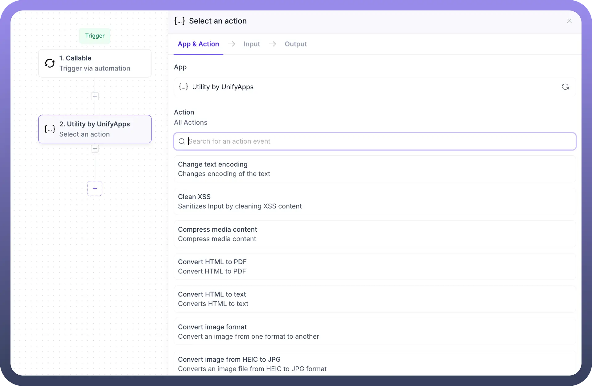

## Use Case Example

**Automated Document Processing Pipeline**

Consider a business scenario where incoming HTML email attachments need to be processed, converted, and stored in a standardized format:

1. Incoming email is processed using Parse Email to extract attachments
2. HTML content is converted to plain text using Convert HTML to Text
3. Text is transformed with Change Text Encoding to ensure consistency
4. Results are serialized to JSON using Serialize Object to JSON String
5. Final document is stored and shared via Generate Public File URL

This automated pipeline demonstrates how multiple Utility by UnifyApps actions can be chained together to create a robust document processing workflow.

## Actions in Utility by UnifyApps

1. **Create UnifyApps File from URL** The "`Create UnifyApps File from URL`" action enables you to import files directly from a specified URL into UnifyApps. This simplifies the process of file integration, allowing users to seamlessly bring external content into their workflows without manual downloads. **Common Usage:** File organization, temporary file management, batch processing

  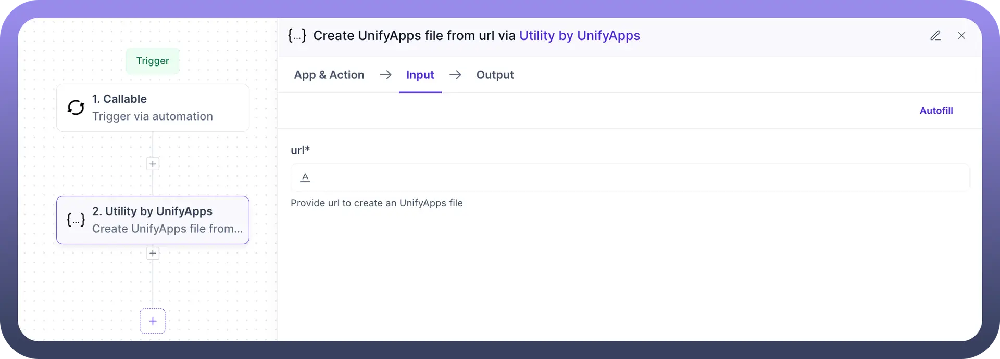

2. **Change Text Encoding** Use the "`Change Text Encoding`" action to modify the encoding of a given text string. This action supports various encoding formats, including Base64, UTF-8, UTF-16, and ASCII. It ensures that text is compatible with different systems and applications, allowing for effective data interchange and preventing encoding-related issues. **Common Usage**: International data processing, legacy system integration.

  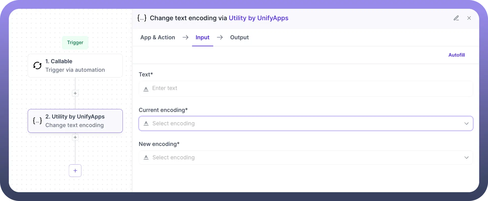

3. **Convert HTML to Text** The "`Convert HTML to Text`" action removes HTML tags, enabling you to extract plain text or markdown from HTML content. This is particularly useful for processing and displaying information without formatting, making it more accessible for applications that require unformatted or simplified content. **Common Usage**: Email processing, web scraping, content extraction

  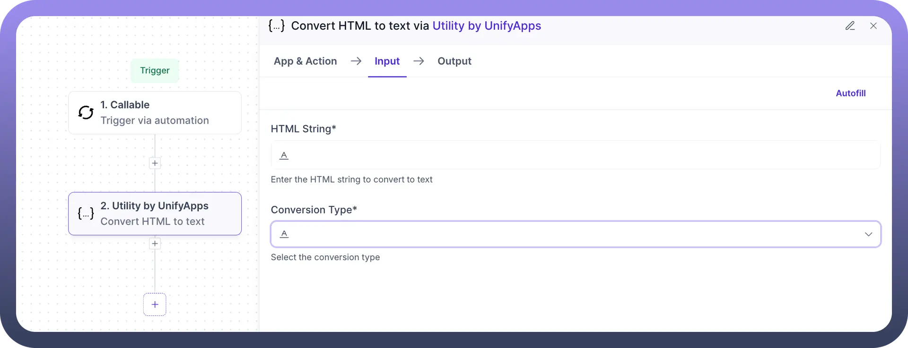

4. **Create UnifyApps Path for File** The "`Create UnifyApps Path for File`" action generates structured paths for already uploaded files within UnifyApps, enhancing file organization and accessibility across workflows, automations, and navigation. This action creates platform-compatible paths based on input parameters, validating directory structures and normalizing paths to ensure consistency. **Common Usage**: File organization, temporary file management, batch processing

  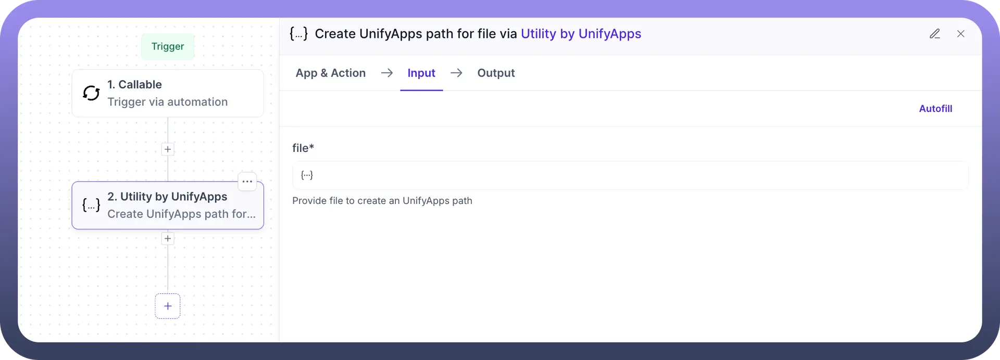

5. **Deserialise XML String to JSON Object** The "`Deserialise XML String to JSON Object`" action converts XML-formatted data into JSON objects, making it easier to work with XML within JSON-based environments and improving compatibility between data formats. This action preserves the original XML structure, managing complex XML schemas and supporting attributes and nested elements for detailed data mapping. **Common Usage**: API integration, data format conversion, legacy system modernization

  

6. **Deserialise String to JSON Object** The "`Deserialise String to JSON Object`" action converts JSON-formatted strings into JSON objects, enabling efficient data manipulation in JavaScript environments. It validates the JSON structure, handles nested objects and arrays, and includes error handling for malformed JSON, ensuring reliable data processing. **Common Usage**: API response processing, configuration management, data parsing

  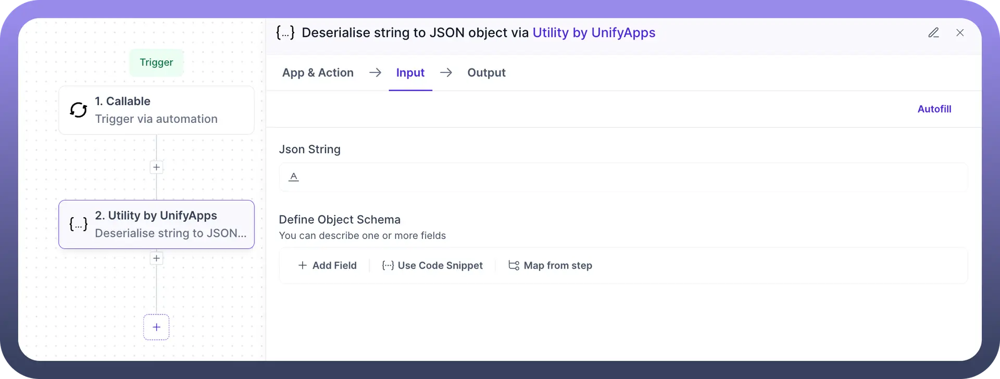

7. **Download File as String** The "`Download File as String`" action retrieves file content as a string, enabling in-memory processing of file data without needing disk storage. This action supports two encoding types: UTF-8 for standard text files and Base64 for binary data, allowing for flexible handling of different file formats. **Common Usage**: Reading configuration files, processing text documents, importing data

  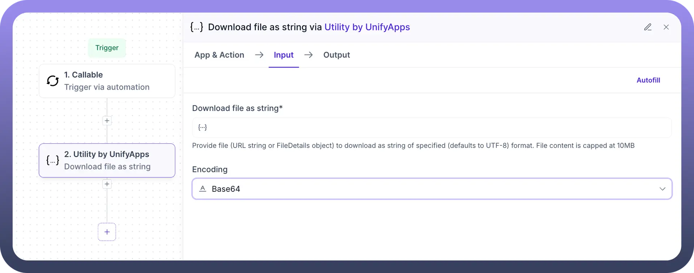

8. **Export Application Datasource** The "`Export Application Datasource`" action enables data extraction from a specified source for backups or transfers. The exported file can be downloaded in CSV, XLS, XLSX formats, with customizable field mappings. It also supports pagination options and lookup requests for additional data. **Common Usage**: Data management, backup processes, and data migration

  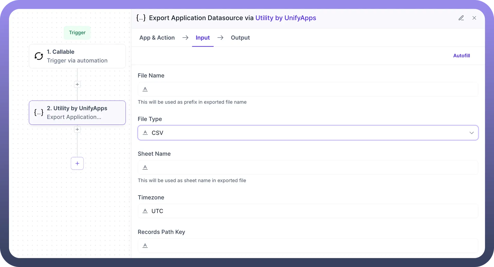

9. **Export UnifyApps Pages to PDF** The "`Export Pages to PDF`" action converts web pages or documents into PDF format, functioning as a PDF converter. Users can specify page URLs to include in the export, choose between A4 or letter formats, and select the layout as either landscape or portrait. **Common Usage**: Report generation, document archiving, print preparation

  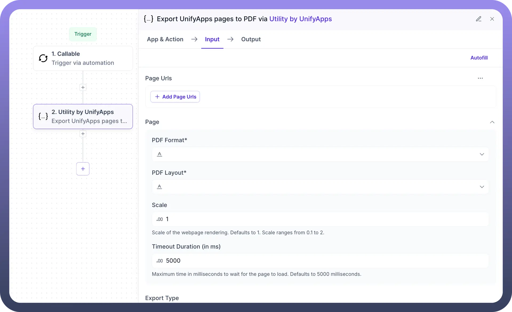

10. **Generate Public File URL** The "`Generate Public File URL`" action creates a short-term public link for secure, temporary file sharing. Users can specify the file or content for which to generate the public URL. Additionally, an expiry time can be set to define how long the public URL will remain valid (in hours). **Common Usage**: File sharing, public downloads, external system integration

  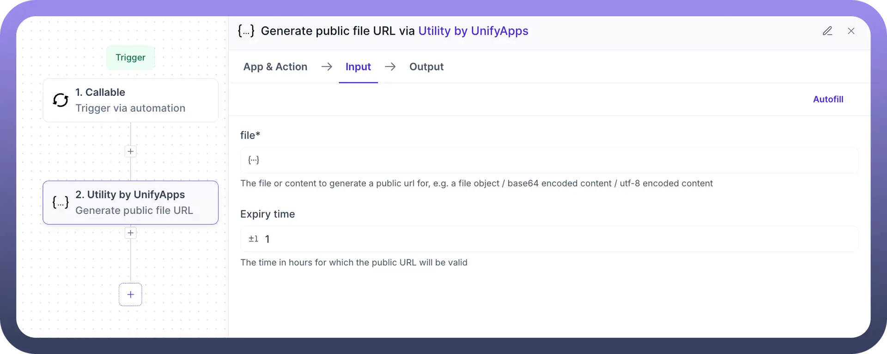

11. **Parse Email** The "Parse Email" action extracts MIME content from emails and produces a structured email object. This enables easy access to key attributes such as the sender, subject, and body of the email, facilitating efficient email processing and management. **Common Usage**: Email automation, attachment processing, communication workflows

  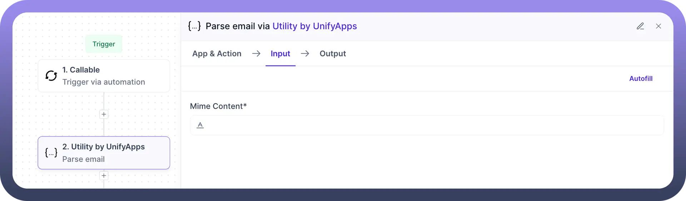

12. **Sequence Generator** The "`Sequence Generator`" action creates an ordered series of values, ideal for generating unique identifiers or sequences. It includes features such as pretty printing options, circular reference handling, and custom serialization rules, ensuring flexibility and efficiency in managing sequences. **Common Usage**: Invoice numbering, batch processing, unique identifier generation

  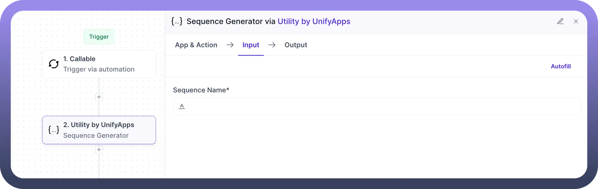

13. **Serialise Object to JSON String** The "`Serialise Object to JSON String`" action converts an object into a JSON string, making it suitable for lightweight data transmission or storage. This process enables compatibility with various data formats, such as XML and CSV, allowing for easy integration. **Common Usage**: API request preparation, data storage, configuration export

  

14. **Clean XSS** The "`Clean XSS`" action sanitizes input text by removing potentially harmful scripts and content, protecting against Cross-Site Scripting (XSS) attacks. This ensures that user inputs or external data are cleaned and safe to be processed, stored, or displayed in applications. **Common Usage**: Web form validation, secure content rendering, input sanitization

  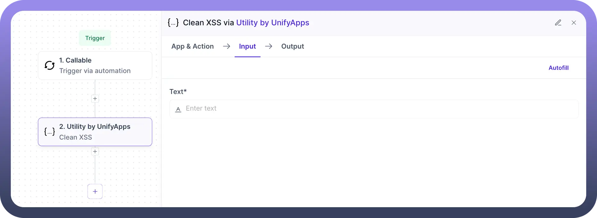

15. **Compress media content** The "`Compress Media Content`" action reduces the size of media files such as images or videos without significantly compromising quality. It helps optimize file storage, improve upload/download speeds, and enhance overall application performance. **Common Usage**: Media optimization, faster file transfers, storage management

  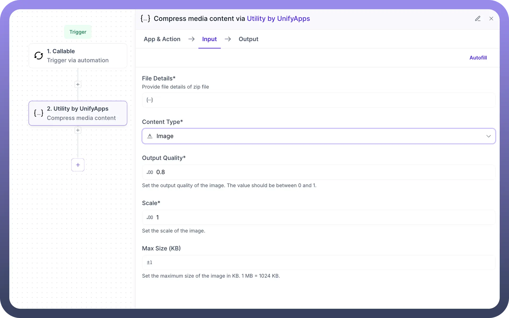

16. **Convert HTML to PDF** The "`Convert HTML to PDF`" action transforms HTML content into a PDF document, preserving the structure, formatting, and styling of the original HTML. This enables easy sharing, printing, and archiving of web-based content in a standardized format. **Common Usage**: Report generation, invoice creation, archiving web content

  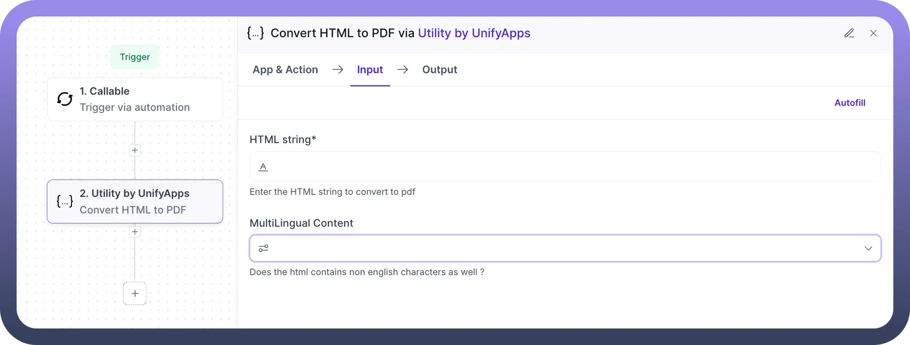

17. **Convert image format** The "`Convert Image Format`" action converts an image from one file format to another, such as from PNG to JPG, or BMP to PNG. This enables compatibility across different platforms, reduces file sizes, and supports diverse application needs. **Common Usage**: Image optimization, format standardization, cross-platform compatibility

  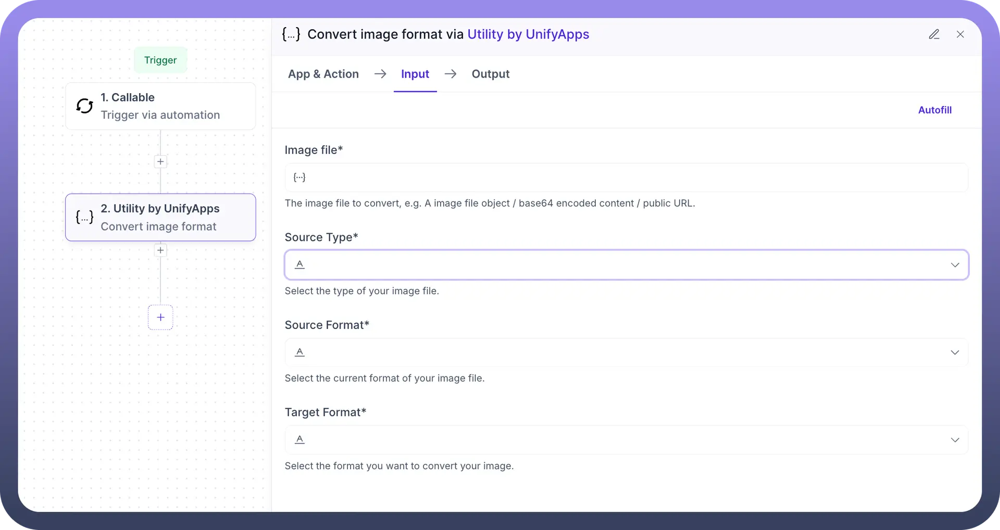

18. **Convert image from HEIC to JPG** The "`Convert Image from HEIC to JPG`" action transforms an image file from the HEIC format (commonly used by iOS devices) into the widely supported JPG format. This ensures broader compatibility and easier sharing or processing across various platforms and applications. **Common Usage**: iOS image compatibility, file format conversion, media processing

  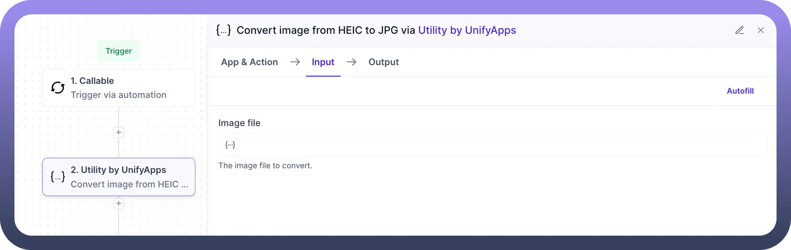

19. **Convert to PDF** The "`Convert to PDF`" action converts various file types (such as documents, images, or text files) into PDF format, maintaining the structure and readability of the original content. It standardizes files for easier sharing, printing, and archiving. **Common Usage**: Document conversion, standardized file sharing, report generation

  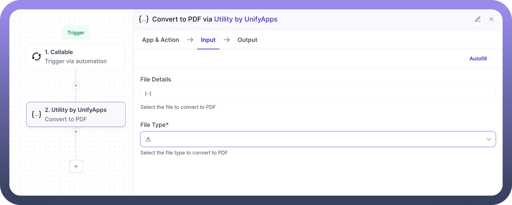

20. **Date Difference Calculator** The "`Date Difference Calculator`" action computes the difference between two dates in specified units such as days, months, hours, or minutes. It is useful for calculating durations, aging, deadlines, or time-based conditions within workflows. **Common Usage**: Duration calculation, SLA tracking, timeline management

  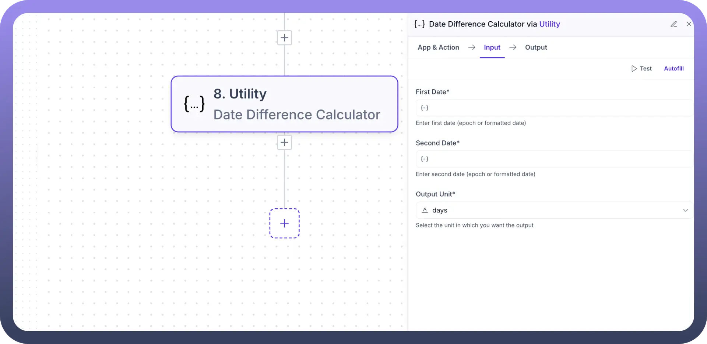

21. **Date to Epoch** The "`Date to Epoch`" action converts a given date and time into an epoch timestamp, representing the number of seconds or milliseconds that have elapsed since January 1, 1970 (UTC). This is essential for time-based calculations and system integrations. **Common Usage**: Time-based operations, API integrations, event tracking

  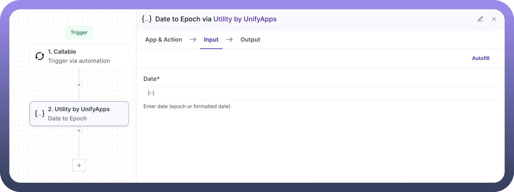

22. **Delete UnifyApps file** The "`Delete UnifyApps File`" action permanently removes a specified file from UnifyApps storage. This helps in maintaining storage hygiene, removing obsolete files, and managing storage quotas effectively within workflows. **Common Usage**: File cleanup, storage management, automated file deletion

  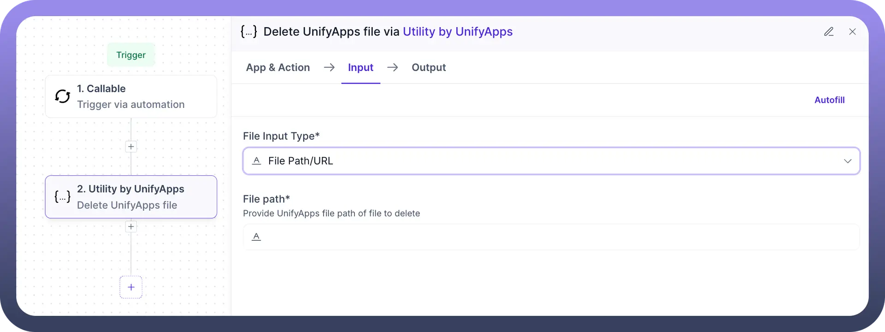

23. **Download multiple files from list of URLs** The "`Download Multiple Files from List of URLs`" action downloads files from a provided list of URLs and makes them available as UnifyApps file objects. This simplifies batch downloading and organizing external resources within your workflows. **Common Usage**: Bulk file downloads, content aggregation, external file collection

  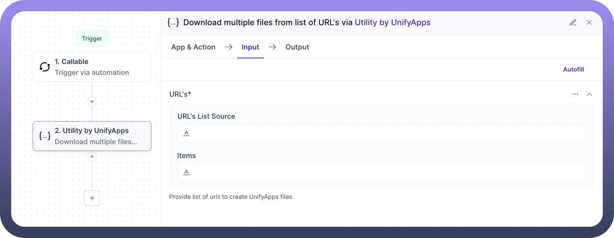

24. **Encrypt data** The "`Encrypt Data`" action secures textual or binary data using various encryption algorithms. It ensures that sensitive information is protected during storage or transmission, maintaining confidentiality and security across systems. **Common Usage**: Secure data transmission, sensitive information protection, encryption before storage

  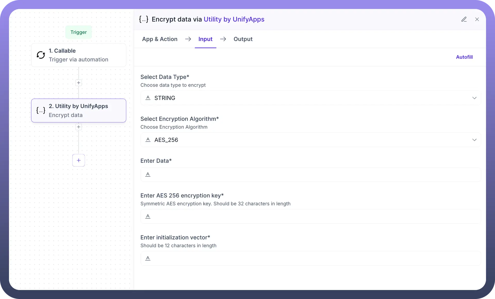

25. **Extract thumbnail from PDF** The "`Extract Thumbnail from PDF`" action generates a thumbnail image from the first page of a PDF document. This is useful for previewing documents, creating visual summaries, or enhancing document management interfaces. **Common Usage**: Document previews, content management, visual indexing

  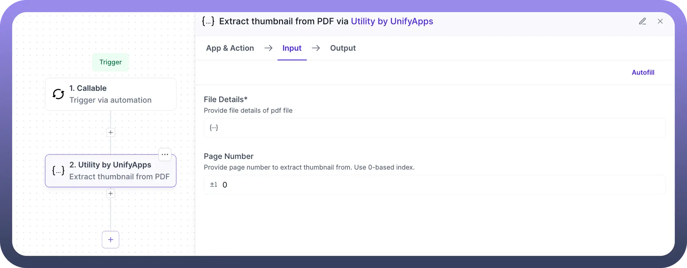

26. **Filter List of Data** The "`Filter List of Data`" action allows you to apply conditions on a list of items and retrieve only those records that match specific criteria. You can define multiple filter conditions and groups to create complex filtering logic, helping streamline data processing within workflows. **Common Usage**: Data extraction, list refinement, conditional data processing

  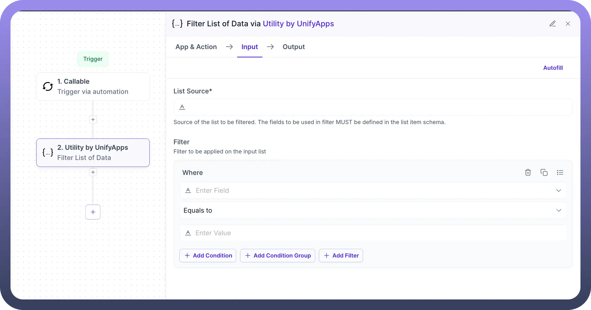

27. **Generate Canonical XML** The "`Generate Canonical XML`" action transforms XML or an object into its canonical (standardized) XML form. It ensures that XML documents are consistently formatted, which is crucial for reliable comparisons, digital signatures, and secure communications. **Common Usage**: XML normalization, digital signing, secure data exchange

  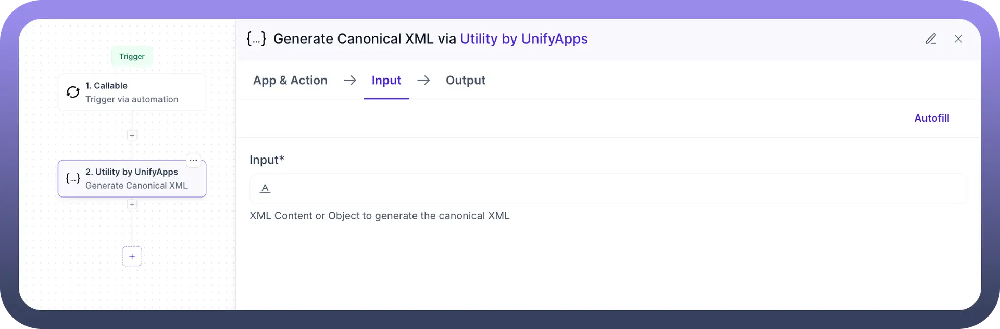

28. **Get Object Field** The "`Get Object Field`" action retrieves the value of a specific field from an object. It simplifies extracting targeted information from complex data structures, making it easier to use selected data points in downstream workflow steps. **Common Usage**: Data extraction, dynamic field access, object manipulation

  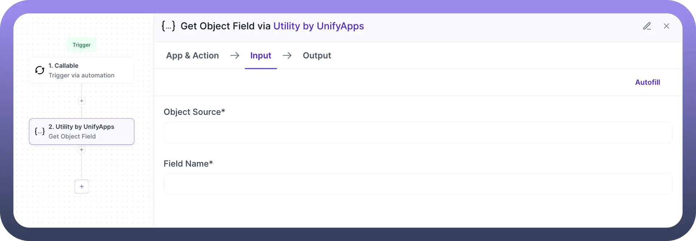

29. **Perform hashing** The "`Perform Hashing`" action generates a hash value from input data using various hashing algorithms like MD5, SHA-2, CRC-32 or you can add custom algorithms too. It is useful for creating data fingerprints, verifying data integrity, and securing sensitive information. **Common Usage**: Data integrity verification, password hashing, checksum generation

  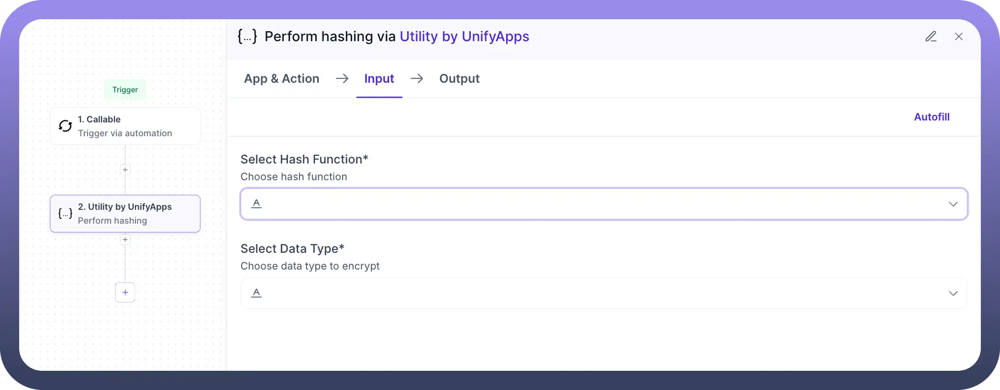

30. **Resolve Output Value** The "`Resolve Output Value`" action evaluates and resolves dynamic or formula-based input values into final output values. It is useful when handling templated or reference-based data that needs to be computed or expanded during workflow execution. **Common Usage**: Dynamic data resolution, formula evaluation, template parsing

  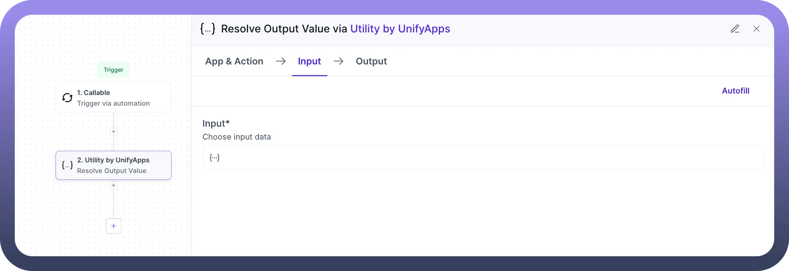

31. **Run SQL query on file** The "`Run SQL Query on File`" action executes SQL queries directly on structured file formats like CSV, Excel, or JSON files. It enables powerful data extraction, transformation, and analysis without needing a database. **Common Usage**: Ad-hoc reporting, data filtering, file-based data analysis

  

32. **Run SQL query on list** The "`Run SQL Query on List`" action allows you to execute SQL queries on a list of data directly within a workflow. You can filter, join, group, and transform data using familiar SQL syntax, without the need for an external database. **Common Usage**: In-memory data querying, advanced data filtering, list transformation

  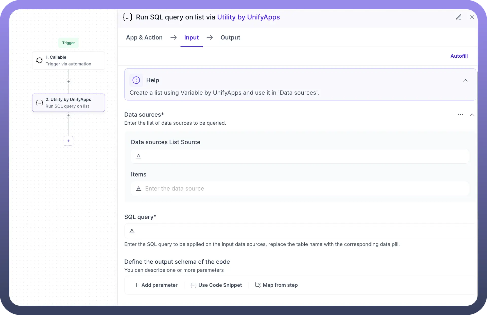

33. **Set Object Field** The "`Set Object Field`" action updates or adds a value to a specific field within an object. It allows dynamic modification of objects during a workflow, enabling flexible data transformations and enrichment. **Common Usage**: Dynamic object modification, data enrichment, workflow data manipulation

  

34. **Template Resolver** The "`Template Resolver`" action resolves nested paths (e.g., a.b.c) from a provided context object. It extracts deeply nested values based on template keys, allowing flexible access to structured data in complex objects. **Common Usage**: Nested data extraction, template resolution, dynamic field referencing

  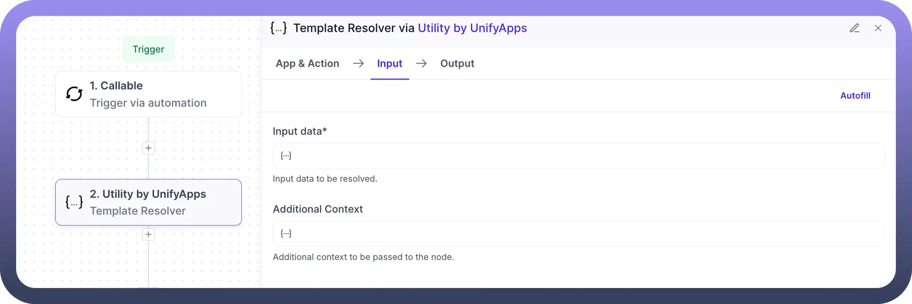

35. **Transform Java code to graph** The "`Transform Java Code to Graph`" action analyzes a Java source file and converts it into a graph representation. This helps visualize code structure, relationships between classes or methods, and dependencies, aiding in better understanding and documentation of codebases. **Common Usage**: Code analysis, architecture visualization, dependency mapping

  

36. **Translate text** The "`Translate Text`" action translates input text from one language to another using built-in language translation capabilities. It supports multiple languages and is ideal for creating multilingual workflows and content. **Common Usage**: Multilingual support, content localization, automated language translation

  

37. **Unzip file** The "`Unzip File`" action extracts the contents of a ZIP archive into individual files, making them accessible for use in subsequent steps of your workflow. It supports handling nested directories and multiple file types within the archive. **Common Usage**: File extraction, bulk file processing, document unpacking

  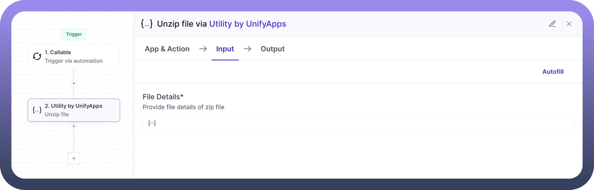

38. **Upload Base64 Content** The "`Upload Base64 Content`" action converts Base64-encoded content into a file and uploads it to UnifyApps. This enables seamless integration of encoded data received from APIs or other sources into file-based workflows. **Common Usage**: API response handling, encoded file uploads, Base64 to file conversion

  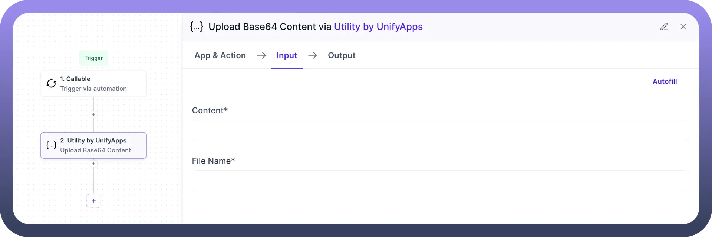

39. **Zip list of files** The "`Zip List of Files`" action compresses multiple files into a single ZIP archive. It simplifies file sharing, storage, and transfer by bundling related files together in a compact format. **Common Usage**: File bundling, storage optimization, batch download packaging

  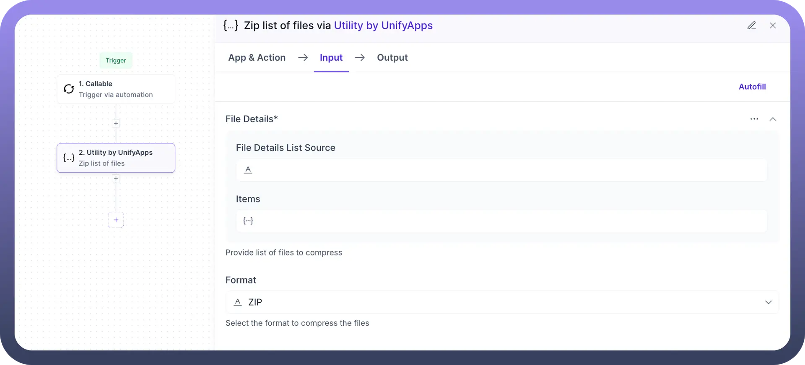

## Best Practices

The Utility node by UnifyApps offers a comprehensive suite of actions for efficient data handling and file management, streamlining workflows and enhancing integration. To optimize these capabilities, consider the following best practices:

- Validate input data before processing
- Handle encoding issues preemptively
- Implement proper error handling for each action
- Monitor performance implications, specially for large files
- Use appropriate content type headers for files
- Establish retry logic for network-dependent operations
- Regularly monitor and log utility operations

The actions in this node are atomic and reusable, allowing users to flexibly combine them into complex workflows.It is important to implement error handling at both action and workflow levels. Additionally, while connecting multiple actions, consider rate limits and resource constraints.
