# Variable by UnifyApps

Source: https://www.unifyapps.com/docs/unify-automations/variable-by-unifyapps
Section: automations

---

## Overview

‘Variable by UnifyApps’ enables users to **create runtime variables** within an automation to **store** and **reuse data** in further nodes. 

The lifetime of a variable is for the duration of a single run (execution scope) and this value can be dynamically updated for each run.

Users can create variables of different data types , such as :

- String
- Integer
- Number
- Boolean
- Object
- Array

## Actions Supported

You can perform following action through Variable by UnifyApps:

| **Action** | **Description** |
|---|---|
| `Create Variables` | Create typed variables. |
| `Create List` | Create list and specify schema for list Items. |
| `Update Variables` | Update value of the variables. |
| `Add Item to List` | Appends a new item to an existing list. |
| `Add Items to List` | Appends multiple items to an existing list. |
| `Find and update variables with names` | Update the values of variable matching the provided name. |
| `Remove all items from list` | Removes all entries in an existing list. |

## Use Cases

Let’s take an example on how you can bucketize all the high tickets present in [Zendesk](/docs/unify-automations/variable-by-unifyapps) based on the priority of the ticket and  then use [Slack](/docs/unify-automations/slack) to notify about both high and low priority tickets.

1. Create a variable list “`ticketStatus`” where you'll store the ticket id based on the priority of the ticket.

  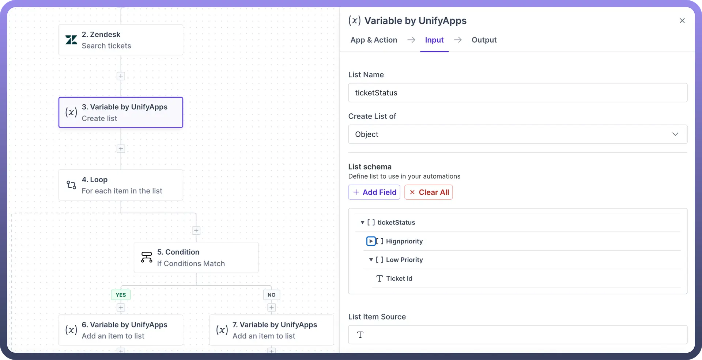

2. Run “`For each item in the list`” action in Loop, to check the priority of each ticket and identify those marked as "`High`" priority.
3. Add an item to the “`ticketStatus`” List with Ticket ID wherever it find the priority of ticket market ”`High`”.

  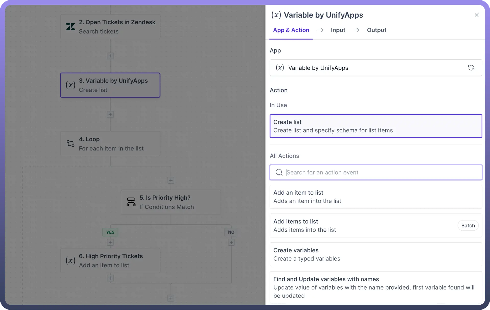

  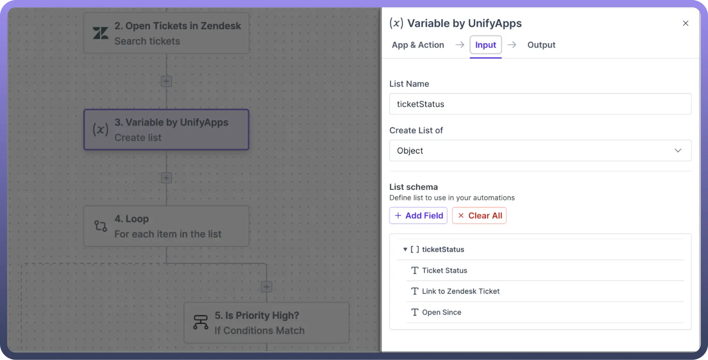

  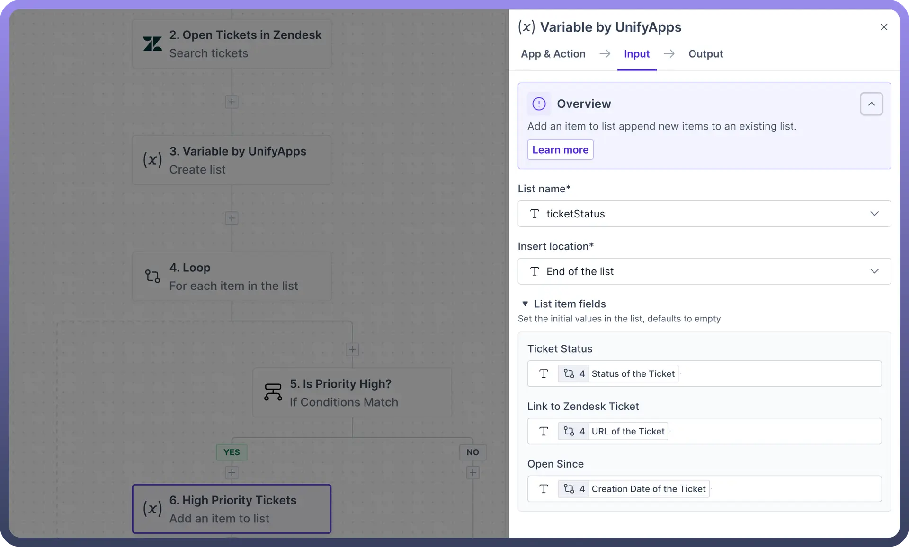

## Create variables

This action helps users create variables to transiently **store** and **re-use** information within an automation run.

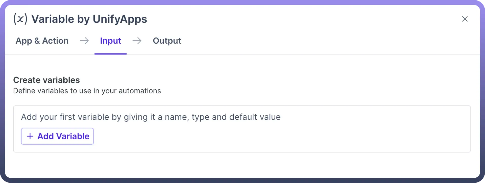

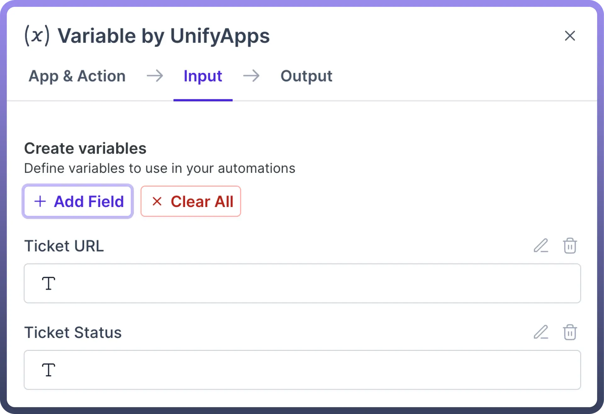

- **Add field** : Multiple variables can be created in this step by clicking on the "`Add Field`" button.
- **Clear All** : You can delete the variable by clicking on the Bin icon or click on the “`Clear All`” button if you want to delete all the existing variables.

  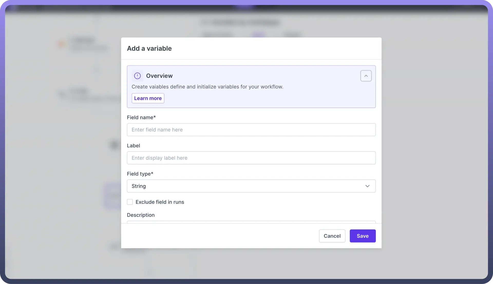

| **Input Fields** | **Description** |
|---|---|
| `Field Name` | Unique ID associated to the variable. |
| `Label` | The name of the variable. |
| `Field Type` | The data type of the variable. |
| `Exclude field in runs` | Ensures sensitive information is omitted in runs. |
| `Description` | A brief description of the variable. |

## Create List

This action helps users create a list. Lists can be useful to **store multiple data points** in a certain format.

List schema should be defined in this node to ensure that we can map data according to subsequent nodes such as add an item to list , add items to list(batch).

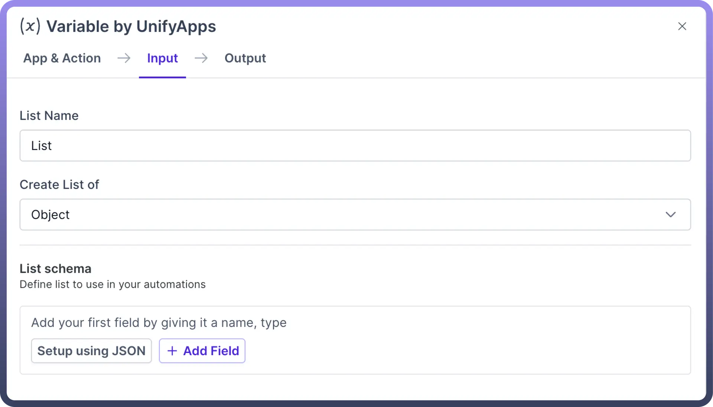

| **Input Field** | **Description** |
|---|---|
| `List Name` | The name of the list. |
| `Create List of` | Data type of the list such as Object, String, Integer, Number, Boolean. |
| `List Schema` | Define the structure and data types for elements within an array. |
| `Setup using JSON` | Define the structure of the list by proving the JSON schema. |

## List Schema

The schema for list items will appear as a data pill in the output data tree, ready for consumption to later steps in the automation.

To introduce a new field, simply utilize the "`Add field`" or “`Setup using JSON`” Option.

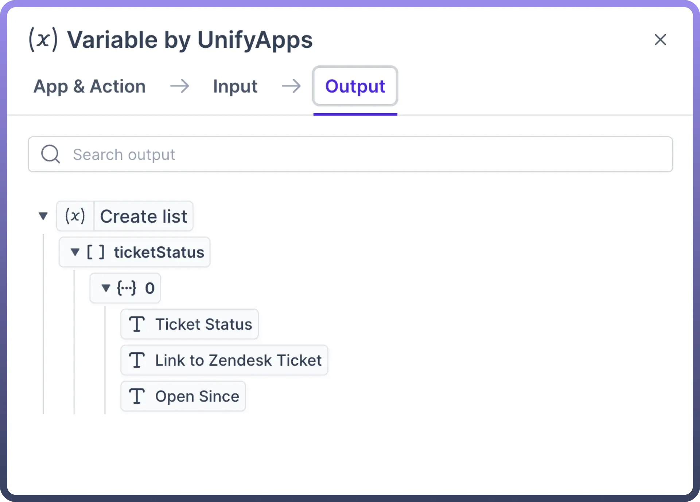

## Setup using JSON

This action is useful if users have a predefined JSON Schema for the list they intend to create, selecting "`Setup using JSON`" enables you to enter the JSON schema directly, thereby generating the list's structure based on it. 

Ensure that you are adding the schema expected **within the list** (for the Object, String, Integer) as this schema is appended within the List.

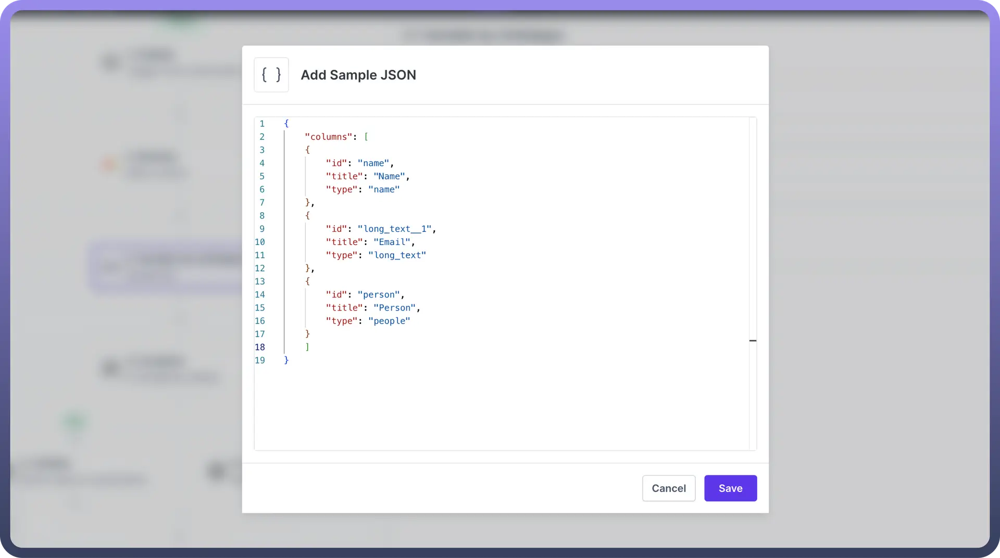

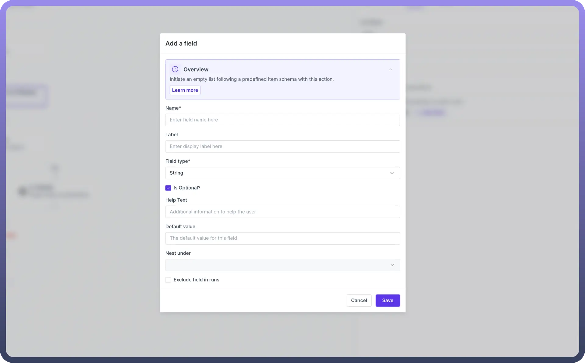

| **Input Fields** | **Description** |
|---|---|
| `Field Name` | Unique ID associated to the variable. |
| `Label` | The name of the variable. |
| `Field Type` | The data type of the variable. |
| `Is Optional` | Select if this field is not mandatory. |
| `Help text` | A description of the field. |
| `Default value` | Value of the field when no other input is provided. |
| `Nest under` | Hierarchy of the fields present in the list. |
| `Exclude field in runs` | Ensures sensitive information is omitted in runs. |

## Update Variables

This action updates existing variables , but it's important to note that only variables initially created with the '`Create variable`' action can be updated. **Without prior creation, this action remains unusable.**

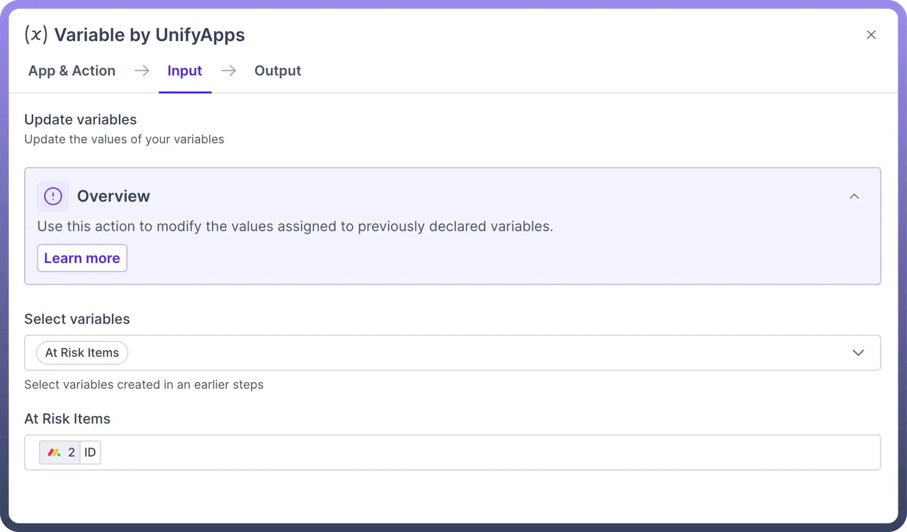

| **Input Fields** | **Description** |
|---|---|
| `Select variable` | Select the variable(s) to update. |
| <`variable`> | The new value of the variable. |

> **Note:** This action does **not** generate a datapill. To use this variable in another action, use the variable datapill from the Create variables node.

## Add Item to List

This action helps users insert a **new record** into an already existing list . This action can be used only if a list is already defined in the automation before the node. Users can select the list and map the list schema to create a new item within the list.

| **Input Fields** | **Description** |
|---|---|
| `List name` | Select the name of the list to add your new entry. |
| `Insert location` | Select the location of the new entry. |
| `List item fields` | Define the values of the new entry. |

> **Note:** This action does **not** generate a datapill. To use this variable in another action, use the variable datapill in the Create List step.

## Add Items to List

This action helps users **add multiple records** to an existing list simultaneously. Users can define the list source and map the datapills based on which the records should be created within the list.

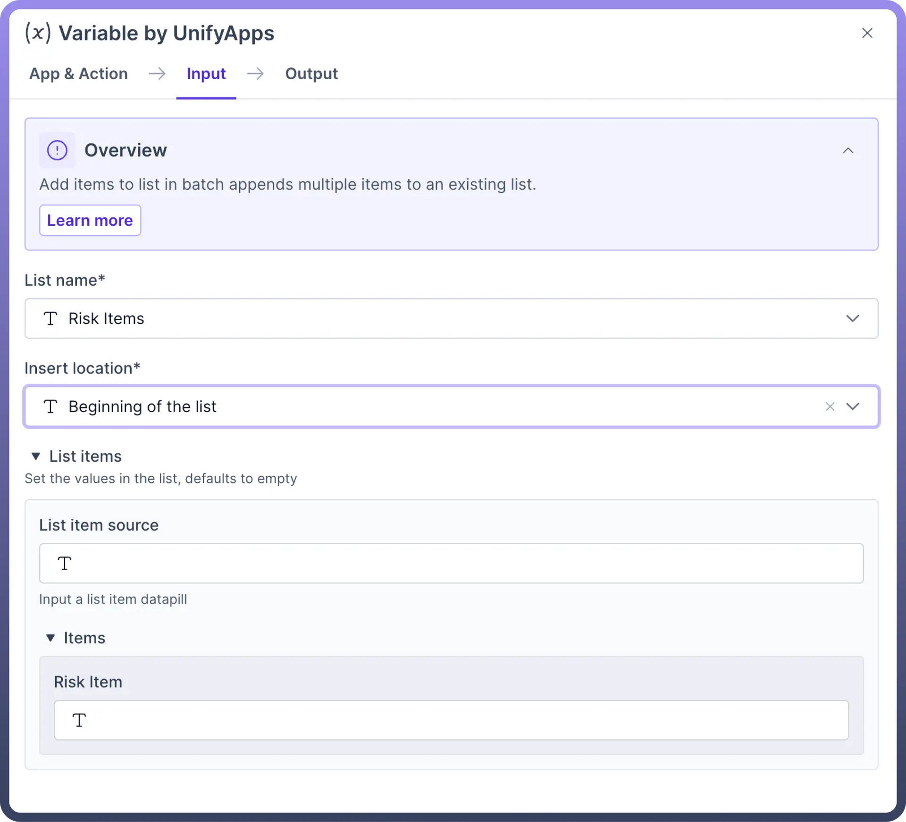

| **Input Fields** | **Description** |
|---|---|
| `List name` | Select the list to add your new entry. |
| `Insert location` | Select the location of the new entry. |
| `List item source` | The source array from which data will be mapped. |
| `List item fields` | Define the values of the new entry. |

> **Note:** This action does **not** generate a datapill. To use this variable in another action, use the variable datapill in the Create List step.

## Find and update variables

This action **updates** the value of variables with the name provided. The first variable found will be updated with the new value.

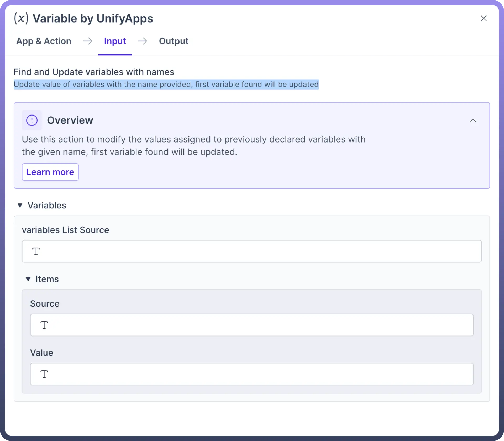

| **Input Fields** | **Description** |
|---|---|
| `Variable List source` | Select the list to add your new entry. |
| `Item source` | Select the location of the new entry. |
| `Item value` | The source array from which data will be mapped. |

> **Note:** This action does **not** generate a datapill. To use this variable in another action, use the variable datapill in the Create variable step.

## Remove all items from list

This action **removes** all items in an existing list. This action should be used after the Create list.

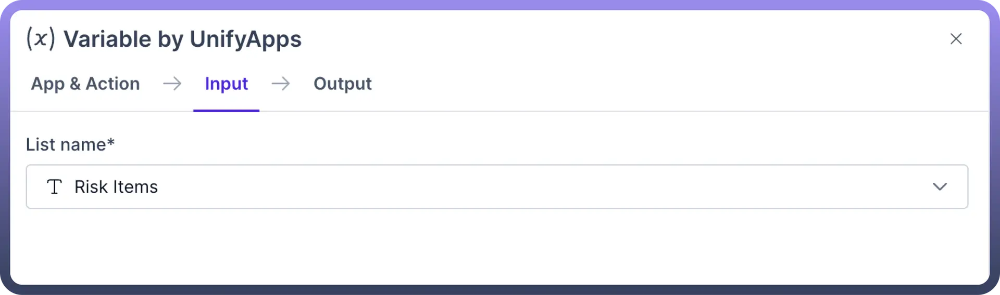

| **Input Fields** | **Description** |
|---|---|
| `List Name` | Name of the list to clear items from. |
