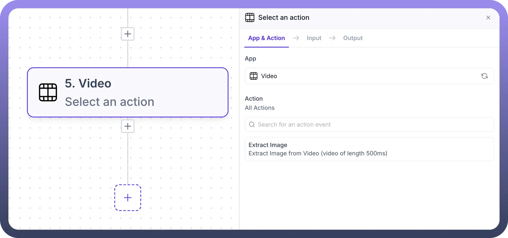
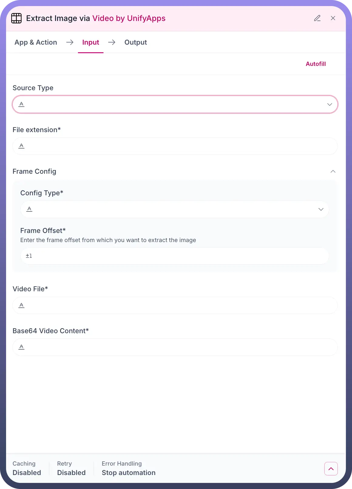

# Video By UnifyApps

Source: https://www.unifyapps.com/docs/unify-automations/video-by-unifyapps
Section: automations

---

## Overview

Video by UnifyApps enables comprehensive video processing and manipulation within your automation workflows. This powerful integration allows you to extract frames from videos, process video content, and manipulate video files for various business applications. The system supports multiple video formats and provides precise frame-level control, making it perfect for content analysis, thumbnail generation, quality control, and media processing tasks.

## Use Cases

**Automated Content Moderation:**

A social media platform processes thousands of uploaded videos by extracting key frames at specific intervals. Using Video by UnifyApps, they extract representative images from each video, analyze them with AI vision models for inappropriate content, and automatically flag videos that require human review. This streamlines content moderation and ensures platform safety standards.

**Product Catalog Generation:**

An e-commerce company automates product image creation from demonstration videos. The system extracts frames at optimal moments showing products clearly, processes them for consistent formatting, and automatically generates product thumbnails and catalog images. This reduces manual work and maintains visual consistency across their product listings.

**Video Quality Assurance:**

A media production company implements automated quality checks by extracting frames from rendered videos at regular intervals. The extracted images are analyzed for color accuracy, resolution quality, and visual artifacts. Any issues detected trigger alerts to the production team, ensuring high-quality output before final delivery.

## Extract Image from Video

The Extract Image action in Video by UnifyApps enables precise extraction of still frames from video files. This action provides frame-level control for capturing specific moments within videos, supporting various video formats and offering flexible configuration options for different extraction scenarios.

**Input Fields:**

1. `Source Type`**:** Specify the method for providing the video content.
  - **Type:** Dropdown selection
  - **Options:**
    - **File Upload:** Direct video file upload
    - **URL:** Video file accessible via web URL
    - **Data Reference:** Video from previous workflow steps
    - **Base64:** Encoded video content
2. `File Extension`**:** Define the format of the source video file.
  - **Type:** String
  - **Required:** Yes
  - **Common Values:** mp4, avi, mov, mkv, webm, flv
  - **Purpose:** Ensures proper video format handling and processing

**Frame Configuration:**

1. `Configuration Type`**:** Select the method for frame extraction timing.
  - **Type:** Dropdown selection
  - **Required:** Yes
  - **Options:**
    - **Time-based:** Extract frame at specific timestamp
    - **Frame Number:** Extract specific frame by sequence number
    - **Percentage:** Extract frame at percentage of video duration
    - **Interval:** Extract frames at regular intervals
2. `Frame Offset`**:** Specify the exact position for frame extraction.
  - **Type:** Numeric input
  - **Required:** Yes
  - **Default:** ±1
  - **Description:** Enter the frame offset from which you want to extract the image
  - **Units:** Varies based on Configuration Type (seconds, frame number, percentage)
  - **Examples:**
    - Time-based: 30 (extract frame at 30 seconds)
    - Frame Number: 150 (extract the 150th frame)
    - Percentage: 25 (extract frame at 25% of video duration)

**Video Input Sources:**

1. `Video File`**:** Direct video file input for processing.
  - **Type:** File upload field
  - **Required:** When using file-based source type
  - **Supported Formats:** MP4, AVI, MOV, MKV, WebM, FLV, WMV
  - **Size Limits:** Standard limit varies by plan (typically 100MB-1GB)
2. `Base64 Video Content`**:** Encoded video data for processing.
  - **Type:** Text area for Base64 encoded content
  - **Required:** When using Base64 source type
  - **Usage:** Ideal for videos received from APIs or stored in databases
  - **Format:** Standard Base64 encoding of video file binary data

**Advanced Options:**

- **Output Format:** Choose extracted image format (PNG, JPEG, WebP)
- **Image Quality:** Set compression level for JPEG output (1-100)
- **Resolution Scaling:** Maintain original resolution or specify custom dimensions
- **Color Space:** Preserve original or convert to specific color profiles

**Configuration Settings:**

- **Caching:** Disabled by default for fresh video processing
- **Retry:** Disabled to prevent processing loops
- **Error Handling:** Stop automation to prevent cascading failures

**Output:**

Upon successful frame extraction, the action provides:

- **Extracted Image:** The captured frame as an image file
- **Image Properties:** Resolution, format, and file size information
- **Frame Information:** Exact timestamp and frame number extracted
- **Processing Metrics:** Extraction time and success status
- **File References:** Direct links or data for use in subsequent workflow steps

This action is essential for video analysis, thumbnail generation, and content processing workflows where specific video moments need to be captured as static images.

## Video Processing Capabilities

### Supported Video Formats

**Input Formats:**

- **MP4:** Most common web-compatible format
- **AVI:** Traditional Windows video format
- **MOV:** Apple QuickTime format
- **MKV:** Open-source container format
- **WebM:** Google's web-optimized format
- **FLV:** Flash video format
- **WMV:** Windows Media Video format

**Output Image Formats:**

- **PNG:** Lossless compression, supports transparency
- **JPEG:** Lossy compression, smaller file sizes
- **WebP:** Modern format with superior compression

### Frame Extraction Methods

**Time-Based Extraction:**

- Extract frames at specific timestamps
- Ideal for capturing key moments or scenes
- Supports millisecond precision
- Example: Extract frame at 1:30.500 (1 minute, 30.5 seconds)

**Frame Number Extraction:**

- Target specific frames by sequence number
- Useful for precise frame-by-frame analysis
- Accounts for variable frame rates
- Example: Extract frame #450 from video sequence

**Percentage-Based Extraction:**

- Extract frames at relative positions
- Consistent across videos of different lengths
- Ideal for comparative analysis
- Example: Extract frame at 25% completion

**Interval Extraction:**

- Extract multiple frames at regular intervals
- Generates frame sequences for analysis
- Configurable spacing between extractions
- Example: Extract every 10 seconds throughout video

### Quality and Performance Optimization

**Processing Efficiency:**

- Optimized for various video resolutions up to 4K
- Efficient memory usage for large video files
- Fast processing times with cloud-based infrastructure
- Batch processing capabilities for multiple extractions

**Image Quality Control:**

- Maintains original video quality in extracted frames
- Lossless extraction preserves video fidelity
- Customizable compression settings for output optimization
- Color accuracy preservation across formats

## Integration Patterns

**Content Analysis Workflow:**

- **Video Input** - Receive video from storage or upload
- **Frame Extraction** - Extract representative frames
- **Image Analysis** - Process frames with AI/ML tools
- **Decision Logic** - Route based on analysis results
- **Action Execution** - Trigger appropriate responses

**Thumbnail Generation Pipeline:**

- **Video Processing** - Extract frame at optimal timestamp
- **Image Enhancement** - Apply filters or adjustments
- **Format Optimization** - Convert to web-friendly format
- **Storage Integration** - Save to CDN or file system
- **Metadata Update** - Link thumbnail to video record

**Quality Assurance Automation:**

1. **Batch Processing** - Extract frames from multiple videos
2. **Comparative Analysis** - Check against quality standards
3. **Issue Detection** - Identify problems or anomalies
4. **Reporting** - Generate quality assessment reports
5. **Notification** - Alert teams of quality issues

## Technical Specifications

**Video Processing Limits:**

- **File Size:** Up to 1GB per video (varies by plan)
- **Duration:** No specific length restrictions
- **Resolution:** Supports up to 4K video processing
- **Frame Rate:** Handles variable and high frame rate videos

**Performance Metrics:**

- **Processing Speed:** Typically 2-5 seconds for frame extraction
- **Concurrent Processing:** Multiple videos can be processed simultaneously
- **Success Rate:** 99%+ extraction success for supported formats
- **Accuracy:** Frame-perfect extraction with millisecond precision

**Output Specifications:**

- **Image Resolution:** Matches source video resolution by default
- **Color Depth:** Preserves original bit depth and color space
- **File Size:** Optimized based on chosen format and quality settings
- **Metadata:** Includes extraction details and source video information

## Error Handling and Troubleshooting

### Common Issues

**Unsupported Video Format:**

- Verify video format is in supported list
- Convert video to compatible format if needed
- Check for codec compatibility issues

**Frame Offset Out of Range:**

- Ensure frame offset is within video duration
- Verify frame number doesn't exceed total frames
- Check percentage values are between 0-100

**Large File Processing:**

- Monitor file size limits for your plan
- Consider video compression before processing
- Use chunked processing for very large files

**Quality Issues:**

- Verify source video quality meets requirements
- Check extraction settings for quality preservation
- Review output format selection for use case
