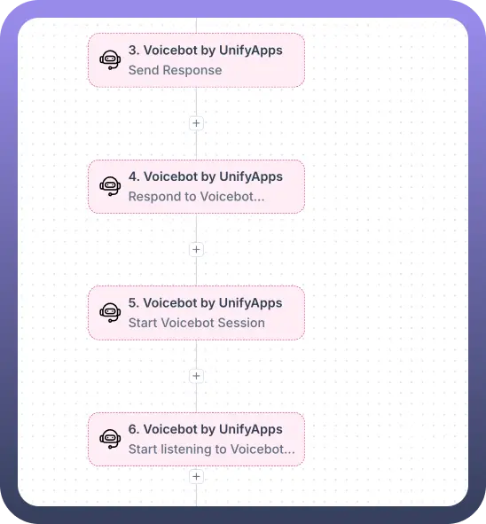
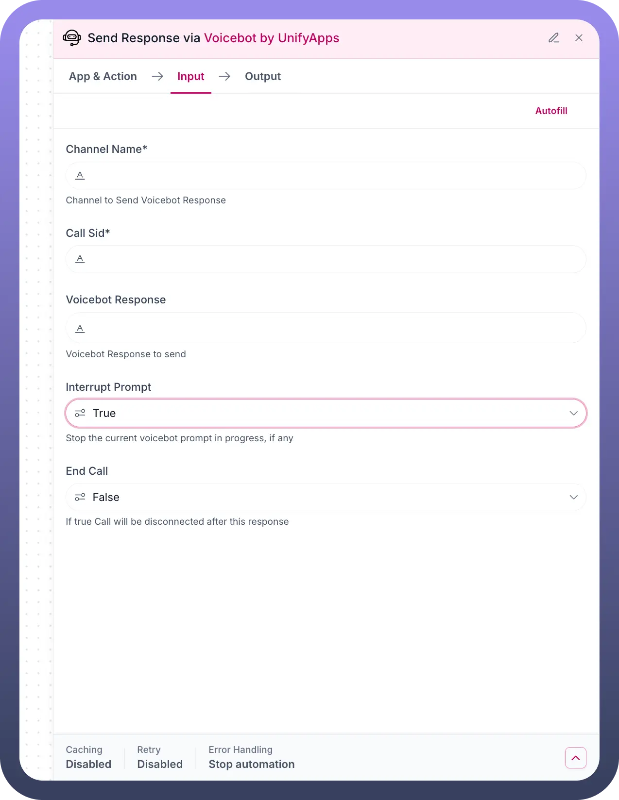
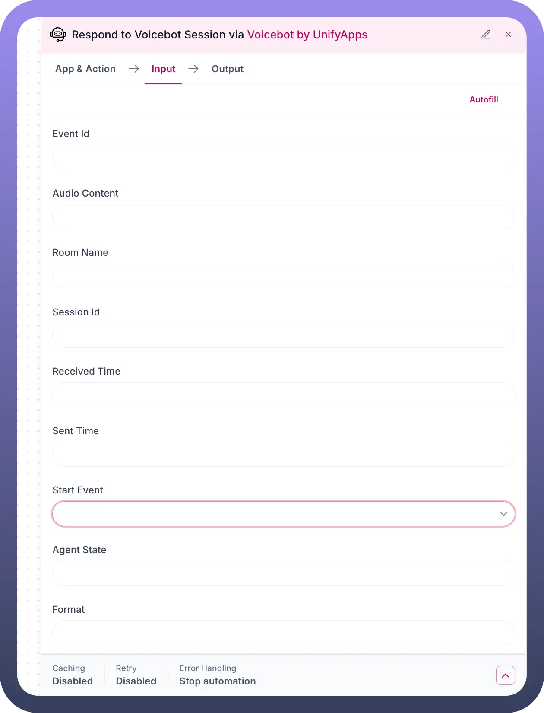
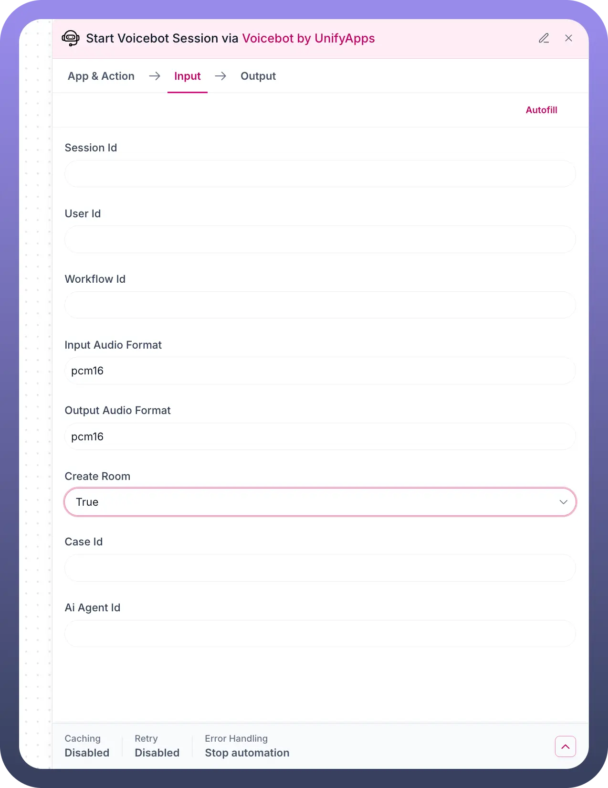

# Voicebot By Unifyapps

Source: https://www.unifyapps.com/docs/unify-automations/voicebot-by-unifyapps
Section: automations

---

## Overview

Voicebot by UnifyApps enables sophisticated voice interaction capabilities within your automation workflows. This powerful integration allows you to create, manage, and process voice-based communications through AI-powered voice agents. The system provides real-time voice processing, session management, and intelligent response handling, making it perfect for customer service automation, voice-activated workflows, and interactive voice response systems.

## Use Cases

**Automated Customer Support:**

A customer service team implements Voicebot by UnifyApps to handle initial customer inquiries. When customers call, the voicebot starts a session, listens to their requests, processes the audio content, and provides intelligent responses. Complex queries are seamlessly transferred to human agents with full conversation context, reducing wait times and improving customer satisfaction.

**Voice-Activated Workflow Triggers:**

A logistics company uses voice commands to trigger warehouse operations. Workers speak into devices to initiate inventory checks, shipment processing, or status updates. The voicebot processes these voice commands, converts them to actionable data, and triggers appropriate workflow sequences, streamlining operations and reducing manual data entry.

**Interactive Voice Surveys:**

A market research firm automates survey collection through voice interactions. The voicebot initiates sessions with respondents, asks survey questions, processes spoken responses, and records answers in structured formats. This approach increases response rates and provides richer qualitative data compared to traditional text-based surveys.

## Send Response

The Send Response action in Voicebot by UnifyApps enables your automation to provide voice responses back to users during active voice sessions. This action controls how the voicebot communicates with users, managing response delivery and call flow control.

**Input fields**

`Interrupt`**:** Configure whether the response should interrupt any currently playing audio or wait for it to complete.

- **Type:** Boolean
- **Default:** true
- **Options:**
  - **true:** Immediately interrupt current audio playback
  - **false:** Wait for current audio to finish before responding

`End Call`: Determine whether the voice session should be terminated after sending the response.

- **Type:** Boolean
- **Default:** false
- **Options:**
  - **true:** End the voice session after response delivery
  - **false:** Keep the session active for continued interaction

**Advanced Configuration**

- `Fallback Mode`: STOP - Determines action behavior when errors occur
- `Resource Version`**:** 86 - Current version of the Send Response functionality
- `Group Integration`: Links with other voicebot actions in the same workflow group

**Output**

The Send Response action provides:

- `Response Status`: Confirmation of successful response delivery
- `Session State`: Current status of the voice session
- `Timing Information`: Response delivery timestamps
- `Error Details`: Any issues encountered during response transmission

This action is essential for creating interactive voice experiences where your automation needs to provide intelligent responses based on user input or workflow logic.

## Respond to Voicebot Session

The Respond to Voicebot Session action processes incoming voice interactions and prepares responses within an active voice session. This action serves as the core processing engine for handling user voice input and generating appropriate responses.

**Input Fields**

`Event Id`: Unique identifier for the specific voice event being processed.

- **Type:** String
- **Required:** Yes
- **Purpose:** Links the response to the specific voice interaction event

`Audio Content`: The processed audio data from the user's voice input.

- **Type:** Audio data object
- **Format:** Typically processed speech-to-text content
- **Usage:** Contains the actual voice input that needs to be processed

`Room Name`: Identifier for the voice session room or channel.

- **Type:** String
- **Purpose:** Organizes voice sessions and enables multi-user voice environments

`Session Id`: Unique identifier for the current voice interaction session.

- **Type:** String
- **Required:** Yes
- **Purpose:** Maintains session continuity and context

`Received Time`: Timestamp indicating when the voice input was received.

- **Type:** DateTime
- **Format:** ISO 8601 timestamp
- **Usage:** Enables timing analysis and session sequencing

`Sent Time`: Timestamp for when the original voice input was transmitted.

- **Type:** DateTime
- **Format:** ISO 8601 timestamp
- **Usage:** Calculates processing delays and response times

`Start Event`: Configuration for session initiation parameters.

- **Type:** Dropdown selection
- **Options:** Various session start triggers and conditions
- **Purpose:** Defines how the voice session begins

`Agent State`: Current operational state of the voice agent.

- **Type:** String
- **Values:** Active, Listening, Processing, Responding, Idle
- **Purpose:** Manages agent behavior and availability

`Format`: Audio and response format specifications.

- **Type:** String
- **Common Values:** PCM16, MP3, WAV
- **Purpose:** Ensures compatibility between voice input and output formats

**Advanced options**

- `Caching`: Disabled by default for real-time voice processing
- `Retry`: Disabled to prevent voice interaction loops
- `Error Handling`: Stop automation to prevent cascading voice session errors

**Output**

For each voice interaction processed, the action outputs:

- `Processed Response`: The generated response ready for voice synthesis
- `Session Context`: Updated session state and conversation history
- `Processing Metrics`: Response time, confidence scores, and processing statistics
- `Next Action Indicators`: Guidance for subsequent workflow steps

This action is crucial for creating intelligent voice interactions that understand user intent and provide contextually appropriate responses.

## Start Voicebot Session

The Start Voicebot Session action initializes new voice interaction sessions, establishing the connection between users and your voice-enabled automation workflows. This action sets up the technical foundation for voice communication and configures session parameters.

**Input fields**

`Session Id`: Unique identifier for the voice session being created.

- **Type:** String
- **Generation:** Auto-generated or manually specified
- **Purpose:** Tracks the session throughout its lifecycle

`User Id`: Identifier for the user participating in the voice session.

- **Type:** String
- **Required:** Recommended for personalized interactions
- **Usage:** Links voice sessions to specific users or accounts

`Workflow Id`: Reference to the automation workflow that will process voice interactions.

- **Type:** String
- **Required:** Yes
- **Purpose:** Determines which automation logic handles the voice session

`Input Audio Format`: Technical specification for incoming audio processing.

- **Type:** String
- **Default:** pcm16
- **Options:**
  - **pcm16:** 16-bit PCM audio (recommended for quality)
  - **pcm8:** 8-bit PCM audio (lower bandwidth)
  - **mp3:** Compressed audio format
  - **wav:** Uncompressed audio format

`Output Audio Format`: Technical specification for outgoing audio synthesis.

- **Type:** String
- **Default:** pcm16
- **Options:**
  - **pcm16:** 16-bit PCM audio (recommended for quality)
  - **pcm8:** 8-bit PCM audio (lower bandwidth)
  - **mp3:** Compressed audio format
  - **wav:** Uncompressed audio format

`Create Room`: Determines whether to establish a new voice session room.

- **Type:** Boolean
- **Default:** true
- **Options:**
  - **true:** Create a new isolated voice session environment
  - **false:** Join an existing voice session room

`Case Id`: Optional identifier linking the voice session to specific cases or tickets.

- **Type:** String
- **Usage:** Useful for customer service scenarios where voice sessions relate to support cases

`AI Agent Id`: Identifier for the specific AI agent that will handle voice interactions.

- **Type:** String
- **Purpose:** Enables multiple AI agents with different capabilities or personalities

**Advanced Configuration**

- `Caching`: Disabled for real-time voice processing requirements
- `Retry`: Disabled to prevent duplicate session creation
- `Error Handling`: Stop automation to prevent incomplete session initialization
- `Resource Version`: 10 - Current version of session start functionality

**Output**

Upon successful session initiation, the action provides:

- `Session Details`: Complete session configuration and identifiers
- `Connection Status`: Confirmation of established voice connection
- `Agent Assignment`: Details of assigned AI agent for the session
- `Room Information`: Voice session room details and access parameters
- `Quality Metrics`: Initial connection quality and latency measurements

This action is the foundation for all voice interactions, ensuring proper session setup and configuration for optimal voice processing performance.

## Start Listening to Voicebot Session

The Start Listening to Voicebot Session action activates audio input monitoring for established voice sessions. This action enables your voicebot to actively listen for user voice input and begin processing spoken interactions.

**Input Fields**

`Session Id`: Reference to the active voice session that should begin listening.

- **Type:** String
- **Required:** Yes
- **Source:** Typically from the Start Voicebot Session action output
- **Purpose:** Links listening activation to the correct session

`Workflow Id`: Reference to the workflow that will process detected voice input.

- **Type:** String
- **Required:** Yes
- **Purpose:** Determines processing logic for incoming voice data

`Room Name`: Identifier for the voice session room where listening should occur.

- **Type:** String
- **Source:** From session creation or room assignment
- **Purpose:** Focuses listening on the correct voice channel

`Track Id`: Unique identifier for the audio track being monitored.

- **Type:** String
- **Usage:** Enables multiple audio stream monitoring within single sessions
- **Purpose:** Manages complex voice environments with multiple participants

**Functionality**

The listening activation process:

- `Audio Stream Connection`: Establishes connection to the voice session's audio input
- `Voice Activity Detection`: Monitors for speech patterns and voice activity
- `Noise Filtering`: Applies audio processing to improve voice recognition quality
- `Continuous Monitoring`: Maintains active listening state throughout the session
- `Event Triggering`: Generates voice input events when speech is detected

**Advanced Configuration**

- `Caching`: Disabled for real-time audio processing
- `Retry`: Disabled to prevent audio stream conflicts
- `Error Handling`: Stop automation to prevent incomplete listening setup
- `Resource Version`: 10 - Current version of listening functionality

**Output**

When listening is successfully activated, the action provides:

- `Listening Status`: Confirmation that voice monitoring is active
- `Audio Stream Details`: Technical information about the audio input stream
- `Detection Sensitivity`: Current voice activity detection settings
- `Processing State`: Status of voice recognition and processing pipeline
- `Event Configuration`: Details of how voice input events will be generated

This action is essential for creating responsive voice interactions, as it enables your automation to detect and respond to user voice input in real-time.

## Workflow Integration Patterns

**Sequential Voice Processing**

The typical workflow pattern follows this sequence:

- `Start Voicebot Session` - Initialize voice communication
- `Start Listening to Voicebot Session` - Activate voice input monitoring
- `Respond to Voicebot Session` - Process incoming voice interactions
- `Send Response` - Deliver voice responses back to users

**Error Handling Strategy**

All voicebot actions are configured with "`STOP`" fallback mode, meaning:

- Errors in any voice action will halt the workflow
- This prevents partial voice sessions or confused user experiences
- Proper error handling ensures voice interactions remain coherent

**Session Management**

- `Session Persistence`: Voice sessions maintain state across multiple interactions
- `Context Preservation`: Conversation history and user context are maintained
- `Resource Cleanup`: Sessions are properly closed when interactions complete

## Audio Format Specifications

**PCM16 (Recommended)**

- **Quality:** High-quality uncompressed audio
- **Compatibility:** Widely supported across voice processing systems
- **Bandwidth:** Higher data usage but optimal for voice recognition
- **Use Case:** Professional voice applications requiring accuracy

**Audio Processing Pipeline**

1. **Input Processing:** User voice → Audio format conversion → Speech recognition
2. **Response Generation:** Text processing → Voice synthesis → Audio format conversion
3. **Output Delivery:** Formatted audio → User playback
