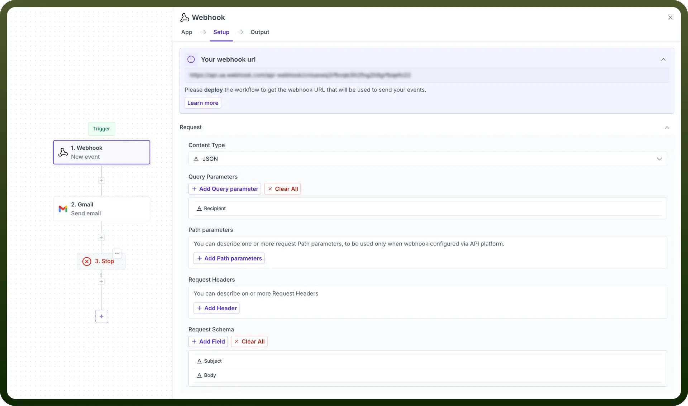
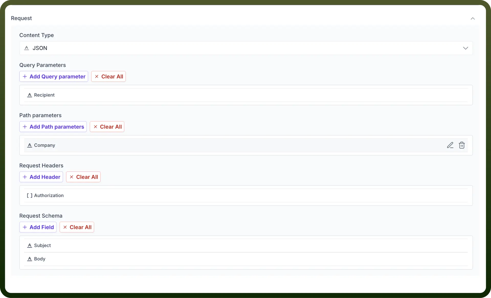
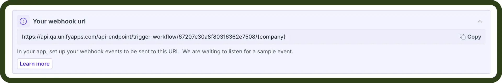

# Webhook

Source: https://www.unifyapps.com/docs/unify-automations/webhook
Section: automations

---

## Overview

**Webhooks** in UnifyApps enable real-time execution of automations. This means the automation will run immediately upon receiving a trigger event, such as a new form submission, an update in a CRM system, or an API request to the designated webhook endpoint.

## Setting up your webhook trigger

- Select the **content type** which you want to receive using your webhook. It can be among JSON, Form-URL encoded or XML types.
- Subsequently, you can define your **query parameters**, **path parameters**, and **request headers**.
- Set up any additional fields required using the **request schema**.

  

- Finally, configure the application to send webhook events to your automation using the URL in the overview section.

  
